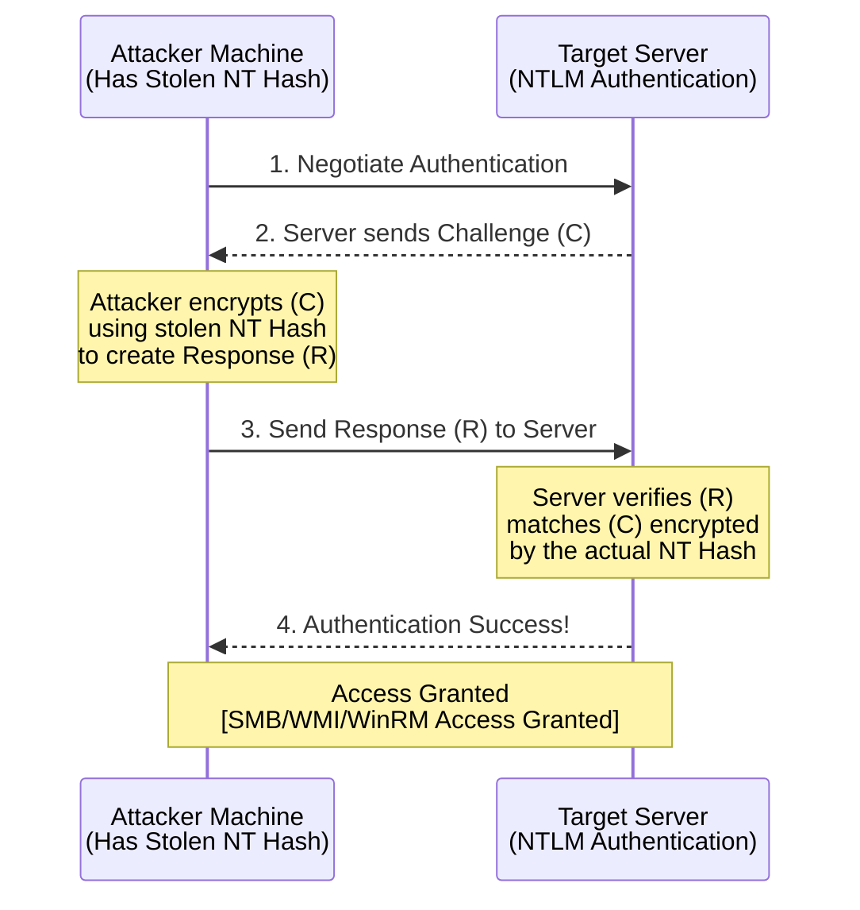

# 68.07 Pass-the-Hash (PtH) Mechanics and Execution

## Introduction to Pass-the-Hash (PtH)

Pass-the-Hash (PtH) is a foundational lateral movement technique in Windows environments. It allows an attacker who has captured a user's NTLM (NT LAN Manager) hash to authenticate to remote systems and services without needing to know or crack the plaintext password. This technique exploits the fact that the NTLM authentication protocol does not require the plaintext password; it only requires the mathematical hash of the password to verify identity.

This technique is predominantly effective against the NTLM authentication protocol, which remains heavily used in modern Active Directory networks for backward compatibility, local logons, and specific services, even when Kerberos is the default protocol.

## Deep Dive: How NTLM Authentication Works (The Flaw)

To understand why PtH works, one must understand the NTLM Challenge-Response mechanism.

1. **Negotiation:** The client requests authentication to a server.
2. **Challenge:** The server generates a random 16-byte number called a "Challenge" and sends it to the client.
3. **Response:** The client takes the user's NT hash (derived from their password) and uses it to encrypt the Challenge. This encrypted Challenge is sent back to the server as the "Response".
4. **Verification:** The server validates the Response. If it's a local account, it checks its local SAM. If it's a domain account, it passes the Challenge and Response to the Domain Controller (via Netlogon). The DC performs the same encryption using its copy of the user's NT hash and compares the result. If they match, authentication succeeds.

**The Crux of PtH:** At no point in this process does the client or server explicitly require the plaintext password. The client only needs the NT hash to calculate the correct Response. Therefore, if an attacker obtains the NT hash (e.g., by dumping the SAM or LSASS memory), they can act as the client, accept the challenge, calculate the response using the stolen hash, and successfully authenticate.

## ASCII Diagram: The Pass-the-Hash Authentication Flow



## Methodology and Execution

There are several ways an attacker can execute a Pass-the-Hash attack, depending on the desired outcome and the tools available.

### 1. PtH over SMB (Accessing File Shares and Execution)

The most common use of PtH is accessing SMB shares and executing remote commands. Tools like `CrackMapExec`, `NetExec`, and `Impacket` excel at this.

#### Impacket's smbclient.py and psexec.py

Impacket scripts allow you to specify an NT hash directly using the `-hashes` flag. The format is typically `LMHASH:NTHASH`. Since LM hashes are largely deprecated, you can provide a dummy value for the LM hash (like `aad3b435b51404eeaad3b435b51404ee` or just `00000000000000000000000000000000`) followed by the actual NT hash.

```bash
# Accessing SMB shares interactively
impacket-smbclient administrator@192.168.1.100 -hashes aad3b435b51404eeaad3b435b51404ee:31d6cfe0d16ae931b73c59d7e0c089c0

# Gaining a remote system shell using psexec (requires admin rights on target)
impacket-psexec administrator@192.168.1.100 -hashes :31d6cfe0d16ae931b73c59d7e0c089c0

# Remote command execution via WMI (stealthier than psexec)
impacket-wmiexec administrator@192.168.1.100 -hashes :31d6cfe0d16ae931b73c59d7e0c089c0
```

#### NetExec / CrackMapExec

NetExec can automate the process across multiple subnets, checking for local administrator access via PtH.

```bash
# Check validity of hash and admin access across a /24 subnet
nxc smb 192.168.1.0/24 -u administrator -H 31d6cfe0d16ae931b73c59d7e0c089c0 --local-auth
```

### 2. PtH to spawn a local process (Mimikatz)

If you are already on a Windows box and want to launch a tool (like PowerShell) in the context of another user using their hash, Mimikatz's `sekurlsa::pth` module is used.

This technique uses a trick: it spawns a process using a dummy password but injects the provided NT hash directly into the Local Security Authority Subsystem Service (LSASS) memory space for that specific process's logon session. When that process attempts network authentication, LSASS uses the injected hash.

```text
mimikatz # privilege::debug
Privilege '20' OK

mimikatz # sekurlsa::pth /user:Administrator /domain:CORP /ntlm:31d6cfe0d16ae931b73c59d7e0c089c0 /run:cmd.exe
user    : Administrator
domain  : CORP
program : cmd.exe
impers. : no
NTLM    : 31d6cfe0d16ae931b73c59d7e0c089c0
  |  PID  3148
  |  TID  2956
  |  LUID 0 ; 10456123 (00000000:009f8c3b)
  \_ msv1_0   - data copy @ 0000021A5890C1A0 : OK !
```
The new `cmd.exe` window that spawns will *locally* look like the current user, but when accessing network resources (like `dir \\DC01\C$`), it will authenticate as the specified user using the injected hash.

### 3. Remote Desktop Protocol (RDP) Restricted Admin Mode

Historically, RDP required the plaintext password. However, Microsoft introduced "Restricted Admin Mode" for RDP. When enabled on the target, it allows an administrator to connect via RDP without supplying the plaintext password, effectively allowing PtH over RDP. This was designed to prevent the administrator's plaintext credentials from being exposed on compromised jump boxes, but attackers use it to pivot.

Using `xfreerdp` from a Linux attacking machine:
```bash
xfreerdp /v:192.168.1.100 /u:Administrator /pth:31d6cfe0d16ae931b73c59d7e0c089c0 /cert:ignore
```
*Note: This requires `DisableRestrictedAdmin` registry key to be set to `0` on the target machine.*

## Restrictions and LocalAccountTokenFilterPolicy

When performing PtH against local accounts (not domain accounts), Windows introduces a defense mechanism called User Account Control (UAC) Remote Restrictions.

If you attempt to PtH with a local user account that is a member of the local Administrators group (e.g., `LocalAdmin`), network logons will be granted standard user privileges, stripping the administrative token. Therefore, `psexec` or accessing `C$` will fail with "Access Denied."

**Exceptions:**
1. **The built-in Administrator account (RID 500):** This specific account is exempt from UAC Remote Restrictions. PtH with the built-in Administrator hash will *always* grant full administrative access.
2. **LocalAccountTokenFilterPolicy:** If a registry key `HKLM\SOFTWARE\Microsoft\Windows\CurrentVersion\Policies\System\LocalAccountTokenFilterPolicy` is set to `1`, the restriction is disabled, and all local administrators can be used for full administrative PtH.

## Defensive Considerations and Mitigations

1. **Disable NTLM:** The ultimate fix is to completely disable NTLM authentication and rely solely on Kerberos. However, this breaks many legacy applications. It can be done via Group Policy (`Network Security: Restrict NTLM: NTLM authentication in this domain`).
2. **Microsoft LAPS:** Since PtH is heavily used with local administrator hashes, deploying LAPS ensures that stealing a local admin hash on Host A cannot be used to authenticate to Host B.
3. **Privileged Access Workstations (PAWs):** Isolate high-privilege accounts (like Domain Admins) so their hashes are never exposed on easily compromised endpoints.
4. **Monitoring:** Look for Event ID 4624 (Logon) where the Logon Type is 3 (Network) and the Authentication Package is NTLM, especially originating from unusual source IPs or targeting administrative shares.


## Real-World Attack Scenario
During a penetration test for a university network, the attackers gained initial access through a compromised student workstation. Through careful local enumeration, they discovered a scheduled task running a backup script under the context of a local administrator. By modifying the script, they obtained a reverse shell running as `NT AUTHORITY\SYSTEM`.

The attackers dumped the local SAM database and extracted the NTLM hash of the built-in Administrator account. They knew that many organizations deploy standardized images where the built-in Administrator password is the same across all machines. However, the university's network heavily segmented traffic, blocking direct RDP access and tightly monitoring anomalous PowerShell activity.

The attacker needed to verify if the extracted hash was valid on other machines within the IT department's subnet without triggering account lockout alarms. They used CrackMapExec (CME) from their attacking machine, routing traffic through a SOCKS proxy established via their initial foothold.

```bash
proxychains4 crackmapexec smb 10.10.50.0/24 -u Administrator -H '31d6cfe0d16ae931b73c59d7e0c089c0' --local-auth
```

The scan quickly returned a result highlighting `IT-ADMIN-WS04` with a `(Pwn3d!)` flag, indicating that the local Administrator password was indeed reused and the hash was valid for full administrative access. 

To capitalize on this without dropping malicious files, the attacker utilized the Pass-the-Hash (PtH) technique natively through Windows via a tool called `Invoke-TheHash`. However, wanting to remain entirely off the radar, they decided to use a modified version of Impacket's `psexec.py` that had been customized to avoid uploading the standard `psexesvc.exe` binary.

```bash
proxychains4 psexec_custom.py WORKGROUP/Administrator@10.10.50.14 -hashes :31d6cfe0d16ae931b73c59d7e0c089c0
```

By authenticating purely with the NTLM hash via the SMB protocol, the attacker bypassed the need to crack the complex 24-character password. Once connected to `IT-ADMIN-WS04`, they discovered an open KeePass database containing the university's core infrastructure passwords. The PtH technique allowed them to seamlessly pivot from a low-value student machine to the epicenter of the IT department's administration network, demonstrating the severe impact of local administrator password reuse.

## Chaining Opportunities

- **[[06 - Dumping Local SAM and LSA Secrets]]**: This is the prerequisite step. You must dump the SAM or LSASS memory to obtain the NT hash required for the PtH attack.
- **[[08 - Over-Pass-the-Hash Pass-the-Key]]**: If NTLM is heavily monitored or restricted, you can convert your PtH attack into a Kerberos-based attack by requesting a TGT using the NT hash.
- **[[14 - SMB Relay Attacks]]**: If you don't have the hash, but can intercept an authentication attempt, you can relay the NTLM hash challenge/response to gain access, effectively achieving the same result as PtH.

## Related Notes

- [[01 - Active Directory Lateral Movement Overview]]
- [[02 - Local Administrator Password Solution LAPS]]
- [[11 - LSASS Memory Dumping Techniques]]
