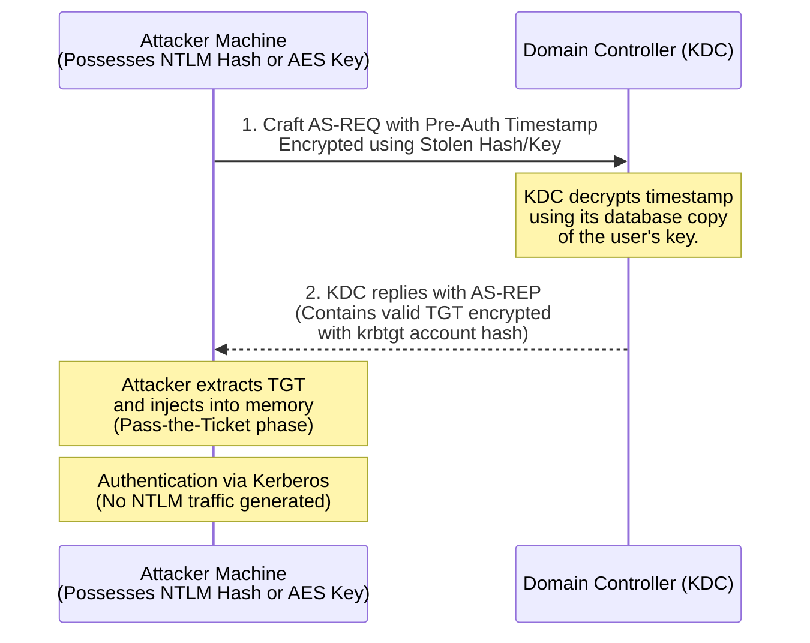

# 68.08 Over-Pass-the-Hash (Pass-the-Key)

## Introduction to Over-Pass-the-Hash

As organizations mature their security postures, they often implement strict monitoring or outright disablement of the NTLM authentication protocol to mitigate standard Pass-the-Hash (PtH) attacks. In environments where Kerberos is strictly enforced, attackers must pivot their techniques. This is where **Over-Pass-the-Hash**, also known as **Pass-the-Key (PtK)**, becomes critical.

Over-Pass-the-Hash is a technique that bridges the gap between NTLM hash theft and Kerberos authentication. It allows an attacker who possesses a user's password hash (NTLM) or a Kerberos encryption key (AES128/AES256) to request a valid Kerberos Ticket Granting Ticket (TGT) directly from the Domain Controller's Key Distribution Center (KDC). Once the TGT is obtained, the attacker can use it to request Service Tickets (TGS) and authenticate to resources strictly via Kerberos, completely bypassing NTLM.

## Deep Dive: The Mechanics of Pass-the-Key

To understand Over-Pass-the-Hash, we must look at the first step of Kerberos Authentication: the `AS-REQ` (Authentication Service Request).

When a normal user logs in, their client machine sends an `AS-REQ` to the Domain Controller. To prove their identity, the client encrypts a timestamp using a secret key derived from their password.

**What is the secret key?**
In legacy Active Directory, this key was the RC4 encryption of the user's password, which is mathematically identical to the NTLM hash. Therefore, the **NT hash is a valid Kerberos key** (specifically, the RC4-HMAC key).

Modern Active Directory heavily prefers AES encryption (AES128 or AES256 keys). When you dump LSASS memory or the NTDS.dit database, you might extract these AES keys alongside the RC4/NT hash.

**The Attack Execution Flow:**
1. The attacker acquires the user's NT hash (RC4) or AES key.
2. The attacker uses a tool to manually construct a Kerberos `AS-REQ` packet.
3. The attacker encrypts the pre-authentication timestamp using the stolen hash/key.
4. The Domain Controller receives the `AS-REQ`, decrypts the timestamp using its copy of the hash/key, validates it, and issues a TGT embedded in an `AS-REP` packet.
5. The attacker loads the TGT into their local session memory (Pass-the-Ticket).
6. The attacker communicates with target services using pure Kerberos.

## ASCII Diagram: Over-Pass-the-Hash Flow



## Methodology and Execution

Over-Pass-the-Hash can be executed from a compromised Windows host or directly from a Linux attacking machine.

### 1. Execution via Rubeus (Windows)

Rubeus is an incredibly powerful C# toolset for raw Kerberos interaction. It provides a dedicated `asktgt` module for this exact purpose.

Using an RC4 (NTLM) Hash:
```powershell
# Requesting a TGT using an RC4 hash and injecting it directly into the current session (Requires local admin)
Rubeus.exe asktgt /user:Administrator /domain:corp.local /rc4:31d6cfe0d16ae931b73c59d7e0c089c0 /ptt
```

Using an AES256 Key (Preferred, stealthier):
```powershell
# Requesting a TGT using an AES256 key
Rubeus.exe asktgt /user:Administrator /domain:corp.local /aes256:d1234567890abcdef1234567890abcdef1234567890abcdef1234567890abcde /ptt
```

The `/ptt` flag automatically injects the ticket into memory. If you omit it, Rubeus will output the TGT in base64 format or save it to a `.kirbi` file, which can be injected later.

### 2. Execution via Mimikatz (Windows)

Mimikatz originated the Over-Pass-the-Hash technique via its `sekurlsa::pth` module. While we used this for standard PtH, Mimikatz is actually quite clever: if it injects the hash into LSASS, and you attempt a Kerberos connection (using a hostname instead of an IP), LSASS will use the injected hash to dynamically request a TGT.

```text
mimikatz # privilege::debug
mimikatz # sekurlsa::pth /user:Administrator /domain:corp.local /ntlm:31d6cfe0d16ae931b73c59d7e0c089c0
```
*Note: To force Kerberos authentication, you must use the Fully Qualified Domain Name (FQDN) or NetBIOS name of the target server, NOT the IP address. For example, `dir \\SERVER01.corp.local\C$` will trigger Kerberos using the injected hash.*

### 3. Execution via Impacket (Linux)

From a Linux attacker machine, you can request a TGT and save it as a credential cache (`.ccache`) file. This is highly useful for proxying traffic or using Linux-based tooling.

Using `getTGT.py` from Impacket:
```bash
# Request TGT using an NT hash
impacket-getTGT corp.local/Administrator -hashes :31d6cfe0d16ae931b73c59d7e0c089c0

# This saves a file named Administrator.ccache to disk.
# Export the variable so tools know to use it:
export KRB5CCNAME=Administrator.ccache

# Now, authenticate via Kerberos using psexec (using the -k flag)
impacket-psexec -k -no-pass DC01.corp.local
```

## Defensive Considerations and Evasion

**Stealth and OPSEC:**
Using Over-Pass-the-Hash with an RC4 (NTLM) hash is noisy. Modern Active Directory environments will log Event ID 4768 (A Kerberos authentication ticket (TGT) was requested). If the encryption type used is `0x17` (RC4-HMAC), it stands out heavily, as legitimate modern Windows clients will use `0x12` (AES256). 

Therefore, for better operational security, attackers prefer to extract the user's AES256 key from LSASS rather than the RC4 hash. Performing Pass-the-Key with an AES256 key perfectly mimics a legitimate Windows authentication request.

**Mitigations:**
1. **Disable RC4 in Active Directory:** Organizations should enforce the "Network security: Configure encryption types allowed for Kerberos" Group Policy to only allow AES. This prevents attackers from using traditional NTLM hashes to request Kerberos tickets, forcing them to find AES keys.
2. **Credential Guard:** Prevents the theft of the NTLM hashes and AES keys from LSASS in the first place, neutering the attacker's ability to perform the attack locally.
3. **Smart Card Authentication:** Enforcing Smart Card authentication changes the `AS-REQ` structure to require PKINIT (certificates) instead of symmetric key encryption, completely defeating Over-Pass-the-Hash.


## Real-World Attack Scenario
In a highly secure environment belonging to a defense contractor, the red team had compromised a system administrator's workstation. The organization had implemented strict NTLM restrictions, disabling NTLM authentication across the domain to thwart standard Pass-the-Hash (PtH) and relay attacks. The environment exclusively required Kerberos for all authentication to critical servers.

The attackers had previously dumped LSASS memory and extracted the NTLM hash for the user `admin_tsmith`, but they did not possess the plaintext password. Because standard PtH (which relies on NTLM) was blocked by Group Policy, the attackers needed to convert their NTLM hash into a valid Kerberos Ticket Granting Ticket (TGT). This technique is known as Over-Pass-the-Hash (or Pass-the-Key).

Using a customized, in-memory execution of Rubeus through their Command and Control framework, the attacker initiated the `asktgt` module. Rubeus uses the provided NTLM hash (the RC4 key) to encrypt a timestamp and request a TGT directly from the Domain Controller, entirely bypassing the local Windows API and avoiding standard credential guard mechanisms.

```cmd
C:\Temp> Rubeus.exe asktgt /user:admin_tsmith /domain:defense.local /rc4:9f2b4c8a6e7d8f9a0b1c2d3e4f5a6b7c /ptt
```

The command succeeded. The Domain Controller validated the RC4-encrypted timestamp and returned a legitimate Kerberos TGT for `admin_tsmith`. Rubeus automatically injected this newly acquired TGT into the attacker's current session memory (`/ptt` flag).

```cmd
C:\Temp> klist

Current LogonId is 0:0x3e7
Cached Tickets: (1)
#0>     Client: admin_tsmith @ DEFENSE.LOCAL
        Server: krbtgt/DEFENSE.LOCAL @ DEFENSE.LOCAL
        KerbTicket Encryption Type: RSADSI RC4-HMAC(NT)
```

With the TGT now injected, the attacker's session seamlessly masqueraded as `admin_tsmith`. When the attacker subsequently ran a PowerShell command to access a highly restricted engineering file share via its fully qualified domain name (`\\eng-share.defense.local\Blueprints`), Windows automatically used the injected TGT to request a Service Ticket.

Because the underlying authentication protocol used was purely Kerberos, the connection succeeded without triggering the network's NTLM denial alarms. The attacker successfully bypassed the restrictive authentication policies, bridging the gap between an extracted hash and a Kerberos-only environment to exfiltrate classified schematics.

## Chaining Opportunities

- **[[06 - Dumping Local SAM and LSA Secrets]]**: You must dump the SAM or LSASS memory to obtain the hash or AES keys required for this attack.
- **[[09 - Pass-the-Ticket PtT and Ticket Management]]**: Over-Pass-the-Hash effectively generates a ticket. The subsequent phase of using that ticket is Pass-the-Ticket.
- **[[17 - Silver Ticket Attacks]]**: While PtK gets you a legitimate TGT, if you have the computer account's AES key, you can just forge a Silver Ticket directly instead of talking to the KDC.

## Related Notes

- [[01 - Active Directory Lateral Movement Overview]]
- [[07 - Pass-the-Hash PtH Mechanics and Execution]]
- [[11 - LSASS Memory Dumping Techniques]]
