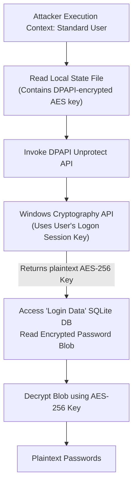

# 68.10 Extracting Credentials from Browsers and Credential Manager

## Introduction

While extracting NT hashes, Kerberos keys, and tickets from LSASS or the registry represents the apex of Active Directory credential theft, attackers frequently target simpler, localized credential storage mechanisms. Users are notorious for saving sensitive credentials within their web browsers, enterprise password managers, and the native Windows Credential Manager.

These credentials often include access to internal web applications (intranets, HR portals, Jenkins/CI pipelines), cloud infrastructure (AWS/Azure console credentials), and even VPN portals. In many cases, these plaintext credentials can be reused across the network, providing an attacker with immediate lateral movement capabilities or access to highly sensitive proprietary data without needing to abuse core Windows authentication protocols.

## Deep Dive: Windows Credential Manager

The Windows Credential Manager acts as a digital locker, storing usernames and passwords for various resources. It is divided into two primary categories:
1. **Web Credentials:** Passwords saved via Edge or Internet Explorer.
2. **Windows Credentials:** Credentials used by the operating system to access network shares, Remote Desktop servers, Outlook profiles, and mapped network drives.

### How Data Protection API (DPAPI) Protects the Data

Windows does not store these passwords in plaintext on disk. They are heavily protected by the **Data Protection API (DPAPI)**. 

DPAPI is a native encryption service built into Windows that allows applications to cryptographically protect data using information tied to the current user's logon or the computer itself. 

The encryption flow works roughly like this:
- The user's plaintext password encrypts a **Master Key**.
- This Master Key encrypts the specific secrets (like the Web Credentials or Windows Credentials).
- The Master Keys are stored in `%APPDATA%\Microsoft\Protect\{SID}`.
- The actual encrypted credentials (the blobs) are stored in `%LOCALAPPDATA%\Microsoft\Credentials` (for Windows Credentials).

Because DPAPI is tied to the user's logged-in session, an attacker operating within the context of the user (e.g., via a standard command shell or beacon) can request Windows to decrypt the DPAPI blobs natively, without needing the user's password.

## Deep Dive: Browser Credential Storage

Modern browsers (Chrome, Edge, Firefox, Brave) also store saved passwords, cookies, and session tokens locally. 

### Chromium-Based Browsers (Chrome, Edge, Brave)

Chromium browsers store user profiles in specific SQLite databases.
- **Passwords:** Stored in `%LOCALAPPDATA%\Google\Chrome\User Data\Default\Login Data`.
- **Cookies:** Stored in `%LOCALAPPDATA%\Google\Chrome\User Data\Default\Network\Cookies`.

**Encryption Mechanism:**
Historically, Chrome used DPAPI directly to encrypt these SQLite databases. However, modern versions of Chrome and Edge use a hybrid approach.
1. Chrome generates a random AES-256 key.
2. Chrome encrypts this AES key using DPAPI and stores it in the `Local State` file (usually `%LOCALAPPDATA%\Google\Chrome\User Data\Local State`).
3. Chrome uses this AES key to encrypt the passwords inside the `Login Data` SQLite database.

Therefore, to extract Chrome passwords, an attacker must:
1. Read the `Local State` file.
2. Use DPAPI to decrypt the AES key (must be running as the user).
3. Open the `Login Data` SQLite database.
4. Use the decrypted AES key to decrypt the ciphertext passwords.

### Firefox

Firefox uses a completely different mechanism, avoiding DPAPI entirely to maintain cross-platform compatibility. Firefox stores credentials in `%APPDATA%\Mozilla\Firefox\Profiles\{random}.default-release\`.

It uses a Master Password (if configured by the user) to encrypt a master key file (`key4.db`), which in turn encrypts the credentials database (`logins.json`). If no Master Password is set (the default behavior), an attacker can easily decrypt the files by parsing the databases using open-source libraries (Network Security Services - NSS).

## ASCII Diagram: DPAPI and Chromium Extraction Flow



## Methodology and Tooling

Due to the complexity of DPAPI and SQLite parsing, manual extraction is tedious. Attackers rely heavily on automated tooling.

### 1. SharpChromium and SharpDPAPI

`GhostPack` (developed by SpecterOps) contains incredibly powerful C# tools for this exact purpose. Because they are C#, they can be executed in-memory via Cobalt Strike's `execute-assembly` to avoid touching disk.

**SharpChromium:**
Automatically handles the process of reading the Local State, decrypting the AES key via DPAPI, and parsing the SQLite databases to dump passwords, cookies, and history.
```powershell
# Dump all passwords and cookies from Chrome and Edge
SharpChromium.exe all
```

**SharpDPAPI:**
Can be used to dump the Windows Credential Manager directly.
```powershell
# Dump the DPAPI master keys and use them to decrypt the Credential Manager vaults
SharpDPAPI.exe vault
```

### 2. Session Cookie Extraction (Pass-the-Cookie)

Often, extracting the password is not enough because the target application enforces Multi-Factor Authentication (MFA). In these cases, attackers target the **Session Cookies**.

If an attacker dumps the cookies using a tool like SharpChromium, they can extract the valid, pre-authenticated session token (e.g., an AWS SSO token, a GitHub session cookie, or an internal Jira portal token). 

The attacker can then inject this cookie into their own browser (using extensions like "EditThisCookie") and access the application, completely bypassing the login page and MFA prompts. This is colloquially known as "Pass-the-Cookie."

### 3. Seatbelt

`Seatbelt.exe`, another GhostPack tool, performs a wide array of host-based situational awareness, but it excels at pulling simple, plaintext secrets from the environment, including saved RDP connections, Putty sessions, and basic Credential Manager entries.
```powershell
Seatbelt.exe User /groups:UserTriage
```

## Defensive Considerations and Mitigations

Defending against local credential extraction is exceptionally difficult because the attacker is abusing legitimate Windows features (DPAPI) and running in the context of the authorized user.

1. **Disable Password Saving:** Organizations should implement Group Policy or Mobile Device Management (MDM) policies to strictly prohibit the saving of passwords in browsers and the Windows Credential Manager. Users should be directed to use centralized, enterprise-grade, MFA-protected password managers.
2. **Ephemeral Sessions:** Ensure that session cookies for critical web applications have aggressively short lifespans (e.g., forcing re-authentication after 4 hours of inactivity) to reduce the window of opportunity for Pass-the-Cookie attacks.
3. **Endpoint Detection and Response (EDR):** EDR solutions monitor for processes attempting to access specific files (like `Login Data` or `key4.db`) or injecting into `explorer.exe` or `lsass.exe` to access DPAPI functions. Anomalous reads of these files by non-browser processes should generate high-fidelity alerts.
4. **AppLocker / WDAC:** Prevent the execution of unauthorized binaries (like custom C# assemblies) that automate the extraction process.


## Real-World Attack Scenario
In a targeted penetration test against a high-profile media company, the red team had compromised the workstation of the Chief Marketing Officer (CMO) via a malicious payload embedded in a PDF document. The CMO's workstation was exceptionally locked down: local administrator rights were revoked, AppLocker was enforced, and aggressive EDR monitored all processes. Escalating privileges to access LSASS or SAM databases was impossible under these constraints.

However, the attackers knew that executives frequently save their passwords in their web browsers for convenience. Given the restrictions, the attackers decided to pivot to targeting Google Chrome's local database and the Windows Credential Manager, operating entirely within the context of the currently logged-on user.

The attacker used a lightweight, compiled C# utility called `SharpChromium`, which is designed to extract cookies, history, and saved logins from Chromium-based browsers. To bypass AppLocker, they executed it entirely in-memory using the .NET reflection capabilities of their initial command-and-control beacon.

```powershell
PS C:\> [System.Reflection.Assembly]::Load([System.Convert]::FromBase64String($Base64SharpChromium))
PS C:\> [SharpChromium.Program]::Main("logins".Split())
```

The output flooded the terminal. `SharpChromium` automatically located the `Login Data` SQLite database in the CMO's `AppData` folder. Because the tool was running under the CMO's user context, it seamlessly utilized the Windows Data Protection API (DPAPI) to decrypt the passwords, requiring no administrative privileges or LSASS interaction.

```text
--- Chrome Logins ---
URL: https://corp-social-media.management.app/login
Username: cmo_executive@mediacorp.com
Password: Marketing_Vision_2025!
```

Alongside the Chrome data, the attacker also queried the built-in Windows Credential Manager using the native `cmdkey` utility, which revealed cached credentials for the corporate Azure environment.

```cmd
C:\> cmdkey /list
Currently stored credentials:
    Target: LegacyGeneric:target=AzureActiveDirectory
    Type: Domain Password
    User: cmo_executive@mediacorp.com
```

Armed with the extracted plaintext password from the browser, the attacker immediately tested it against the external corporate VPN and Office 365 portals. The password was valid. Since the CMO had "trusted" their mobile device for MFA, the attackers were able to initiate an MFA fatigue attack, eventually gaining full access to the CMO's email and social media management platforms. This devastating compromise was achieved entirely through user-land data extraction, completely bypassing the heavy OS-level security controls.

## Chaining Opportunities

- **[[15 - Cloud Infrastructure Pivoting]]**: Passwords or cookies extracted from browsers often belong to AWS, Azure, or GCP consoles, allowing an attacker to pivot from the on-premise Active Directory network into the cloud control plane.
- **[[03 - Lateral Movement via Remote Desktop Protocol RDP]]**: The Windows Credential Manager frequently stores saved RDP credentials, allowing instant lateral movement to other servers.
- **[[21 - Bypassing Multi-Factor Authentication]]**: Session cookie theft directly bypasses MFA mechanisms.

## Related Notes

- [[01 - Active Directory Lateral Movement Overview]]
- [[11 - LSASS Memory Dumping Techniques]]
- [[25 - Post-Exploitation Situational Awareness]]
