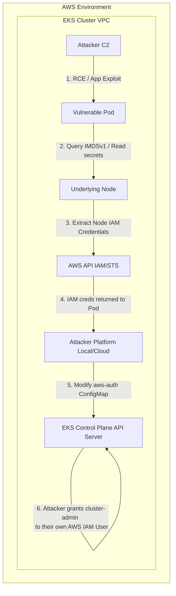

# EKS Cluster Takeover from Pod to Node to IAM

## Introduction to EKS Security Architecture

Amazon Elastic Kubernetes Service (EKS) represents the intersection of two complex ecosystems: Kubernetes and AWS Identity and Access Management (IAM). Securing EKS requires managing Role-Based Access Control (RBAC) within the cluster alongside IAM policies governing the underlying EC2 nodes and associated AWS resources.

The most critical interface in EKS security is how Pods authenticate to the AWS API. Historically, pods inherited the IAM role attached to the underlying EC2 worker node (the Node Instance Role). This meant any pod could query the EC2 Instance Metadata Service (IMDS) and extract credentials valid for the entire node's role. To mitigate this, AWS introduced IAM Roles for Service Accounts (IRSA), leveraging OpenID Connect (OIDC) to grant IAM roles directly to Kubernetes service accounts.

However, legacy configurations, misconfigured IMDS endpoints, and excessive node permissions frequently provide attackers with pathways to escalate from a compromised container (Pod) to full control over the EKS cluster and the broader AWS environment.

## Attack Flow and Architecture Diagram

The takeover typically follows a structured escalation path: compromising a pod, escaping to or interacting with the node environment, extracting high-privilege credentials, and ultimately manipulating the cluster's IAM bindings.



## Step-by-Step Escalation Methodology

### Phase 1: Initial Pod Compromise and Local Enumeration

The attack begins with gaining code execution on a Pod running inside the EKS cluster. This is typically achieved via application vulnerabilities (e.g., Server-Side Request Forgery, unauthenticated RCE, or exploiting a misconfigured web application).

Once inside the Pod, the attacker enumerates the environment:
1. **Check for Kubernetes Service Account Tokens**:
   ```bash
   cat /var/run/secrets/kubernetes.io/serviceaccount/token
   ```
   *If the pod has an associated IRSA role, there will also be an AWS web identity token here.*

2. **Check AWS Environment Variables**:
   ```bash
   env | grep -i aws
   ```
   *Look for `AWS_WEB_IDENTITY_TOKEN_FILE` or `AWS_ROLE_ARN`.*

### Phase 2: Querying Instance Metadata Service (IMDS)

If the cluster is not enforcing IMDSv2 (which requires session tokens and hop limits) or if network policies do not block access to `169.254.169.254`, the attacker queries the metadata service to steal the IAM credentials assigned to the underlying EC2 node.

```bash
# Attempt to read the IAM role name attached to the node
curl -s http://169.254.169.254/latest/meta-data/iam/security-credentials/

# Assuming the role is named "eks-worker-node-role"
curl -s http://169.254.169.254/latest/meta-data/iam/security-credentials/eks-worker-node-role
```

**Response Example**:
```json
{
  "Code" : "Success",
  "LastUpdated" : "2023-10-27T10:00:00Z",
  "Type" : "AWS-HMAC",
  "AccessKeyId" : "ASIA...",
  "SecretAccessKey" : "...",
  "Token" : "...",
  "Expiration" : "2023-10-27T16:00:00Z"
}
```
The attacker exports these credentials to their local machine, granting them the permissions of the EKS worker node.

### Phase 3: Abusing Kubelet Credentials (If Node Escape Occurs)

If IMDS is blocked, but the attacker manages to escape the container (e.g., via a privileged container, hostPath mount, or kernel exploit), they can access the host filesystem of the EC2 node.

On the node, the Kubelet binary communicates with the EKS API server. Its authentication configuration is stored at `/var/lib/kubelet/kubeconfig`.
```bash
cat /var/lib/kubelet/kubeconfig
```
This kubeconfig contains certificates that authenticate as `system:node:<node-name>` and belong to the `system:nodes` group. While limited, these permissions often allow listing all pods, reading secrets mounted to pods on that node, or performing node-level operations.

### Phase 4: Cluster Takeover via `aws-auth` Modification

The most devastating escalation path in EKS involves manipulating the `aws-auth` ConfigMap. EKS uses this ConfigMap (located in the `kube-system` namespace) to map AWS IAM users and roles to Kubernetes RBAC groups (like `system:masters`).

If the EC2 Node IAM Role stolen in Phase 2 has excessive permissions, or if the attacker compromises an IAM user that has access to the cluster, they might be able to modify this ConfigMap.

**Exploitation Steps**:
1. Configure AWS CLI with the stolen Node credentials.
2. Update the kubeconfig to communicate with the EKS cluster:
   ```bash
   aws eks update-kubeconfig --name target-cluster --region us-east-1
   ```
3. Attempt to edit the `aws-auth` ConfigMap:
   ```bash
   kubectl edit configmap aws-auth -n kube-system
   ```
4. Insert a new mapping under `mapUsers` or `mapRoles` granting `system:masters` (cluster admin) to an IAM user controlled by the attacker.
   ```yaml
   mapUsers: |
     - userarn: arn:aws:iam::123456789012:user/attacker-controlled-user
       username: attacker-admin
       groups:
         - system:masters
   ```
5. Save the configuration. EKS automatically syncs this, and the attacker's AWS IAM user now has irrevocable, full administrative access to the entire Kubernetes cluster.

### Phase 5: Persistence and Lateral Movement

With `system:masters` access, the attacker can:
- Deploy malicious DaemonSets to compromise every node in the cluster.
- Read all Kubernetes Secrets (which often contain database passwords, API keys for external services, etc.).
- Use the cluster as a launching pad to attack other AWS services utilizing the permissions of any IRSA-enabled pod.

## Mitigation and Defense Strategies

Defending an EKS cluster requires defense-in-depth across the network, container, and IAM layers:

1. **Enforce IMDSv2 and Restrict Hop Limit**:
   Require IMDSv2 on all EC2 worker nodes. Set the HTTP PUT response hop limit to `1`. This prevents pods running on the node from completing the IMDSv2 handshake, effectively blocking metadata access from within containers.
   ```bash
   aws ec2 modify-instance-metadata-options --instance-id i-123456 --http-endpoint enabled --http-tokens required --http-put-response-hop-limit 1
   ```

2. **Implement Network Policies**:
   Deploy Calico or AWS VPC CNI network policies to explicitly block egress traffic from pods to the metadata IP (`169.254.169.254`), unless specifically required.

3. **Adopt IAM Roles for Service Accounts (IRSA)**:
   Do not attach broad application permissions to the Node Instance Role. Use IRSA to grant least-privilege IAM roles directly to individual Kubernetes service accounts. The Node role should only contain permissions necessary to join the cluster (e.g., `AmazonEKSWorkerNodePolicy`, `AmazonEC2ContainerRegistryReadOnly`).

4. **Restrict Access to `aws-auth`**:
   Ensure strict Kubernetes RBAC controls prevent unauthorized manipulation of the `aws-auth` ConfigMap. Audit cluster role bindings regularly to ensure no unauthorized service accounts or users have `edit` or `admin` access to the `kube-system` namespace.

## Chaining Opportunities

- **[[04 - SSRF in Cloud Environments]]**: Server-Side Request Forgery is the primary vector for extracting credentials from IMDS without needing RCE.
- **[[10 - SecretsManager and Parameter Store Data Exfiltration]]**: Once pod or node IAM credentials are stolen, attackers immediately query AWS Secrets Manager for further pivoting.
- **Container Breakouts**: Exploiting Docker socket mounts (`/var/run/docker.sock`) or privileged pods directly leads to Phase 3 (Node Kubelet compromise).

## Related Notes
- [[01 - Kubernetes RBAC and Privilege Escalation]]
- [[02 - AWS STS and Cross-Account AssumeRole Abuse]]
- [[07 - AWS RDS Database Snapshots and Public Exposure]]
