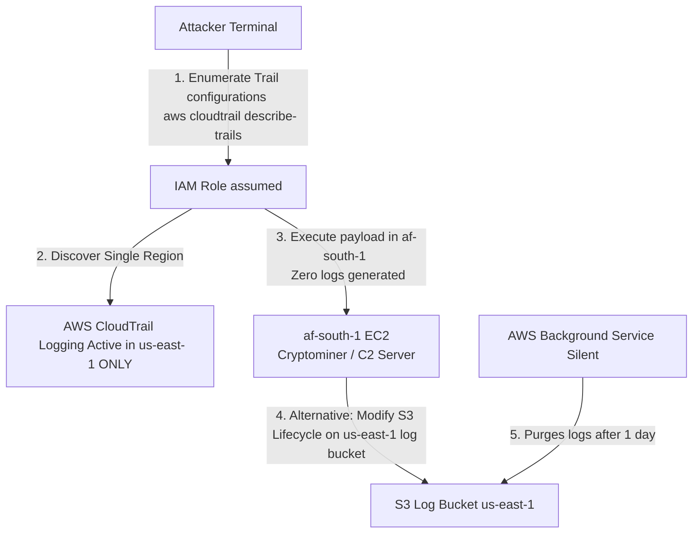

# AWS CloudTrail Evasion and Log Manipulation

## Introduction to CloudTrail Forensics

AWS CloudTrail is the cornerstone of security operations in AWS, providing a comprehensive, chronological record of API calls made within an account. This telemetry allows Security Operations Centers (SOC) to detect anomalous behavior, trace attacker lateral movement, and conduct incident response.

Because CloudTrail represents the primary visibility mechanism for defenders, advanced attackers prioritize its evasion or disruption. A sophisticated adversary seeks to manipulate, blind, or bypass CloudTrail to ensure their post-exploitation activities remain hidden, prolonging their dwell time and reducing the risk of attribution.

## Core Evasion Strategies

Attackers employ several distinct methodologies to defeat CloudTrail logging. These range from aggressive disruption (deleting trails) to passive evasion (operating in blind spots).

### 1. Operating in Unmonitored Regions

By default, CloudTrail can be configured as a multi-region trail or a single-region trail. If an organization has only configured single-region trails for the regions they actively use (e.g., `us-east-1` and `eu-west-1`), an attacker can simply execute their operations in a seemingly dormant region (e.g., `af-south-1`).

```bash
# Example of an attacker launching resources in a rarely monitored region
aws ec2 run-instances \
  --image-id ami-0abcdef1234567890 \
  --instance-type p3.8xlarge \
  --region af-south-1
```
Because no trail is capturing events in `af-south-1`, the creation of these expensive GPU instances (often used for cryptomining) goes entirely unnoticed until the billing alert triggers.

### 2. Disabling or Deleting the Trail (Loud/Aggressive)

If an attacker compromises an identity with `cloudtrail:*` permissions, they can directly disable logging. This is a "loud" action—the act of disabling the trail generates one final log event before blindness sets in. 

```bash
# Stop logging on a specific trail
aws cloudtrail stop-logging --name arn:aws:cloudtrail:us-east-1:123456789012:trail/security-trail

# Or entirely delete the trail
aws cloudtrail delete-trail --name security-trail
```

### 3. S3 Bucket Manipulation (The "Quiet" Disruption)

CloudTrail deposits its logs into an S3 bucket. Rather than attacking CloudTrail directly (which often triggers immediate alerts), an attacker might attack the destination bucket.

If the attacker has `s3:PutLifecycleConfiguration` permissions on the destination bucket, they can quietly configure a rule to delete all log files after 1 day.

```bash
# malicious-lifecycle.json
{
  "Rules": [
    {
      "ID": "DeleteLogsQuickly",
      "Prefix": "AWSLogs/",
      "Status": "Enabled",
      "Expiration": { "Days": 1 }
    }
  ]
}

aws s3api put-bucket-lifecycle-configuration \
  --bucket my-cloudtrail-logs-bucket \
  --lifecycle-configuration file://malicious-lifecycle.json
```
The logs will still generate, but the forensics team will find their historical data systematically purged by AWS's own background processes.

### 4. Bypassing Data Events

CloudTrail records two types of events: **Management Events** (control plane operations like `CreateUser` or `RunInstances`) and **Data Events** (data plane operations like `s3:GetObject` or `lambda:InvokeFunction`). 

By default, Data Events are **NOT** logged due to the massive volume and cost they generate. Attackers abuse this by extracting sensitive data directly from S3 buckets or invoking Lambdas, knowing these operations will not appear in standard CloudTrail configurations.

## Attack Architecture Diagram



## Advanced Log Manipulation Techniques

### 5. STS Assuming Chaining for Obfuscation

Attackers frequently chain `AssumeRole` calls to create a confusing audit trail. If an attacker compromises User A, they might use User A to assume Role B, Role B to assume Role C, and Role C to carry out the attack. 

While CloudTrail logs the final action under Role C, the incident responder must manually stitch together the `sts:AssumeRole` events backward to find the true origin identity (User A). If the attacker jumps across accounts, tracing becomes highly complex and requires access to cross-account CloudTrail logs.

### 6. CloudTrail Log Injection / Forgery

In rare configurations where an S3 bucket hosting CloudTrail logs allows public or overly permissive `s3:PutObject` access, an attacker might inject fake CloudTrail log files (JSON compressed in GZIP). 

This technique, known as CloudTrail CSV/JSON Injection, pollutes the log data ingested by SIEMs (like Splunk or Elastic). By flooding the SIEM with false alerts, the attacker causes alert fatigue, effectively burying their genuine malicious actions in a mountain of noise.

## Mitigation and Defense Strategies

Defending CloudTrail requires securing both the configuration of the service and the destination of the logs.

1. **Enforce Multi-Region Trails**:
   Always configure at least one organizational trail as a multi-region trail to ensure API activity in globally disabled or unused regions is captured.

2. **Enable Log File Validation**:
   CloudTrail Log File Validation uses digital signatures to ensure that log files have not been modified or deleted after AWS delivered them. This provides forensic integrity.
   ```bash
   aws cloudtrail update-trail --name my-trail --enable-log-file-validation
   ```

3. **Protect the S3 Bucket (MFA Delete & Object Lock)**:
   Apply S3 Object Lock (WORM - Write Once Read Many) to the CloudTrail S3 bucket to mathematically prevent any user, including the root user, from deleting or modifying logs before a defined retention period expires.

4. **Dedicated Security Account**:
   Send all organizational CloudTrail logs to an S3 bucket residing in a strictly isolated, dedicated "Log Archive" AWS account. Production identities should have zero access to this account.

5. **Alerting on Evasion**:
   Create immediate, high-priority alerts via EventBridge for any API calls matching `StopLogging`, `DeleteTrail`, `UpdateTrail`, or `PutBucketLifecycleConfiguration` on the trail's bucket.

## Chaining Opportunities

- **[[02 - AWS STS and Cross-Account AssumeRole Abuse]]**: AssumeRole chaining is inherently a method of confusing CloudTrail correlation.
- **[[01 - S3 Bucket Misconfigurations and Data Leaks]]**: Unlogged Data Events (`s3:GetObject`) are the primary reason S3 data exfiltration often goes unnoticed until the data surfaces on the dark web.

## Related Notes
- [[10 - SecretsManager and Parameter Store Data Exfiltration]]
- [[07 - AWS RDS Database Snapshots and Public Exposure]]
