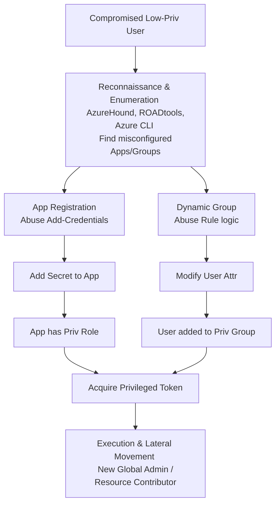

# Azure AD (Entra ID) Privilege Escalation Vectors

## 1. Introduction to Azure Active Directory (Entra ID)

Azure Active Directory (Azure AD), now officially rebranded as Microsoft Entra ID, is Microsoft’s enterprise cloud-based identity and access management (IAM) service. It forms the backbone of security for Azure, Microsoft 365, and thousands of third-party SaaS applications. Unlike traditional on-premises Active Directory Domain Services (AD DS) which relies on protocols like Kerberos and NTLM, Entra ID is built on modern web-based identity protocols including OAuth 2.0, OpenID Connect (OIDC), and SAML.

Privilege escalation in Entra ID rarely looks like traditional on-premises AD escalation (e.g., Kerberoasting or BloodHound-driven ACL abuse, though BloodHound Azure exists). Instead, it involves exploiting misconfigurations in Role-Based Access Control (RBAC), application permissions, dynamic group rules, or identity synchronization mechanisms.

Understanding the difference between Azure AD Roles and Azure Resource Roles is critical:
- **Azure AD Roles**: Control access to identity resources (e.g., Global Administrator, User Administrator, Helpdesk Administrator).
- **Azure Resource Roles**: Control access to Azure resources like Virtual Machines, Storage Accounts, and Key Vaults (e.g., Owner, Contributor, Reader).

Escalating from Resource Roles to AD Roles (and vice versa) forms the core of many advanced attack paths in Azure environments. Attackers constantly seek ways to move horizontally between subscriptions and vertically into directory-level privileges.

## 2. ASCII Architecture & Attack Flow Diagram



## 3. Detailed Attack Vectors

### 3.1. Application Registration and Service Principal Abuse

In Azure AD, when an application needs to interact with Azure resources or the Microsoft Graph API, an **App Registration** is created. This creates an Application Object in the tenant. Simultaneously, a **Service Principal** (Enterprise Application) is instantiated in the tenant to define what the app can actually do.

If a low-privileged user has `Application.ReadWrite.All` or is the assigned "Owner" of an App Registration, they can add new credentials (secrets or certificates) to that application. 

**The Attack:**
1. The attacker enumerates applications they own or can modify.
2. The attacker identifies an application that has been granted high privileges, such as `RoleManagement.ReadWrite.Directory` (which allows assigning Entra ID roles) or `AppRoleAssignment.ReadWrite.All`.
3. The attacker adds a new client secret to the App Registration.
4. The attacker requests an access token as the Service Principal using the newly created secret.
5. The attacker uses this token to grant their own low-privileged user the `Global Administrator` role.

**Commands Example:**
```bash
# Add a new password to the application using Azure CLI
az ad app credential reset --id <application-object-id>

# Output will provide the new password (client secret)
# Use the secret to request a token
curl -X POST -d 'grant_type=client_credentials&client_id=<app-id>&client_secret=<secret>&resource=https://graph.microsoft.com' https://login.microsoftonline.com/<tenant-id>/oauth2/token

# Decode the token locally to verify roles
# Use the token to elevate privileges via MS Graph API
```

### 3.2. Dynamic Group Membership Exploitation

Azure AD supports Dynamic Groups, where users or devices are automatically added or removed based on attributes. For example, a rule might be: `user.department -eq "IT"`.

If an attacker compromises a user who has permissions to modify user attributes (e.g., `User Administrator` or a custom role allowing attribute modification), they can change their own (or another compromised user's) attributes to match the dynamic group's criteria.

**The Attack:**
1. Attacker enumerates dynamic groups and views their membership rules.
2. Attacker identifies a dynamic group that holds a privileged role (e.g., assigned the `Privileged Role Administrator` role).
3. Attacker discovers the rule is `user.jobTitle -eq "Senior Cloud Admin"`.
4. Attacker modifies their compromised user's job title to "Senior Cloud Admin".
5. Azure AD's background process evaluates the rule and adds the user to the privileged group.
6. The attacker now inherits the permissions of the group.

### 3.3. Privilege Escalation via Azure Automation and Logic Apps

Azure Automation Accounts and Logic Apps often run under a Managed Identity or a Run As account. These identities frequently hold highly privileged roles across the subscription to automate tasks (e.g., starting/stopping VMs, rotating keys).

If an attacker has `Contributor` access to a Resource Group containing an Automation Account, they can modify the automation runbook to execute arbitrary code.

**The Attack:**
1. Attacker identifies an Automation Account with a highly privileged System-Assigned Managed Identity.
2. Attacker modifies an existing PowerShell or Python runbook, or creates a new one, injecting a payload that assigns the attacker's account a high-privilege role or dumps secrets.
3. Attacker triggers the runbook.
4. The script executes within the context of the Managed Identity, leveraging its privileges to escalate the attacker's access.

### 3.4. Administrative Units Abuse

Administrative Units (AUs) in Azure AD allow for granular administrative control over a subset of users or groups. If an attacker gains administrative control over an AU, they might be able to add a highly privileged user (like a Global Admin) to that AU and subsequently reset their password or modify their MFA settings, depending on the exact configuration and applied roles within the AU scope.

### 3.5. On-Premises to Cloud Sync Exploitation (Hybrid Identities)

In hybrid setups, Active Directory is synced to Azure AD via Azure AD Connect. If an attacker compromises the on-premises Active Directory, they can often pivot to the cloud. 
- **Pass-the-Hash / Pass-the-PRT**: Extracting Primary Refresh Tokens (PRTs) from compromised Windows devices allows attackers to seamlessly authenticate to Azure AD without needing the plaintext password or fulfilling MFA challenges again.
- **Sync Account Abuse**: The MSOL_ account used for directory synchronization holds vast directory permissions. Compromising the server running Azure AD Connect allows complete control over the synced cloud identities.

## 4. Discovery and Enumeration Tools

Advanced Azure enumeration relies heavily on programmatic interaction with the Azure Resource Manager (ARM) and Microsoft Graph APIs.

- **AzureHound**: The official BloodHound collector for Azure. It maps users, groups, apps, roles, and resources, identifying complex attack paths.
- **ROADtools**: A robust framework designed to authenticate to Azure AD, dump directory information, and map out the environment. ROADrecon, a component of ROADtools, provides a local web GUI to explore the extracted data.
- **MicroBurst**: A collection of PowerShell scripts for Azure security assessment. It includes modules for credential dumping, privilege escalation, and lateral movement.
- **Stormspotter**: An Azure Red Team tool for graphing and analyzing the attack surface, similar to BloodHound but specifically tailored for Azure.
- **BARK (BloodHound Analytics and Reporting Kit)**: Advanced queries to find hidden identity relationships.

## 5. Defense and Mitigation Strategies

Mitigating these escalation vectors requires a defense-in-depth approach tailored for the cloud:

1. **Principle of Least Privilege (PoLP)**: Strictly limit who can modify App Registrations and Service Principals. Use custom roles instead of broad built-in roles like `Application Administrator`.
2. **Privileged Identity Management (PIM)**: Implement PIM for all privileged roles (both Entra ID and Azure Resource roles). Require MFA, justification, and approval for activation. PIM significantly reduces the standing privileges in the environment.
3. **Monitor Role Assignments**: Set up Azure Monitor alerts for new role assignments, especially to critical roles like `Global Administrator` or `User Access Administrator`.
4. **Audit App Credentials**: Regularly monitor and audit changes to application credentials (secrets and certificates) using Entra ID audit logs. Any unexpected credential addition to an application should trigger a high-severity alert.
5. **Secure Dynamic Groups**: Be cautious when assigning privileged roles to dynamic groups. Monitor changes to user attributes that could trigger unintended group additions.
6. **Conditional Access Policies**: Enforce robust conditional access policies requiring MFA and compliant devices for any administrative actions.
7. **Protect Azure AD Connect**: Treat the Azure AD Connect server as a Tier 0 asset. Restrict access strictly and monitor the MSOL account for anomalous activity.

## 6. Real-World Case Study Example

In a notable incident, attackers compromised a developer's account that held the `Application Administrator` role. This role allowed the attacker to add a new client secret to a dormant Service Principal associated with a legacy application. Unbeknownst to the security team, this legacy Service Principal retained `Directory.ReadWrite.All` permissions. The attacker used the new secret to authenticate as the Service Principal, reset the passwords of several Global Administrators, and effectively took over the entire tenant, subsequently exfiltrating sensitive data across connected Azure subscriptions. 

This case highlights how stale applications and excessive standing privileges combine to form devastating attack paths.

## 7. Deep Dive: Inspecting API Permissions via MS Graph

To programmatically identify applications with dangerous permissions, an attacker or auditor can use Microsoft Graph API. The following is an example of querying Service Principals and expanding their app role assignments:

```http
GET https://graph.microsoft.com/v1.0/servicePrincipals?$expand=appRoleAssignments
Authorization: Bearer <token>
```

By filtering the response, one can identify Service Principals that hold roles like `RoleManagement.ReadWrite.Directory`. This level of continuous auditing is required for mature defensive postures.

## Chaining Opportunities
- After establishing higher privileges, an attacker can pivot to exploiting specific compute instances or PaaS services as seen in `[[02 - Exploiting Azure Managed Identities]]`.
- Escalated privileges often allow for the creation of persistence mechanisms, such as generating long-lived SAS tokens detailed in `[[04 - Azure Blob Storage Public Access and SAS Tokens]]`.

## Related Notes
- `[[02 - Exploiting Azure Managed Identities]]`
- `[[03 - Azure Function Apps and Exposed Secrets]]`
- `[[04 - Azure Blob Storage Public Access and SAS Tokens]]`
- `[[05 - Azure SSRF to IMDS Data Exfiltration]]`
