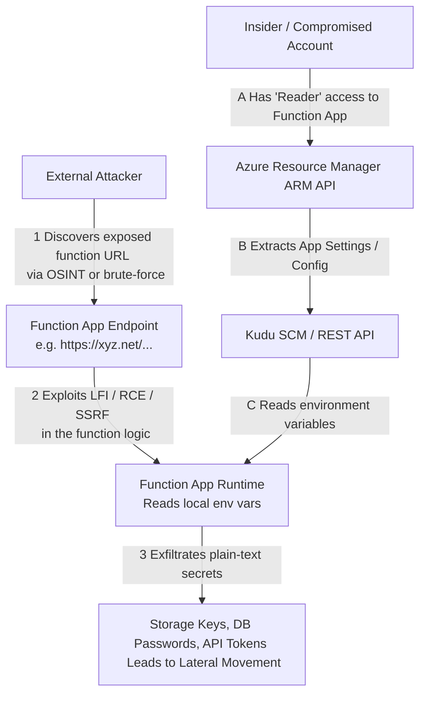

# Azure Function Apps and Exposed Secrets

## 1. Introduction to Azure Function Apps

Azure Functions is a serverless compute service that enables users to run event-triggered code without having to explicitly provision or manage infrastructure. As a Platform as a Service (PaaS) offering, it scales automatically and is highly integrated with other Azure services. Functions can be written in multiple languages including C#, Java, JavaScript, TypeScript, and Python.

While Azure Functions abstract away the underlying operating system and server administration, they introduce specific application security risks. A common and critical vulnerability in serverless environments is the exposure of secrets—API keys, database connection strings, storage account keys, and sometimes even Managed Identity tokens—due to misconfigurations, insecure coding practices, or insufficient access controls. Serverless functions often act as "glue" between different cloud components, meaning they frequently possess highly sensitive credentials.

## 2. ASCII Architecture & Attack Flow Diagram



## 3. Mechanisms of Secret Exposure

Secrets in Azure Functions are typically exposed through a few distinct vectors:

### 3.1. App Settings and Environment Variables
By default, configuration data and secrets for Azure Functions are stored in "App Settings". At runtime, these settings are exposed to the function code as standard environment variables.
- If an attacker gains `Contributor` or `Website Contributor` access via the Azure Portal or ARM API, they can view these settings in plaintext.
- If an attacker discovers an application-level vulnerability (like Local File Inclusion - LFI, or Server-Side Template Injection - SSTI) within the function itself, they can read the environment variables. In Linux-based environments, dumping `/proc/self/environ` or executing `env` will reveal all configured secrets.

### 3.2. Source Code Hardcoding
Despite best practices, developers often hardcode secrets directly into the function code (`run.csx`, `index.js`, `__init__.py`).
- If source code control (like GitHub or Azure DevOps) is compromised or accidentally made public, keys are easily harvested.
- If an attacker can access the Azure Functions backend storage (typically an Azure File Share linked to a Storage Account) where the function source code resides, they can read the raw code files.

### 3.3. Kudu SCM Dashboard
Every Azure Function App has an associated advanced tools management dashboard called Kudu (accessible at `https://<app_name>.scm.azurewebsites.net`). 
If an attacker compromises publishing credentials or has sufficient RBAC permissions, they can log into the Kudu dashboard. Kudu provides a web-based shell, process explorer, and file manager, allowing the attacker to easily dump environment variables, download source code, and inspect configuration files like `local.settings.json`.

Furthermore, Kudu APIs can be invoked directly:
```bash
curl -u <deployment_user>:<password> https://<app_name>.scm.azurewebsites.net/api/settings
```
This returns a JSON blob of all application settings, including secrets.

## 4. Exploitation and Data Exfiltration

When assessing an Azure Function, an attacker's goal is to pivot from the constrained serverless environment to broader Azure resources or external systems.

### Exploiting an RCE Vulnerability
Assume an Azure Function is written in Node.js and contains an `eval()` vulnerability or unsafe deserialization.
An attacker can send a crafted payload to execute shell commands:

```javascript
// Example Node.js payload to dump environment variables
require('child_process').execSync('env > /tmp/env.txt');
```
Once the `env` is exfiltrated, the attacker will typically find:
- `AzureWebJobsStorage`: A connection string to the storage account used by the function.
- `WEBSITE_AUTH_ENCRYPTION_KEY`: Keys used for encryption.
- Application-specific database credentials and API keys.

### The Storage Account Pivot
The `AzureWebJobsStorage` connection string is critical. It contains the primary or secondary key to the Azure Storage account. With this connection string, an attacker can completely compromise the storage account:
```bash
# Using Azure CLI with the stolen connection string
az storage blob list --container-name secrets-container --connection-string "DefaultEndpointsProtocol=https;AccountName=...;AccountKey=..."
```
Because the function's source code is also stored in this storage account, the attacker can download the code, modify it to insert a persistent backdoor, and upload it back, effectively hijacking the Function App indefinitely. This enables stealthy persistence deep within the cloud environment.

### Extracting Function Keys
Functions often require a key (authorization code) to be invoked. If an attacker gains read access to the Azure management plane, they can query the API to list these keys:
```bash
az rest --method post --uri "/subscriptions/<sub-id>/resourceGroups/<rg-name>/providers/Microsoft.Web/sites/<app-name>/functions/<func-name>/listKeys?api-version=2019-08-01"
```

## 5. Defensive Hardening and Best Practices

To secure Azure Function Apps against secret exposure, a combination of architecture design and strict access controls must be implemented:

1. **Use Azure Key Vault**: Never store sensitive secrets directly in App Settings. Instead, store secrets in Azure Key Vault and use **Key Vault References** in the Function App settings. The App Setting value should look like: `@Microsoft.KeyVault(SecretUri=https://myvault.vault.azure.net/secrets/mysecret/)`. This ensures secrets are fetched at runtime and managed centrally.
2. **Implement Managed Identities**: Wherever possible, eliminate secrets entirely. Use System-Assigned or User-Assigned Managed Identities to authenticate to Azure resources (Storage, SQL, Key Vault). The application relies on Entra ID tokens rather than static keys. (See `[[02 - Exploiting Azure Managed Identities]]`).
3. **Restrict Network Access**: Function Apps should not be openly accessible on the internet unless required. Use Azure Private Endpoints to restrict access to the function to specific Virtual Networks (VNet integration). Ensure Kudu SCM is also protected by IP restrictions.
4. **RBAC Hardening**: Limit who has `Contributor` or `Website Contributor` roles. Only authorized deployment pipelines (CI/CD) should have the ability to modify App Settings or push code.
5. **Continuous Code Scanning**: Implement static application security testing (SAST) in CI/CD pipelines to detect hardcoded secrets before they are deployed to Azure. Tools like TruffleHog or GitHub Advanced Security can catch these early.
6. **Function Keys Management**: Azure Functions use specific "Function Keys" or "Host Keys" for authorization. Rotate these keys periodically and never embed them in client-side applications. Treat them with the same severity as passwords.

## Chaining Opportunities
- Compromising `AzureWebJobsStorage` connection strings can lead directly to exploiting blob storage data, related to `[[04 - Azure Blob Storage Public Access and SAS Tokens]]`.
- If the Function App utilizes a Managed Identity, achieving RCE allows the extraction of the identity's token, detailed in `[[02 - Exploiting Azure Managed Identities]]`.

## Related Notes
- `[[01 - Azure AD Privilege Escalation Vectors]]`
- `[[02 - Exploiting Azure Managed Identities]]`
- `[[04 - Azure Blob Storage Public Access and SAS Tokens]]`
