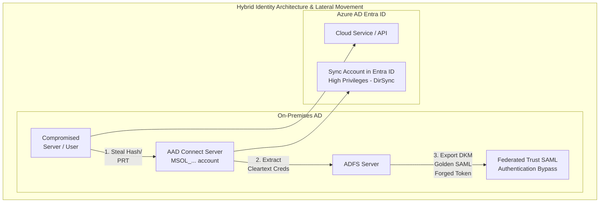

# 14 - Lateral Movement from On-Prem AD to Azure

## Overview

Modern enterprise environments rarely exist purely in the cloud or purely on-premises; they are heavily hybrid. Microsoft Entra ID (Azure AD) is deeply integrated with on-premises Active Directory Domain Services (AD DS) using tools like Azure AD Connect or Entra Cloud Sync. This hybrid identity model bridges the two environments, but it also creates high-value attack paths.

When an attacker compromises the on-premises AD environment, their ultimate goal is often to pivot into the cloud (Azure/Entra ID) to access Office 365 data, cloud infrastructure, or privileged roles. Lateral movement from On-Prem AD to Azure involves abusing synchronization mechanisms, stealing high-privileged sync accounts, or forging authentication tokens via federated trusts (e.g., ADFS).

## Core Concepts & Architectural Background

### Hybrid Identity Models
1. **Password Hash Synchronization (PHS)**: The most common model. Azure AD Connect synchronizes user objects and password hashes (specifically, a hash of the NT hash) from on-prem AD to Entra ID. Authentication happens in the cloud.
2. **Pass-Through Authentication (PTA)**: A lightweight agent on-prem intercepts authentication requests from Entra ID, validates the credentials directly against the on-prem Domain Controllers, and returns the result to the cloud.
3. **Federation (ADFS)**: Entra ID trusts an on-prem Active Directory Federation Services (ADFS) server. When a user authenticates to the cloud, Entra ID redirects them to the on-prem ADFS. ADFS validates the user and issues a SAML token, which the user presents back to Entra ID to gain access.

### Azure AD Connect Sync Accounts
During setup, Azure AD Connect creates two highly privileged accounts:
- **On-Premises Sync Account (`MSOL_xxxxxx`)**: Exists in local AD and has Directory Replication (DirSync) privileges to read passwords.
- **Cloud Sync Account (`Sync_xxxxxx`)**: Exists in Entra ID and holds the `Directory Synchronization Accounts` role, granting it immense power to update user objects, passwords, and group memberships in the cloud.

## ASCII Architecture Diagram: Hybrid Identity Lateral Movement



## Attack Vectors and Execution

### 1. Compromising the Azure AD Connect Server (Pass-the-Sync)
If an attacker gains local administrator access to the on-premises server hosting Azure AD Connect, they can extract the credentials for the Entra ID Cloud Sync Account (`Sync_xxxxxx`).
**The Exploit**: The AD Connect configuration database (LocalDB) stores the credentials for the cloud sync account in an encrypted format. Tools like `AADInternals` can extract the encryption keys from the server registry, decrypt the database, and reveal the plaintext password for the `Sync_` account.
```powershell
Import-Module AADInternals
Get-AADIntSyncCredentials
```
Once the attacker has the `Sync_` account password, they can log directly into Entra ID. Because this account is explicitly designed to synchronize passwords, the attacker can forcefully overwrite the password of any cloud-only Global Administrator, taking full control of the tenant.

### 2. ADFS Golden SAML Attack
In federated environments, the ADFS server signs SAML tokens using a Token-Signing Certificate. The private key for this certificate is stored in AD DS, encrypted using Distributed Key Manager (DKM).
**The Exploit**: If an attacker compromises an on-prem Domain Administrator, they can read the DKM key from the AD container (`CN=ADFS,CN=Microsoft,CN=Program Data...`). With the DKM key, they can export the Token-Signing certificate from the ADFS server.
Using this certificate, the attacker can forge a "Golden SAML" token for *any* user (including cloud Global Admins), bypassing MFA and password checks entirely, and present it to Entra ID for full access.
```powershell
# Using AADInternals to export the ADFS certificate
Export-AADIntADFSCertificate -Server "adfs.contoso.com"
```

### 3. Pass-the-PRT (Primary Refresh Token)
When an on-premises machine is "Hybrid Azure AD Joined," it receives a Primary Refresh Token (PRT) upon user login. This PRT allows seamless single sign-on to cloud resources.
**The Exploit**: An attacker with local admin access to the hybrid-joined workstation can use Mimikatz to dump the PRT from the LSASS process. They can then inject this PRT into their own session (using `roadtx` or `TokenTactics`) to authenticate to Azure resources as the compromised user, bypassing Conditional Access Policies requiring compliant devices.
```bash
mimikatz # sekurlsa::cloudap
```

### 4. Seamless SSO (SSSO) Kerberos Silver Ticket
Seamless SSO uses an on-prem computer account named `AZUREADSSOACC`. The NTLM hash of this account is used to decrypt Kerberos tickets presented by users attempting to log into Entra ID.
**The Exploit**: If an attacker compromises the on-prem AD and extracts the NTLM hash of `AZUREADSSOACC`, they can forge Kerberos Silver Tickets. These forged tickets can be presented to the Entra ID Seamless SSO endpoint to log in as any synced user without needing their password.

## Mitigation and Defense Strategies

### 1. Protect the Tier 0 Assets
- **Isolate AD Connect and ADFS**: Treat the servers hosting Azure AD Connect and ADFS as Tier 0 assets (equivalent to Domain Controllers). Restrict RDP access, apply rigorous endpoint protection, and strictly limit local administrative privileges.
- **Rotate the AZUREADSSOACC Key**: Regularly roll the Kerberos decryption key for the `AZUREADSSOACC` account (Microsoft recommends every 30 days).

### 2. Restrict the Cloud Sync Account
- Ensure that the on-premises `MSOL_` account and the cloud `Sync_` account are excluded from any automated password reset systems and are not used for interactive logons.
- Entra ID should be configured to prevent the `Sync_` account from resetting the passwords of highly privileged cloud roles (Global Admins). Microsoft implements this by default now, but legacy tenants must be audited.

### 3. Detection and Monitoring
- Monitor on-premises AD for unusual reads of the DKM container, which indicates a potential Golden SAML attack in progress.
- Monitor Entra ID audit logs for the `Sync_` account executing actions outside of normal synchronization cycles, especially password resets for admin accounts.
**KQL Query for Suspicious Sync Account Activity:**
```kusto
AuditLogs
| where InitiatedBy.user.userPrincipalName startswith "Sync_"
| where OperationName in ("Reset user password", "Add member to role")
| project TimeGenerated, InitiatedBy.user.userPrincipalName, OperationName, TargetResources[0].userPrincipalName
```

## Chaining Opportunities

- **[[13 - Bypassing Conditional Access Policies CAPs]]**: Extracting a PRT during lateral movement from on-prem to Azure is a direct method to bypass device-compliance CAPs.
- **[[15 - MicroBurst Toolkit and Azure Pentesting Workflows]]**: Once an attacker gains access to Azure via a compromised sync account, they can deploy MicroBurst to automate the discovery of Azure VMs, databases, and key vaults.
- **[[12 - Azure Custom Role Definition Abuse]]**: If the on-prem synchronized user holds a misconfigured custom RBAC role in Azure, the lateral movement grants immediate execution over cloud infrastructure.

## Related Notes

- [[02 - JWT Exploitation and Forgery]]
- [[07 - Privilege Escalation in Cloud Deployments]]
- [[11 - Illicit Consent Grants and OAuth Phishing in Azure]]
- [[22 - Active Directory Domain Dominance Techniques]]
