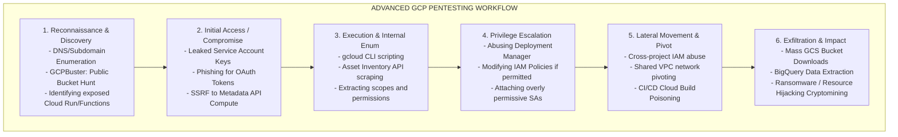

# GCPBuster and GCP Pentesting Workflows

## Introduction to Cloud Pentesting Workflows

Penetration testing in Google Cloud Platform (GCP) differs fundamentally from traditional on-premises network assessments. While you still encounter virtual machines and IP addresses, the primary attack surface shifts from network ports to RESTful APIs, Identity and Access Management (IAM) configurations, and managed services.

To effectively assess a GCP environment, a security professional must utilize a structured, API-driven methodology. This document outlines an advanced workflow for GCP penetration testing, focusing on the utilization of specialized tooling like `GCPBuster` alongside established industry frameworks.

---

## The GCP Pentesting Methodology

A robust GCP assessment follows a distinct lifecycle, optimized for the nuances of cloud environments.



---

## Phase 1: Reconnaissance and Discovery (Enter GCPBuster)

The external reconnaissance phase focuses on identifying assets exposed to the public internet without proper authentication.

### Utilizing GCPBuster

`GCPBuster` (and similar tools like `GCPBucketBrute` or `Cloud_Enum`) are vital for unauthenticated external enumeration. The primary objective is usually identifying misconfigured Google Cloud Storage (GCS) buckets.

Unlike AWS S3, GCP bucket names are globally unique across all Google Cloud customers. If an organization names a bucket `corp-acme-finance-backups`, anyone on the internet can attempt to access it.

**Workflow with GCPBuster:**
1.  **Keyword Generation:** Generate a list of keywords based on the target organization (e.g., `acme`, `acmecorp`, `acme-dev`, `acme-staging`).
2.  **Permutation:** The tool generates permutations (e.g., `acme-backup`, `acme-logs-prod`).
3.  **Resolution:** The tool queries the GCP APIs or DNS (`storage.googleapis.com/bucket-name`) to see if the bucket exists.
4.  **Permission Check:** If a bucket exists, the tool tests for misconfigurations:
    *   `allUsers` -> `roles/storage.objectViewer` (Public read access).
    *   `allAuthenticatedUsers` -> `roles/storage.objectViewer` (Read access to *anyone* with a Google account).
    *   Write permissions (highly dangerous, allows data tampering or hosting malicious payloads).

### Enumerating Serverless Endpoints

Attackers will also search for exposed Cloud Functions and Cloud Run services. These often have predictable URLs based on the Project ID and region:
`https://[SERVICE_NAME]-[PROJECT_HASH]-[REGION].a.run.app`

Finding an exposed serverless endpoint provides a target for application-level attacks (e.g., SQLi, Command Injection), which, if successful, yield execution within the cloud environment and access to the service's attached Service Account metadata.

---

## Phase 2: Initial Access and Metadata Extraction

Once initial access is achieved (e.g., via Server-Side Request Forgery on a web app, or discovering a leaked `.json` key on GitHub), the immediate priority is to understand the identity context.

### The Metadata API Pivot

If execution is achieved on a Compute Engine VM or a Cloud Function, the attacker immediately queries the Metadata server.

```bash
# Extracting the attached Service Account email
curl -H "Metadata-Flavor: Google" http://metadata.google.internal/computeMetadata/v1/instance/service-accounts/default/email

# Extracting the OAuth 2.0 Access Token
curl -H "Metadata-Flavor: Google" http://metadata.google.internal/computeMetadata/v1/instance/service-accounts/default/token
```

This token is the keys to the kingdom. The attacker will export this token to their local machine to utilize specialized scripts.

---

## Phase 3: Internal Enumeration and Execution

With a valid token or Service Account key, the pentester transitions to authenticated API interaction. The goal is to answer: "Who am I?", "What can I do?", and "What else is out there?"

### Scripting the `gcloud` CLI

The `gcloud` CLI is the pentester's primary weapon. However, manual execution is slow. Red teamers utilize custom bash/python scripts to automate discovery.

```bash
# Workflow Script Example: automated_enum.sh

export CLOUDSDK_AUTH_ACCESS_TOKEN="ya29.c.c0AY_VpZ..."
export PROJECT_ID=$(gcloud config get-value project)

echo "[*] Identifying IAM Policies..."
gcloud projects get-iam-policy $PROJECT_ID --format=json > iam_policy.json

echo "[*] Listing Compute Instances..."
gcloud compute instances list --format="table(name,zone,status,serviceAccounts[].email)"

echo "[*] Checking available Secrets..."
gcloud secrets list
```

### Leveraging Specialized Frameworks

Advanced workflows rely on automated assessment tools designed for cloud infrastructure:
*   **ScoutSuite / CloudMapper:** Used to ingest the entire GCP configuration and visually map the attack surface, highlighting overly permissive IAM roles and open firewalls.
*   **GCP-Enum:** A script that aggressively tests thousands of API endpoints to determine the exact permissions attached to the compromised token, bypassing the need for `roles/iam.securityReviewer`.

---

## Phase 4: Privilege Escalation and Lateral Movement

Based on the enumeration data, the pentester attempts to elevate privileges.

*   **Hunting for `iam.serviceAccounts.actAs`:** Does the current token have the ability to attach a more powerful Service Account to a new VM?
*   **Abusing Default Accounts:** Checking if the `cloudservices.gserviceaccount.com` account retains its default `roles/editor` permissions, allowing for Infrastructure-as-Code exploitation.

Once escalated, the focus shifts to lateral movement. The pentester maps Shared VPC architectures and analyzes Organization-level IAM bindings to pivot from the initial point of entry (e.g., a dev sandbox) into highly secured production projects.

---

## Phase 5: Exfiltration and Objective Completion

The final phase demonstrates impact.

1.  **Data Extraction:** Identifying sensitive data within Cloud SQL, BigQuery datasets, or internal GCS buckets.
2.  **Egress Evasion:** Utilizing stealthy exfiltration techniques to bypass VPC Service Controls or IDS/IPS. This might involve creating temporary snapshots and sharing them with external attacker-controlled projects, rather than transferring data directly over the network.
3.  **Persistence:** Creating backdoor Service Accounts, modifying Workspace email routing rules, or injecting malicious configurations into Cloud Build pipelines to ensure long-term access, proving the catastrophic potential of the breach.

---

## Chaining Opportunities
- **[[11 - Attacking Google Workspace and G Suite]]:** Recon workflows often start by analyzing the Workspace configuration to find weak users before attacking the GCP infrastructure.
- **[[14 - Lateral Movement across GCP Projects]]:** The ultimate goal of the internal enumeration phase is to discover the pathways required to execute cross-project lateral movement.

## Related Notes
- [[06 - Cloud Environment Reconnaissance and Enumeration]]
- [[12 - Privilege Escalation via GCP Deployment Manager]]
- [[13 - GCP Cloud Build CI CD Poisoning]]
