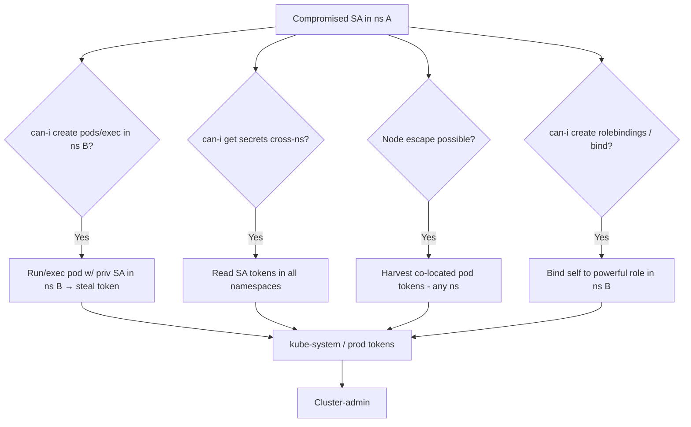

# 11 - Kubernetes Namespace Escalation

## 1. Executive Summary

Namespaces are a **soft** boundary, not a security boundary. An attacker who controls a service account (SA) in namespace A frequently reaches namespace B by abusing RBAC verbs that aren't namespace-scoped in effect, by escaping to the **node** (where tokens of pods from *all* namespaces are mounted), or by abusing cluster-wide resources (PVs, nodes, webhooks, CRDs). The goal: turn "compromised in `dev`" into "tokens/secrets of `kube-system`/`prod`" → cluster-admin.

## 2. Service / Resource Overview & Architecture

A **Namespace** scopes Roles/RoleBindings, SAs, secrets, pods. But **ClusterRoles/ClusterRoleBindings**, **nodes**, **PersistentVolumes**, **admission webhooks**, and the **kubelet** are cluster-wide. Every pod's SA token is a file on the node it runs on (`/var/lib/kubelet/pods/.../volumes/kubernetes.io~projected-token/`). So node access = cross-namespace token access regardless of RBAC.

## 3. Enumeration

```bash
kubectl auth can-i --list -n <ns>                 # what current SA can do
kubectl get rolebindings,clusterrolebindings -A -o wide | grep <sa>
kubectl get sa -A ; kubectl get secrets -A 2>/dev/null
kubectl get pods -A -o wide                        # which namespaces share a node
# from a pod:
cat /var/run/secrets/kubernetes.io/serviceaccount/token
```

## 4. Privilege Escalation / Abuse Vectors

- **`create pods` / `pods/exec` in a target NS** — schedule a pod (or exec into one) bound to a privileged SA in NS B → use that SA's token.
  ```bash
  kubectl run shell -n prod --image=alpine --overrides='{"spec":{"serviceAccountName":"prod-admin"}}' -- sleep 1d
  kubectl exec -n prod shell -- cat /var/run/secrets/kubernetes.io/serviceaccount/token
  ```
- **`secrets get/list` across NS** — if you hold a ClusterRole granting secrets, read SA tokens in every namespace.
- **Escape to node → harvest all tokens** — privileged-pod/hostPath escape (see [[10 - Escaping Privileged Containers Deep Dive]]); on the node, read every co-located pod's projected token (any namespace).
- **`create rolebindings` / `bind` verb** — bind your SA to a powerful Role/ClusterRole in the target NS (or cluster-wide).
- **Cluster-wide resource abuse** — control over nodes, PVs, validating/mutating webhooks ([[12 - Abusing Validating and Mutating Admission Webhooks]]) reaches all namespaces.
- **Shared/mirror pods + `nodes/proxy`** → kubelet on a node hosting target-NS pods → exec / token theft.

## 5. Mermaid Attack Flow



## 6. Persistence
- RoleBinding/ClusterRoleBinding granting your SA standing access across namespaces.
- Backdoor SA + long-lived token secret in a quiet namespace.

## 7. Post-Exploitation / Data Access
- Secrets/tokens of high-value namespaces (kube-system, prod).
- Path to cluster-admin → all workloads + cloud IRSA/pod-identity pivot.

## 8. Defense & Hardening
1. Treat namespaces as soft boundaries — back them with **NetworkPolicies**, **RBAC least-privilege** (no cross-NS secrets/`bind`/`escalate`), and **Pod Security Admission** (block privileged pods that enable node escape).
2. Avoid broad ClusterRoleBindings; scope SAs per-namespace; disable auto-mount of SA tokens where unused (`automountServiceAccountToken: false`).
3. Node isolation (taints/affinity) so sensitive namespaces don't co-locate; audit `create pods`, `exec`, `rolebindings`, `bind`.

## 9. Related Notes
- Node escape: **[[10 - Escaping Privileged Containers Deep Dive]]**, **[[05 - Advanced Docker Breakouts Capabilities and Mounts]]**.
- RBAC: **[[04 - RBAC Exploitation and Privilege Escalation in K8s]]**. Webhook path: **[[12 - Abusing Validating and Mutating Admission Webhooks]]**. Cloud pivot after cluster-admin: **[[10 - EKS Exploitation]]** (A-82).

## 10. Tools
`kubectl`, `kubectl auth can-i`, `kube-hunter`, `rbac-police`, `peirates`, `kubeletctl`.
