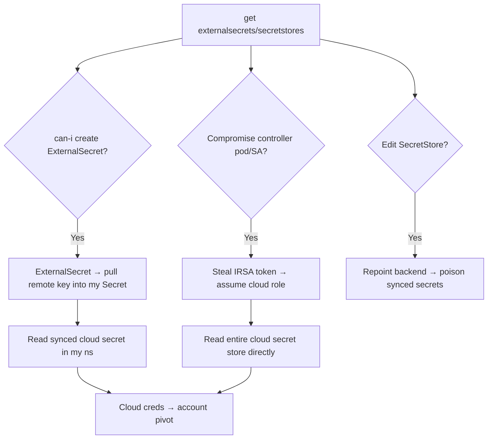

# 13 - External Secrets Operator Exploitation

## 1. Executive Summary

The External Secrets Operator (ESO) syncs secrets from cloud secret stores (AWS Secrets Manager / SSM, GCP Secret Manager, Azure Key Vault, Vault) **into Kubernetes Secrets**. To do that the operator's controller holds **broad, standing credentials** to the cloud secret store (often via IRSA / pod identity) and **cluster-wide write access to create Secrets**. That makes ESO a high-value pivot: compromise the controller (or its SA/IRSA role) and you can read the cloud store directly, and creating a malicious `ExternalSecret`/`SecretStore` can **pull arbitrary cloud secrets into a namespace you control** — a clean bridge from K8s RBAC to cloud IAM.

## 2. Resource Overview & Architecture

CRDs: **`SecretStore`/`ClusterSecretStore`** (defines the backend + auth, e.g. an IRSA-annotated SA) and **`ExternalSecret`** (maps remote keys → a K8s Secret the operator creates/updates). The **controller pod** runs with a SA bound (via IRSA/workload identity) to a cloud role that can read the secret store, and with RBAC to write Secrets across namespaces.

## 3. Enumeration

```bash
kubectl get externalsecrets,secretstores,clustersecretstores -A
kubectl get clustersecretstore <s> -o yaml          # backend + auth (SA/role)
kubectl -n <eso-ns> get sa -o yaml                  # IRSA annotation = cloud role
kubectl -n <eso-ns> get deploy external-secrets -o yaml
kubectl auth can-i create externalsecrets -n <ns>
```

## 4. Privilege Escalation / Abuse Vectors

- **Create a malicious `ExternalSecret`** — if you can create ExternalSecrets in a namespace that references a `ClusterSecretStore`, point it at high-value remote keys → ESO writes them into a Secret you can read:
  ```yaml
  apiVersion: external-secrets.io/v1beta1
  kind: ExternalSecret
  metadata: { name: loot, namespace: attacker }
  spec:
    secretStoreRef: { name: aws-store, kind: ClusterSecretStore }
    target: { name: loot }
    dataFrom: [{ extract: { key: prod/db/master } }]   # pull any key the store role can read
  ```
- **Create/edit a `SecretStore`** with attacker auth or pointed at an attacker-controlled backend (poison synced secrets cluster-wide).
- **Compromise the controller SA → IRSA role** — steal the controller pod's projected token / IMDS-equivalent → assume the cloud role → read the **entire** cloud secret store directly ([[10 - EKS Exploitation]] / [[12 - Secrets Manager Exploitation]] in A-82).
- **Cluster-wide Secret write** — the operator's RBAC (create Secrets in many namespaces) is itself a privesc lever if hijacked.

## 5. Mermaid Attack Flow



## 6. Persistence
- Standing `ExternalSecret` continuously syncing target secrets to a namespace you hold.
- Backdoored `SecretStore` feeding attacker values to workloads.

## 7. Post-Exploitation / Data Access
- Any secret the store role can read (DB creds, API keys) → cloud + app pivot.
- Controller IRSA role = direct, broad cloud secret-store access.

## 8. Defense & Hardening
1. Scope the ESO controller's cloud role to the minimum secret paths (not `secretsmanager:GetSecretValue *`); enforce IMDSv2 / restrict token use.
2. Restrict who can create/edit `ExternalSecret`/`SecretStore`/`ClusterSecretStore` (RBAC + policy engine); prefer namespaced `SecretStore` over `ClusterSecretStore`.
3. Alert on new ExternalSecrets referencing sensitive keys, SecretStore edits, controller-SA token use; least-privilege Secret-write RBAC.

## 9. Related Notes
- Cloud-side stores: **[[12 - Secrets Manager Exploitation]]**, **[[14 - SSM Exploitation]]** (A-82). K8s→cloud pivot: **[[10 - EKS Exploitation]]** (A-82).
- Token theft basis: **[[09 - Secrets Extraction from etcd]]**; RBAC: **[[04 - RBAC Exploitation and Privilege Escalation in K8s]]**.

## 10. Tools
`kubectl`, `awscli` (assume IRSA role), `peirates`, `kube-hunter`.
