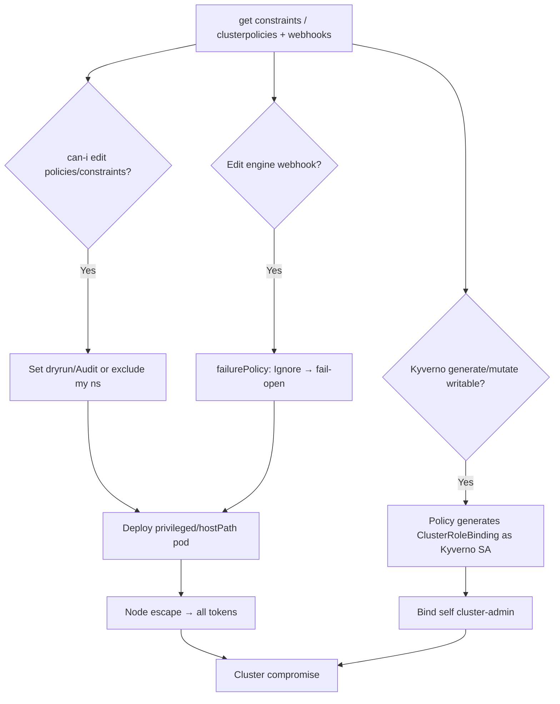

# 14 - Policy Engine Abuse: OPA Gatekeeper and Kyverno

## 1. Executive Summary

OPA Gatekeeper and Kyverno are the admission policy engines that *enforce* the rules stopping privileged pods, hostPath mounts, and untrusted images. They run as **admission webhooks** backed by their own CRDs (constraints / policies). If an attacker can edit those CRDs, scope an **exception**, or weaken the engine's webhook, the guardrails silently disappear cluster-wide — then deploy the privileged/hostPath pod that escapes to the node. Worse: **Kyverno's `generate`/`mutate` policies run with the Kyverno controller's powerful SA**, so a crafted policy can create/modify resources (RBAC, Secrets) **as the controller** — direct privesc. This complements [[20 - Admission Controller Bypass]] (evasion) and [[12 - Abusing Validating and Mutating Admission Webhooks]] (the webhook layer).

## 2. Resource Overview & Architecture

**Gatekeeper**: `ConstraintTemplates` (Rego logic) + `Constraints` (instances with `match`/`enforcementAction`), enforced via `gatekeeper-validating-webhook-configuration`. **Kyverno**: `ClusterPolicy`/`Policy` (validate/mutate/generate rules, `validationFailureAction: Enforce|Audit`), enforced via `kyverno-resource-validating-webhook-cfg` (+ mutating). Both run controllers with broad SAs; Kyverno's generate/mutate acts using its own ServiceAccount.

## 3. Enumeration

```bash
# Gatekeeper
kubectl get constrainttemplates ; kubectl get constraints -A
kubectl get constraint <kind> <name> -o yaml          # match, enforcementAction
# Kyverno
kubectl get clusterpolicy,policy -A
kubectl get clusterpolicy <p> -o jsonpath='{.spec.validationFailureAction}'
# webhooks + controller SA
kubectl get validatingwebhookconfigurations | grep -E 'gatekeeper|kyverno'
kubectl -n kyverno get sa kyverno -o yaml ; kubectl auth can-i update clusterpolicies
```

## 4. Privilege Escalation / Abuse Vectors

- **Disable enforcement** — set Gatekeeper `enforcementAction: dryrun` / delete the Constraint, or flip Kyverno `validationFailureAction: Audit`, then deploy the otherwise-blocked privileged/hostPath pod → node escape ([[10 - Escaping Privileged Containers Deep Dive]]).
- **Carve an exception** — edit a Constraint's `match.excludedNamespaces` (or Kyverno `exclude`) to add your namespace → policies no longer apply to you.
- **Weaken the engine webhook** — `failurePolicy: Ignore` / narrow `rules` on the engine's webhook config → fail-open admission ([[12 - Abusing Validating and Mutating Admission Webhooks]]).
- **Kyverno `generate`/`mutate` as controller SA (privesc)** — author a policy whose generate rule creates a **ClusterRoleBinding** or Secret; Kyverno applies it with *its* SA, which can often create RBAC → bind yourself cluster-admin.
  ```yaml
  # generate rule produces a ClusterRoleBinding granting attacker cluster-admin
  spec: { rules: [{ name: x, generate: { kind: ClusterRoleBinding, ... } }] }
  ```
- **ConstraintTemplate Rego tamper** — edit the Rego so the policy always passes (looks enforced, isn't).
- **Delete/scale the controller** — remove enforcement entirely (`failurePolicy: Ignore` makes this fail-open) — DoS/evasion; report, don't run on prod.

## 5. Mermaid Attack Flow



## 6. Persistence
- Standing namespace exception / `dryrun` constraint so your workloads are never checked.
- Kyverno generate policy that re-creates a backdoor ClusterRoleBinding if removed.

## 7. Post-Exploitation / Data Access
- Guardrails off → privileged pods → node escape → cluster-admin + cloud pivot.
- Kyverno-SA resource creation = direct RBAC privesc.

## 8. Defense & Hardening
1. Lock RBAC on `constrainttemplates`/`constraints` (Gatekeeper) and `clusterpolicies`/`policies` (Kyverno) + the engine webhook configs to a tiny admin set.
2. Scope the Kyverno controller SA tightly (no `clusterrolebindings`/RBAC create via generate); prefer `Enforce` + `failurePolicy: Fail`; protect `excludedNamespaces`.
3. Monitor policy/constraint edits, enforcementAction/validationFailureAction changes, controller scaling, and generate-rule targets (RBAC/Secrets). Run a backup detective control (audit/Falco) independent of the admission engine.

## 9. Related Notes
- Evasion: **[[20 - Admission Controller Bypass]]** (I-38). Webhook layer: **[[12 - Abusing Validating and Mutating Admission Webhooks]]**.
- Payoff: **[[10 - Escaping Privileged Containers Deep Dive]]**, **[[15 - Pod Security — Privileged Pods]]** (I-38). RBAC: **[[04 - RBAC Exploitation and Privilege Escalation in K8s]]**.

## 10. Tools
`kubectl`, `gator` (Gatekeeper), `kyverno` CLI, `rbac-police`, `peirates`, `kube-hunter`.
