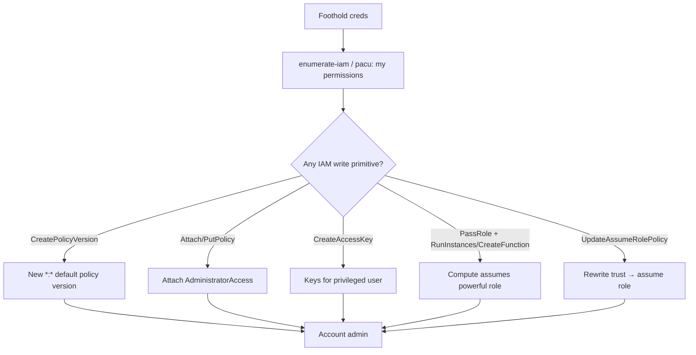

# 01 - AWS IAM Exploitation

## 1. Executive Summary

IAM (Identity and Access Management) is the control plane of an AWS account — every other service trusts it. For an attacker, a foothold with *almost any* IAM write permission is usually a path to **account takeover** via a privilege-escalation primitive: rewrite your own policy, create access keys for a more-privileged user, set a login profile, or `PassRole` a powerful role into a compute service. Enumerating exactly which IAM actions your principal holds (and where the over-permissive policies are) is the first move in any AWS engagement.

## 2. Service Overview & Architecture

IAM has **users** (long-term creds: access keys / password), **groups**, **roles** (assumable identities with trust policies), and **policies** (JSON allow/deny on `service:Action` + resource + conditions). Roles are assumed via STS (see [[02 - STS Exploitation]]). Privilege escalation almost always reduces to: *I have permission X that lets me grant myself permission Y.* IAM is global (not regional).

## 3. Enumeration

```bash
aws sts get-caller-identity                      # who am I
aws iam get-account-authorization-details        # full dump (if allowed) — users/roles/policies
aws iam list-attached-user-policies --user-name <u>
aws iam list-user-policies --user-name <u>
aws iam simulate-principal-policy --policy-source-arn <arn> --action-names iam:CreatePolicyVersion
# Automated: enumerate your own perms
# pacu> run iam__enum_permissions ; enumerate-iam --access-key ... --secret-key ...
```

## 4. Privilege Escalation Vectors

Each of these single permissions (often + `iam:PassRole`) is a known escalation:

- **`iam:CreatePolicyVersion` / `iam:SetDefaultPolicyVersion`** — push a new `*:*` version of a policy attached to you.
- **`iam:AttachUserPolicy` / `AttachGroupPolicy` / `AttachRolePolicy`** — attach `AdministratorAccess`.
- **`iam:PutUserPolicy` / `PutGroupPolicy` / `PutRolePolicy`** — inline an admin policy.
- **`iam:CreateAccessKey`** (on another user) — mint keys for a privileged user.
- **`iam:CreateLoginProfile` / `UpdateLoginProfile`** — set/replace console password of a privileged user.
- **`iam:AddUserToGroup`** — join an admin group.
- **`iam:UpdateAssumeRolePolicy`** (+`sts:AssumeRole`) — rewrite a role's trust to allow yourself, then assume it.
- **`iam:PassRole` + service create** (ec2/lambda/glue/cloudformation/…) — hand a powerful role to compute you control → act as that role.
- **`iam:CreateServiceSpecificCredential` / `ResetServiceSpecificCredential`** — alt creds for CodeCommit etc.
- **MFA tampering** (`DeactivateMFADevice`,`CreateVirtualMFADevice`) — weaken a target account.

```bash
# Example: CreatePolicyVersion → admin
aws iam create-policy-version --policy-arn <attached-policy> \
  --policy-document file://admin.json --set-as-default   # admin.json = Allow *:* on *
```

## 5. Mermaid Attack Flow



## 6. Persistence
- New access keys on a benign-looking user; second access key on an existing user.
- Backdoor role trust (`UpdateAssumeRolePolicy`) trusting an external/attacker account.
- Inline policy hidden on a low-profile role.

## 7. Post-Exploitation / Data Access
- Admin → enumerate and loot every service (S3, Secrets Manager, RDS snapshots, etc.).
- `get-account-authorization-details` maps all trust relationships for lateral movement.

## 8. Detection & Hardening
1. Least privilege; deny `iam:*` write to non-admins; use permission boundaries + SCPs.
2. Alert (CloudTrail/GuardDuty) on `CreatePolicyVersion`, `AttachUserPolicy`, `CreateAccessKey`, `UpdateAssumeRolePolicy`, `CreateLoginProfile`.
3. Require MFA; rotate keys; remove unused users/keys; restrict `iam:PassRole` with conditions.

## 9. Chaining / Related Notes
- Deep technique writeup: **[[01 - AWS IAM Privilege Escalation Advanced Vectors]]** (A-62), **[[12 - AWS IAM Privilege Escalation]]** (I-37).
- Role assumption mechanics: **[[02 - STS Exploitation]]**.
- PassRole targets: **[[04 - EC2 Exploitation]]**, **[[05 - Lambda Exploitation]]**.

## 10. Tools
`aws cli`, `pacu` (iam__* modules), `enumerate-iam`, `ScoutSuite`, `cloudsplaining`, PMapper.
