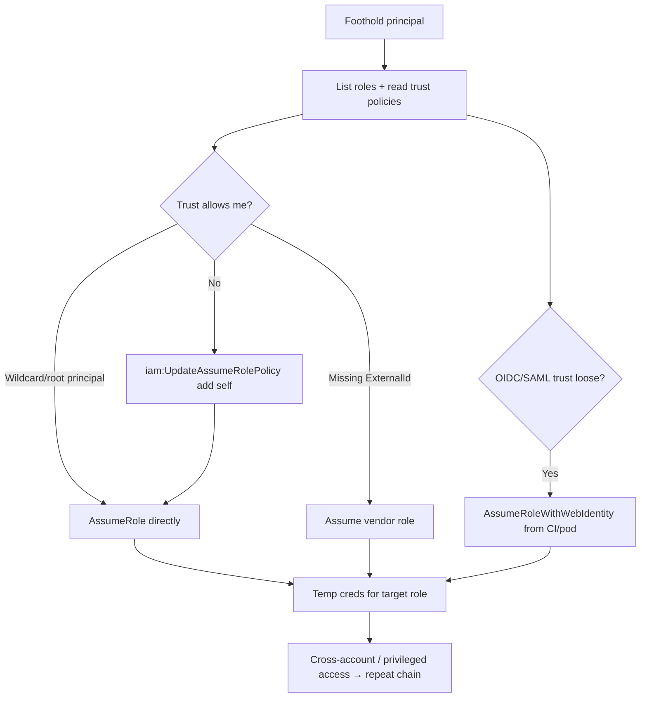

# 02 - AWS STS Exploitation

## 1. Executive Summary

STS (Security Token Service) issues the **temporary credentials** behind every role assumption in AWS. Offensively it's the engine of **lateral movement and cross-account pivoting**: `sts:AssumeRole` lets you become any role whose trust policy allows you, and over-broad trust policies (wildcards, missing `ExternalId`, `Principal: *`) are a top finding. STS is also how you **escalate** after IAM tricks (assume a role you just made trustable) and how you **enumerate** what you can reach (`get-caller-identity`, role-trust analysis).

## 2. Service Overview & Architecture

A **role** has a *trust policy* (who may assume it) and *permission policies* (what it can do). `AssumeRole` returns short-lived AccessKey/Secret/SessionToken. Cross-account access works when account B's role trusts account A's principal. `AssumeRoleWithWebIdentity` / `WithSAML` bridge OIDC/SAML (incl. **IRSA** in EKS and GitHub OIDC). Misconfigured trust = confused-deputy / unauthorized assumption.

## 3. Enumeration

```bash
aws sts get-caller-identity
# Find roles + read their trust policies
aws iam list-roles --query 'Roles[].[RoleName,AssumeRolePolicyDocument]'
# Try assuming
aws sts assume-role --role-arn arn:aws:iam::<acct>:role/<role> --role-session-name x
```

## 4. Privilege Escalation / Abuse Vectors

- **Over-permissive trust** — `Principal: "*"` or `arn:aws:iam::*:root`, or trust without `Condition`/`ExternalId` → assume from your account.
- **Self-grant then assume** — with `iam:UpdateAssumeRolePolicy`, rewrite a powerful role's trust to include you, then `AssumeRole` (see [[01 - IAM Exploitation]]).
- **Role-chaining** — hop role→role across accounts to reach the target; chained sessions reset the 1-hour max but work.
- **Confused-deputy / missing ExternalId** — third-party vendor roles without `sts:ExternalId` condition can be assumed by anyone who guesses the role ARN.
- **Web identity abuse** — misconfigured OIDC trust (`token.actions.githubusercontent.com`, EKS OIDC) with loose `sub`/`aud` conditions → assume from attacker-controlled CI/pod.

```bash
aws sts assume-role --role-arn <vendor-role> --role-session-name x --external-id <guessed>
```

## 5. Mermaid Attack Flow



## 6. Persistence
- Backdoor a role's trust to include an attacker-owned account (durable cross-account access).
- Long sessions / role-chaining for ongoing access without new keys.

## 7. Post-Exploitation / Data Access
- Each assumed role unlocks its service permissions — pivot S3/Secrets/RDS in the target account.
- Map the full role graph (PMapper) to find shortest path to admin.

## 8. Detection & Hardening
1. Lock trust policies to specific principals; require `ExternalId` for third-party roles; tight OIDC `sub`/`aud` conditions.
2. Alert on `AssumeRole` from unexpected accounts / `UpdateAssumeRolePolicy`.
3. Use SCPs to restrict cross-account assumption; short session durations; condition on source IP/VPC.

## 9. Chaining / Related Notes
- Cross-account deep dive: **[[14 - Cross-Account Trust Abuse and AssumeRole Chaining]]** (A-62).
- Grant-then-assume: **[[01 - IAM Exploitation]]**.
- EKS IRSA path: **[[10 - EKS Exploitation]]**.

## 10. Tools
`aws cli` (sts/iam), `pacu`, PMapper, `ScoutSuite`, `cloudmapper`.
