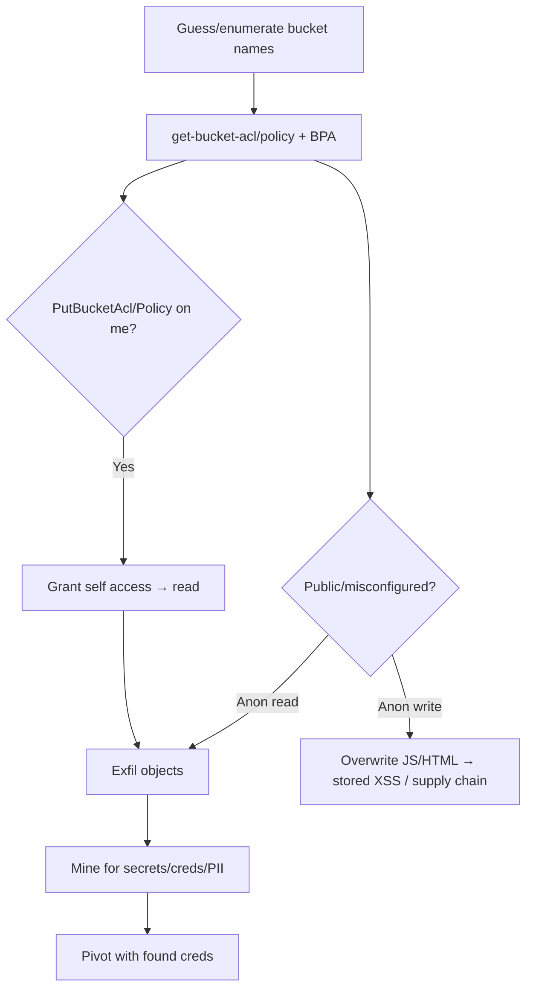

# 03 - AWS S3 Exploitation

## 1. Executive Summary

S3 (Simple Storage Service) is AWS's object store and the single most common source of cloud data breaches. Attacks: **public/misconfigured buckets** (anonymous read or *write*), **ACL/policy abuse** to grant yourself access, reading data you shouldn't, and using **write access for impact** (overwrite static sites/JS for stored XSS or supply-chain, plant Lambda triggers, or "ransomware" via SSE-C re-encryption). Bucket names are global and guessable, so unauthenticated discovery is trivial.

## 2. Service Overview & Architecture

Data lives in **buckets** (global namespace) → **objects**. Access is governed by **bucket policies**, **ACLs** (legacy, per-object/bucket grantees incl. `AllUsers`/`AuthenticatedUsers`), **Block Public Access** settings, and IAM. Misconfig surface: ACL grants to `AllUsers`, permissive bucket policy, BPA disabled, or `s3:PutBucketAcl`/`PutBucketPolicy` letting a low-priv principal open the bucket up.

## 3. Enumeration

```bash
aws s3 ls                                        # your buckets
aws s3 ls s3://<bucket> --recursive --no-sign-request   # anonymous
aws s3api get-bucket-acl --bucket <bucket>
aws s3api get-bucket-policy --bucket <bucket>
aws s3api get-public-access-block --bucket <bucket>
# Unauth discovery
# s3scanner / cloud_enum / take guesses: <company>-backups, -logs, -dev
```

## 4. Privilege Escalation / Abuse Vectors

- **Anonymous/Authenticated read** — `s3:GetObject` via `AllUsers`/`AuthenticatedUsers` ACL → exfil.
- **Anonymous write** — `s3:PutObject` open → overwrite hosted JS/HTML (stored XSS / supply chain), upload payloads.
- **`s3:PutBucketAcl` / `PutBucketPolicy`** — grant yourself full access to a bucket you couldn't read.
- **`s3:PutBucketNotification`** — wire bucket events to a Lambda/SNS you control.
- **`s3:GetBucketCORS`/`PutBucketCORS`** — relax CORS to enable browser-based theft.
- **Ransomware pattern** — with write+delete, re-encrypt objects with SSE-C (attacker key) or delete versions (report; destructive — don't run on prod).

```bash
aws s3api put-bucket-acl --bucket <bucket> --grant-full-control id=<your-canonical-id>
```

## 5. Mermaid Attack Flow



## 6. Persistence
- `PutBucketNotification` → attacker Lambda on object events.
- Backdoor objects (web shells in served buckets); keep a hidden access grant.

## 7. Post-Exploitation / Data Access
- Buckets hold backups, source, env files, Terraform state (with secrets), DB dumps, logs.
- Grep exfil for keys/tokens; Terraform state often leaks credentials.

## 8. Detection & Hardening
1. Enable **Block Public Access** account-wide; disable ACLs (bucket owner enforced).
2. Least-privilege bucket policies; deny `s3:PutBucketAcl/PutBucketPolicy` broadly; enable versioning + MFA-delete.
3. CloudTrail data events + GuardDuty S3 protection; alert on policy/ACL changes and mass GET/DELETE.

## 9. Chaining / Related Notes
- Deep dive: **[[03 - S3 Bucket Misconfigurations and Ransomware]]** (A-62), **[[02 - AWS S3 — Public Access, ACL Misconfiguration]]** (I-37).
- Recon: **[[02 - Discovering Exposed Cloud Storage S3 Scanner]]** (B-75), **[[32 - Cloud Storage Mining]]** (I-37).

## 10. Tools
`aws s3/s3api`, `s3scanner`, `cloud_enum`, `s3-account-search`, `ScoutSuite`.
