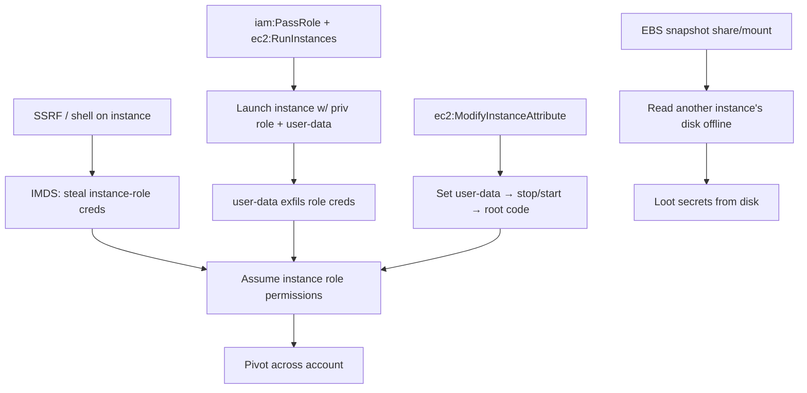

# 04 - AWS EC2 Exploitation

## 1. Executive Summary

EC2 is AWS compute (VMs), and it's a privilege-escalation and credential-theft hotspot. Top vectors: **IMDS credential theft** (SSRF or shell on an instance → steal the instance-role creds from `169.254.169.254`), **`iam:PassRole` + `ec2:RunInstances`** (launch an instance with a powerful role and read its creds), **EBS snapshot abuse** (share/mount a volume snapshot to read another instance's disk offline), and **user-data injection** (code that runs at boot as root). It spans EBS, ELB, SSM, VPC, and VPN.

## 2. Service Overview & Architecture

Instances run with an optional **instance profile** (an IAM role); the role's temp creds are served by **IMDS** at `169.254.169.254` (v1 = no token; v2 = PUT-token required). **EBS** = block volumes + snapshots; **SSM** = agent-based remote command (see [[14 - SSM Exploitation]]); **VPC** = networking. Boot-time **user data** executes as root. PassRole governs which roles you may attach to compute.

## 3. Enumeration

```bash
aws ec2 describe-instances --query 'Reservations[].Instances[].[InstanceId,IamInstanceProfile,State.Name]'
aws ec2 describe-iam-instance-profile-associations
aws ec2 describe-snapshots --owner-ids self
aws ec2 describe-security-groups
# On a box / via SSRF:
TOKEN=$(curl -s -X PUT http://169.254.169.254/latest/api/token -H 'X-aws-ec2-metadata-token-ttl-seconds: 60')
curl -s -H "X-aws-ec2-metadata-token: $TOKEN" http://169.254.169.254/latest/meta-data/iam/security-credentials/
```

## 4. Privilege Escalation / Abuse Vectors

- **IMDS creds** — SSRF or RCE on the instance → pull role creds (IMDSv1 trivial; v2 needs the token header but still reachable from the host/SSRF that can set headers).
- **`iam:PassRole` + `ec2:RunInstances`** — launch an instance with a high-priv profile + user-data that exfils its creds.
- **`ec2:ReplaceIamInstanceProfileAssociation` / `AssociateIamInstanceProfile`** — swap a more-privileged profile onto an instance you control.
- **`ec2:ModifyInstanceAttribute` (user-data)** — set user-data then stop/start → code runs as root with the instance role.
- **EBS snapshot exposure** — `ec2:CreateSnapshot`/`ModifySnapshotAttribute` to share a snapshot to your account → mount → read disks/secrets.
- **`ec2:CreateKeyPair` + replace / serial console** (`EnableSerialConsoleAccess`) — gain shell access.

```bash
aws ec2 run-instances --image-id <ami> --iam-instance-profile Name=<privrole> \
  --user-data file://exfil.sh --instance-type t3.micro
```

## 5. Mermaid Attack Flow



## 6. Persistence
- New key pair / authorized_keys; user-data backdoor that re-runs at boot.
- `ec2:ReplaceRootVolume` persistence; leave a privileged instance running.

## 7. Post-Exploitation / Data Access
- Instance role creds → S3/Secrets/RDS in the account.
- Snapshots/volumes → offline credential & data theft; security-group review for further reachable hosts.

## 8. Detection & Hardening
1. **Enforce IMDSv2** (`HttpTokens=required`), hop-limit 1; this blunts SSRF cred theft.
2. Restrict `iam:PassRole` with conditions; least-privilege instance profiles.
3. Alert on `RunInstances` with profile, `ModifySnapshotAttribute` (public/cross-account share), user-data changes; encrypt EBS/snapshots.

## 9. Chaining / Related Notes
- IMDS/SSRF deep dive: **[[02 - AWS SSRF to Metadata and IMDSv2 Bypass]]** (A-62), **[[03 - AWS EC2 — Metadata Service (IMDS) Exploitation]]** (I-37).
- User-data: **[[13 - EC2 User Data and Startup Script Injection]]** (A-62). SSM: **[[14 - SSM Exploitation]]**.

## 10. Tools
`aws ec2`, `pacu` (ec2__* / ebs), `ScoutSuite`, `dsnap` (snapshot dump), curl (IMDS).
