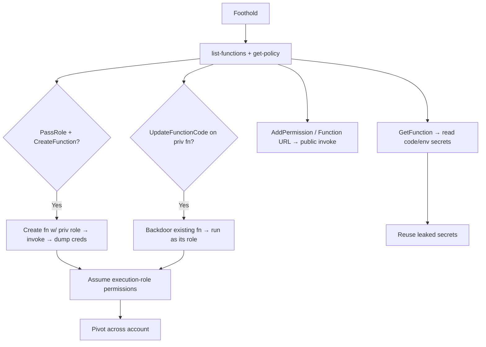

# 05 - AWS Lambda Exploitation

## 1. Executive Summary

Lambda runs serverless functions, each with an **execution role**. Attack value: **`iam:PassRole` + `lambda:CreateFunction` + `lambda:InvokeFunction`** lets you run arbitrary code under a powerful role (instant privesc); editing existing functions (`UpdateFunctionCode`) hijacks their role and logic; **Function URLs / resource-policy (`AddPermission`)** can expose a function publicly or to your account; and the **runtime environment leaks credentials** (the role creds are in env vars / available to the code). Layers and event-source mappings add stealthy persistence.

## 2. Service Overview & Architecture

A function has code + an **execution role** (its permissions) + triggers (API GW, S3, EventBridge, SQS, Function URL). At runtime the execution-role creds are exposed via env vars (`AWS_ACCESS_KEY_ID`, `AWS_SESSION_TOKEN`) — any code you run in the function *is* that role. Resource policies (`AddPermission`) say who can invoke. Layers are shared code pulled into the runtime.

## 3. Enumeration

```bash
aws lambda list-functions --query 'Functions[].[FunctionName,Role,Runtime]'
aws lambda get-function --function-name <fn>          # code location + config
aws lambda get-policy --function-name <fn>            # resource policy (who can invoke)
aws lambda list-layers
aws lambda get-function-url-config --function-name <fn>
```

## 4. Privilege Escalation / Abuse Vectors

- **`iam:PassRole` + `lambda:CreateFunction` + `lambda:Invoke...`** — create a function with a high-priv role; code dumps/uses its creds → privesc.
- **`lambda:UpdateFunctionCode`** — overwrite an existing privileged function's code → run as its role on next invoke.
- **`lambda:UpdateFunctionConfiguration`** — change env/handler/role wiring.
- **`lambda:AddPermission` / `CreateFunctionUrlConfig`** — grant invoke to your account or make a public Function URL (unauth trigger).
- **`lambda:CreateEventSourceMapping`** — trigger a function off a stream/queue you can write.
- **`lambda:GetFunction`** — download code (often hardcoded secrets) and read env vars.

```bash
aws lambda create-function --function-name pwn --runtime python3.12 \
  --role arn:aws:iam::<acct>:role/<privrole> --handler i.h --zip-file fileb://f.zip
aws lambda invoke --function-name pwn out.json    # code prints/exfils $AWS_SESSION_TOKEN
```

## 5. Mermaid Attack Flow



## 6. Persistence
- Add a malicious **layer** to many functions; hidden Function URL; event-source mapping as a trigger.
- Backdoored function code that re-exfils creds on each invoke.

## 7. Post-Exploitation / Data Access
- Execution-role creds → downstream services (DynamoDB, S3, Secrets).
- Function code/env routinely contain API keys, DB creds, tokens.

## 8. Detection & Hardening
1. Restrict `iam:PassRole` (conditions on which roles); least-privilege execution roles.
2. Alert on `CreateFunction`/`UpdateFunctionCode`/`AddPermission`/`CreateFunctionUrlConfig`; code-sign functions.
3. No secrets in env/code (use Secrets Manager); review resource policies + Function URLs.

## 9. Chaining / Related Notes
- Deep dive: **[[04 - Exploiting AWS Lambda and Serverless Functions]]** (A-62), **[[04 - AWS Lambda — Privilege Escalation, Event Injection]]** (I-37).
- PassRole source: **[[01 - IAM Exploitation]]**. Triggers: **[[15 - API Gateway Exploitation]]**.

## 10. Tools
`aws lambda`, `pacu` (lambda__*), `ScoutSuite`, Cloudsplaining.
