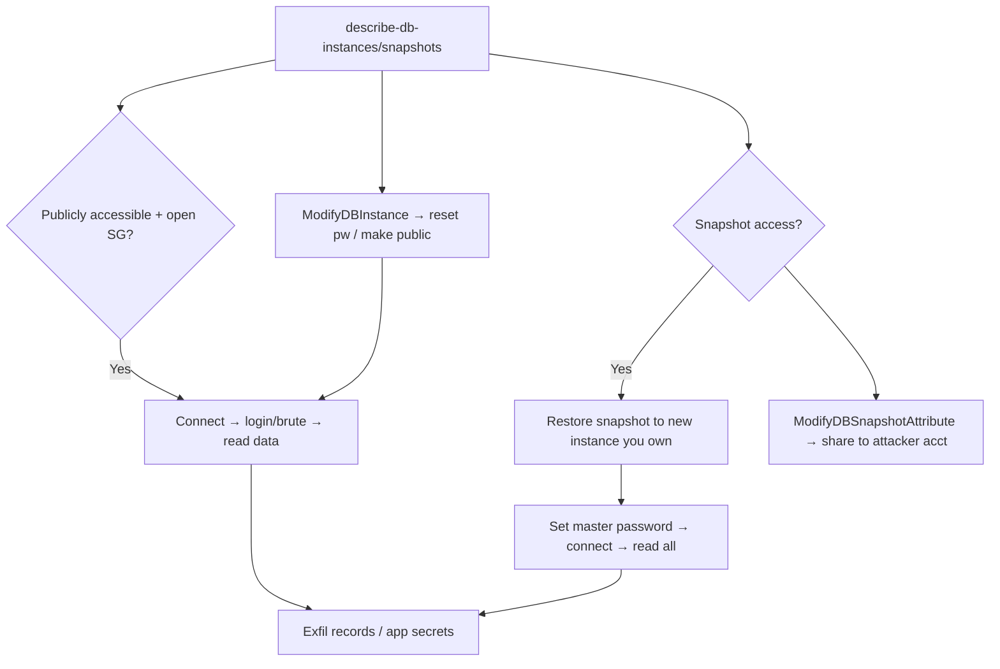

# 06 - AWS RDS Exploitation

## 1. Executive Summary

RDS is AWS managed relational databases (MySQL, Postgres, Aurora, etc.). The signature attacks: **publicly-exposed instances** (public IP + open security group → connect and brute/login), **snapshot abuse** (restore or share a DB snapshot to your account → spin up a copy you fully control → read all data), **`rds:ModifyDBInstance`** to reset the master password or make an instance public, and **snapshot sharing** as exfiltration. The data is the prize — RDS holds the application's crown-jewel records.

## 2. Service Overview & Architecture

A **DB instance** sits in a VPC with a **security group** and optional **public accessibility**. **Snapshots** (manual/automated) are point-in-time copies that can be **restored** to a new instance or **shared** with other accounts (`ModifyDBSnapshotAttribute`). Master credentials gate SQL access; **IAM database authentication** is an alternative. Aurora adds cluster snapshots.

## 3. Enumeration

```bash
aws rds describe-db-instances --query 'DBInstances[].[DBInstanceIdentifier,Engine,PubliclyAccessible,Endpoint.Address]'
aws rds describe-db-snapshots --query 'DBSnapshots[].[DBSnapshotIdentifier,Status]'
aws rds describe-db-snapshot-attributes --db-snapshot-identifier <snap>   # shared with whom
aws rds describe-db-security-groups
```

## 4. Privilege Escalation / Abuse Vectors

- **Public + open SG** — connect directly; brute/login or use leaked creds → full DB read.
- **Snapshot restore** — `rds:RestoreDBInstanceFromDBSnapshot` to a new instance you control (set your own master password) → read everything.
- **`rds:ModifyDBSnapshotAttribute`** — share a snapshot to an attacker account (cross-account exfil).
- **`rds:ModifyDBInstance`** — reset master password, or set `--publicly-accessible` + modify SG → expose then connect.
- **`rds:CreateDBSnapshot` + share** — snapshot a private DB then exfil via share.

```bash
aws rds restore-db-instance-from-db-snapshot \
  --db-instance-identifier pwn --db-snapshot-identifier <snap> --publicly-accessible
aws rds modify-db-instance --db-instance-identifier pwn \
  --master-user-password 'NewPass123!' --apply-immediately
```

## 5. Mermaid Attack Flow



## 6. Persistence
- Keep a restored copy; create an extra snapshot shared to attacker account.
- Add a DB user inside the engine for ongoing SQL access.

## 7. Post-Exploitation / Data Access
- All application data (PII, financial, secrets); app DBs often store API keys / hashed creds → crack & reuse.
- Pivot from DB-stored credentials to other services.

## 8. Detection & Hardening
1. Never set `PubliclyAccessible`; tight SGs; private subnets only.
2. Restrict `rds:Modify*`, `RestoreDBInstanceFromDBSnapshot`, `ModifyDBSnapshotAttribute`; deny cross-account snapshot sharing.
3. Encrypt instances/snapshots (KMS); IAM DB auth + Secrets Manager; alert on restore/share/modify events.

## 9. Chaining / Related Notes
- Deep dive: **[[07 - AWS RDS Database Snapshots and Public Exposure]]** (A-62), **[[08 - AWS RDS — Publicly Exposed Databases]]** (I-37).
- Cracked DB creds → reuse; snapshot access often via **[[01 - IAM Exploitation]]** perms.

## 10. Tools
`aws rds`, `pacu` (rds__*), `mysql`/`psql` clients, `ScoutSuite`.
