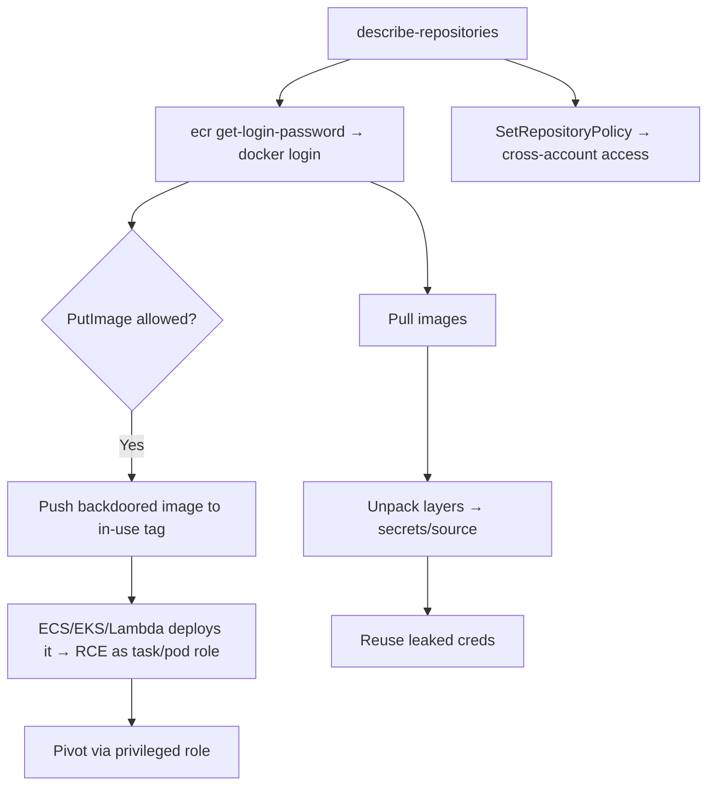

# 08 - AWS ECR Exploitation

## 1. Executive Summary

ECR (Elastic Container Registry) stores Docker/OCI images that ECS/EKS/Lambda pull and run. Two themes: **pull & mine images for secrets** (Dockerfiles, env, baked-in creds, source) with `ecr:GetAuthorizationToken` + `BatchGetImage`, and **image poisoning / supply-chain** with `ecr:PutImage` — push a backdoored image to an existing tag so the next deployment runs your code (often with a privileged task/pod role). Registry/repository policies (`PutRegistryPolicy`/`SetRepositoryPolicy`) can be abused to grant cross-account access.

## 2. Service Overview & Architecture

A **registry** (per account/region) holds **repositories** → tagged **images** (layers). Access = IAM + repository/registry resource policies. `GetAuthorizationToken` yields a docker-login token; layers are pulled/pushed via the Docker protocol. **Pull-through cache rules** mirror upstream registries. Images frequently embed secrets and are trusted implicitly by orchestrators.

## 3. Enumeration

```bash
aws ecr describe-repositories
aws ecr list-images --repository-name <repo>
aws ecr get-repository-policy --repository-name <repo>
aws ecr get-registry-policy
aws ecr get-login-password | docker login --username AWS --password-stdin <acct>.dkr.ecr.<region>.amazonaws.com
```

## 4. Privilege Escalation / Abuse Vectors

- **Pull & mine** — `GetAuthorizationToken` + `BatchGetImage`/`GetDownloadUrlForLayer`: pull images, unpack layers, grep for secrets/source.
- **Image poisoning** — `ecr:PutImage` + layer upload: overwrite an in-use tag with a backdoored image → executes on next ECS/EKS/Lambda deploy (supply chain; can land in a privileged role).
- **Repository/registry policy abuse** — `SetRepositoryPolicy`/`PutRegistryPolicy`: grant pull/push to an attacker account.
- **Pull-through cache abuse** — `CreatePullThroughCacheRule` to influence what images get cached/served.

```bash
docker pull <acct>.dkr.ecr.<region>.amazonaws.com/<repo>:tag
docker tag evil <acct>.dkr.ecr.<region>.amazonaws.com/<repo>:tag && docker push ...
```

## 5. Mermaid Attack Flow



## 6. Persistence
- Backdoored base image / poisoned tag re-deployed on every rollout.
- Cross-account repo policy grant for ongoing pull/push.

## 7. Post-Exploitation / Data Access
- Layer secrets → DB/cloud creds; source disclosure → more vulns.
- Poisoned image lands in ECS/EKS with that workload's IAM role.

## 8. Detection & Hardening
1. Enable image scanning + **tag immutability**; sign images; least-privilege repo policies.
2. No secrets in images; alert on `PutImage`, `SetRepositoryPolicy`, `PutRegistryPolicy`.
3. Restrict pull-through cache; private endpoints only.

## 9. Chaining / Related Notes
- Generic registry mining: **[[29 - Container Registry Attacks]]** (I-37), **[[15 - Container Registry Enumeration]]** (B-75).
- Poisoned image runs on **[[09 - ECS Exploitation]]** / **[[10 - EKS Exploitation]]**.

## 10. Tools
`aws ecr`, `docker`, `dive`/`trufflehog` (layer mining), `pacu`.
