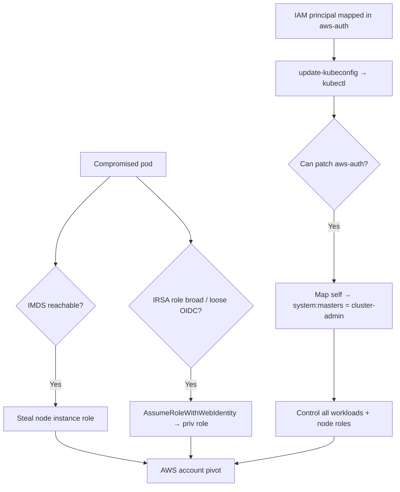

# 10 - AWS EKS Exploitation

## 1. Executive Summary

EKS is managed Kubernetes on AWS — it fuses two privilege models (Kubernetes RBAC + AWS IAM), and the bridge is where it breaks. Classic chain: **pod → node → IAM** — a compromised pod reaches the node's **IMDS** to steal the node instance role, or abuses **IRSA** (pods assuming IAM roles via OIDC) with loose trust. On the AWS side, `eks:AccessKubernetesApi` / the **`aws-auth` ConfigMap** map IAM principals to Kubernetes groups (incl. `system:masters`), so editing it = cluster-admin. `eks:UpdateClusterConfig`/public endpoint exposure widens reach.

## 2. Service Overview & Architecture

The EKS control plane authenticates IAM identities and maps them to K8s RBAC via the **`aws-auth` ConfigMap** (or EKS access entries). Worker nodes run with an **instance role**; pods get creds via **IRSA** (ServiceAccount annotated with a role, assumed through the cluster OIDC provider) or fall back to the node role via IMDS. Misconfigs: pods able to reach IMDS, over-broad IRSA trust, `aws-auth` mapping low-priv IAM to `system:masters`, public API endpoint.

## 3. Enumeration

```bash
aws eks list-clusters
aws eks describe-cluster --name <c> --query 'cluster.[endpoint,resourcesVpcConfig.endpointPublicAccess]'
aws eks update-kubeconfig --name <c>          # if IAM mapped
kubectl auth can-i --list
kubectl get configmap aws-auth -n kube-system -o yaml
# In a pod:
curl http://169.254.169.254/latest/meta-data/iam/security-credentials/   # node role (if IMDS reachable)
```

## 4. Privilege Escalation / Abuse Vectors

- **Pod → node IMDS** — pod with network access to `169.254.169.254` steals the **node instance role** (often broad).
- **IRSA abuse** — over-permissive ServiceAccount role, or loose OIDC trust (`sub`/`aud`) lets you assume a powerful role from a pod (see [[02 - STS Exploitation]]).
- **`aws-auth` edit** — with K8s perms to patch the ConfigMap (or `eks` access-entry APIs), map your IAM user to `system:masters` → cluster-admin.
- **Public endpoint + leaked kubeconfig/token** — reach the API directly.
- **Pod escape → node → all pods' creds** — privileged pod / hostPath → node → harvest every workload's tokens.

```bash
kubectl patch configmap aws-auth -n kube-system --type merge -p '<map your ARN to system:masters>'
```

## 5. Mermaid Attack Flow



## 6. Persistence
- Add an IAM principal to `aws-auth`/access entries as admin; deploy a backdoor DaemonSet.
- Backdoored IRSA ServiceAccount; malicious admission webhook.

## 7. Post-Exploitation / Data Access
- Cluster-admin → all secrets/configmaps, every pod's IRSA + node roles.
- Node role / IRSA → AWS account (S3, Secrets, etc.).

## 8. Detection & Hardening
1. **Block pod→IMDS** (hop-limit 1 / restrict; use IRSA or Pod Identity, not node role).
2. Tight IRSA trust (exact `sub`); least-privilege; lock down `aws-auth`/access entries; private API endpoint.
3. NetworkPolicies, no privileged/hostPath pods, audit logging + GuardDuty EKS protection.

## 9. Chaining / Related Notes
- Deep dive: **[[08 - EKS Cluster Takeover from Pod to Node to IAM]]** (A-62), **[[31 - Kubernetes on Cloud — EKS, GKE, AKS]]** (I-37).
- Generic K8s: the **I-38 Container and Kubernetes Security** module. Web-identity: **[[02 - STS Exploitation]]**.

## 10. Tools
`aws eks`, `kubectl`, `pacu`, `peirates`, `kube-hunter`, `ScoutSuite`.
