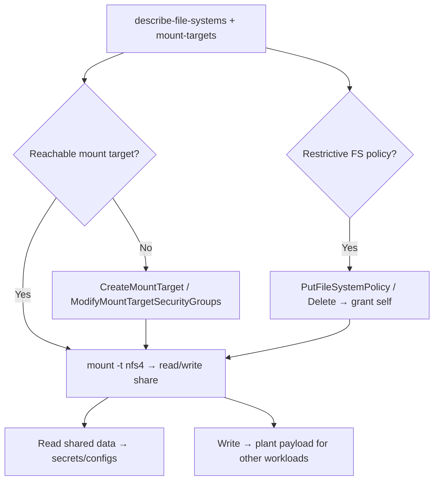

# 11 - AWS EFS Exploitation

## 1. Executive Summary

EFS (Elastic File System) is managed NFS shared across instances/containers. Attacks are about **reaching and mounting the filesystem** to read/write shared data: a permissive **file-system policy** or default no-policy (which allows any client that can network-reach a mount target) lets you mount it; `elasticfilesystem:ClientRootAccess`/`ClientWrite` grant root-level write; and `CreateMountTarget`/`ModifyMountTargetSecurityGroups` can expose the share to a subnet/SG you control. Shared app data, configs, and secrets live here.

## 2. Service Overview & Architecture

A **file system** is exposed via **mount targets** (one per AZ, each in a subnet with a security group). Access control = network reachability (SG/subnet) + optional **file system policy** (IAM, e.g. `ClientMount`/`ClientWrite`/`ClientRootAccess`) + POSIX permissions. With no policy, any host that can reach the mount target on NFS (2049) can mount it.

## 3. Enumeration

```bash
aws efs describe-file-systems
aws efs describe-mount-targets --file-system-id <fs>
aws efs describe-mount-target-security-groups --mount-target-id <mt>
aws efs describe-file-system-policy --file-system-id <fs>
```

## 4. Privilege Escalation / Abuse Vectors

- **Mount from a reachable host** — if you control an instance in the mount target's subnet/SG (or open the SG), mount over NFS and read/write shared data:
  ```bash
  sudo mount -t nfs4 -o nfsvers=4.1 <fs-id>.efs.<region>.amazonaws.com:/ /mnt/efs
  ```
- **`elasticfilesystem:ClientRootAccess` / `ClientWrite`** — root-level write to the share → tamper files / plant payloads consumed by other workloads.
- **`elasticfilesystem:CreateMountTarget`** — create a mount target in a subnet you control → reach the data.
- **`ModifyMountTargetSecurityGroups`** — loosen the SG to allow your access.
- **`PutFileSystemPolicy` / `DeleteFileSystemPolicy`** — grant yourself access or remove a restrictive policy.

## 5. Mermaid Attack Flow



## 6. Persistence
- Plant scripts/configs other workloads execute (shared mount = lateral execution).
- Keep a permissive file-system policy / mount target.

## 7. Post-Exploitation / Data Access
- Shared application data, configs, credentials, code.
- Write access → influence every consumer of the share.

## 8. Detection & Hardening
1. Attach a restrictive **file system policy** (deny by default; require TLS/IAM); least-privilege client actions.
2. Tight mount-target SGs/subnets; encrypt at rest/in transit; enforce POSIX permissions.
3. Alert on `PutFileSystemPolicy`, `CreateMountTarget`, `ModifyMountTargetSecurityGroups`.

## 9. Chaining / Related Notes
- Same NFS-mount data-theft pattern as on-prem **[[25 - NFS (Port 2049) Pentesting]]** (Network module).
- Reachability often needs an instance: **[[04 - EC2 Exploitation]]**.

## 10. Tools
`aws efs`, `mount.nfs4`, `pacu`, `ScoutSuite`.
