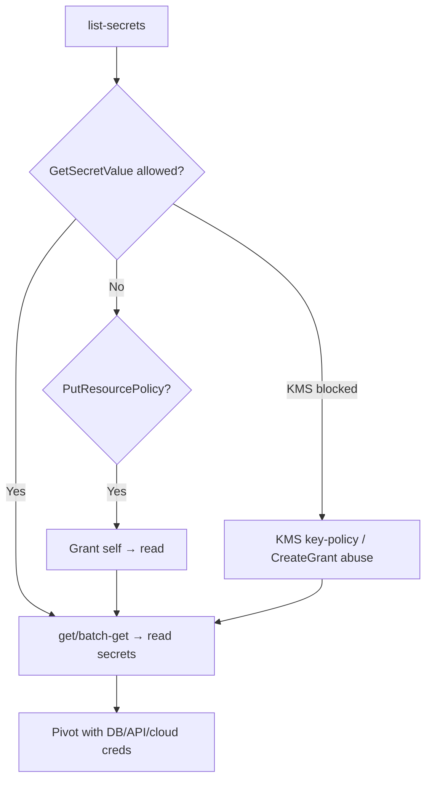

# 12 - AWS Secrets Manager Exploitation

## 1. Executive Summary

Secrets Manager stores secrets (DB creds, API keys, tokens) — by definition the highest-value loot in an account. With `secretsmanager:GetSecretValue`/`BatchGetSecretValue` you simply **read every secret you can access**, then pivot using those credentials. Resource policies (`PutResourcePolicy`) can be abused to grant yourself or another account access; KMS decrypt rights are required and sometimes the weak link. It's a pure IAM-gated API — no network exposure — so over-broad read perms = mass credential theft.

## 2. Service Overview & Architecture

Each **secret** is KMS-encrypted and gated by IAM + an optional **resource policy**. Reading requires `secretsmanager:GetSecretValue` **and** `kms:Decrypt` on the encrypting key. `ListSecrets`/`BatchGetSecretValue` enable bulk discovery/retrieval. Rotation Lambdas hold elevated access too.

## 3. Enumeration

```bash
aws secretsmanager list-secrets --query 'SecretList[].[Name,ARN]'
aws secretsmanager get-secret-value --secret-id <name>
aws secretsmanager batch-get-secret-value --secret-id-list <a> <b>   # bulk
aws secretsmanager get-resource-policy --secret-id <name>
```

## 4. Privilege Escalation / Abuse Vectors

- **`GetSecretValue` / `BatchGetSecretValue`** — read secrets directly → pivot with the creds inside (DB, third-party APIs, other AWS).
- **`ListSecrets` + loop** — enumerate then mass-exfil everything readable.
- **`PutResourcePolicy`** — attach a policy granting your principal / an attacker account access to a secret you couldn't read.
- **KMS angle** — if you lack `kms:Decrypt`, pursue KMS key-policy abuse (see [[13 - KMS Exploitation]]) or a `CreateGrant`.
- **Rotation Lambda** — its execution role can read the secret; compromise the function (see [[05 - Lambda Exploitation]]).

```bash
aws secretsmanager put-resource-policy --secret-id <name> \
  --resource-policy '{"Version":"2012-10-17","Statement":[{"Effect":"Allow","Principal":{"AWS":"<you>"},"Action":"secretsmanager:GetSecretValue","Resource":"*"}]}'
```

## 5. Mermaid Attack Flow



## 6. Persistence
- Resource policy granting an attacker account ongoing read.
- Compromise/backdoor the rotation Lambda to capture rotated secrets.

## 7. Post-Exploitation / Data Access
- Direct credentials to databases, SaaS APIs, and other AWS principals.
- Often the fastest path from low-priv foothold to broad compromise.

## 8. Detection & Hardening
1. Least-privilege: scope `GetSecretValue` to specific secret ARNs; restrict `kms:Decrypt` to the right principals.
2. Resource policies that deny by default; alert on `GetSecretValue` spikes, `BatchGetSecretValue`, `PutResourcePolicy`.
3. Rotate secrets; use VPC endpoints; monitor rotation-Lambda changes.

## 9. Chaining / Related Notes
- Deep dive: **[[10 - SecretsManager and Parameter Store Data Exfiltration]]** (A-62), **[[06 - AWS SecretsManager Parameter Store — Misconfigured Access]]** (I-37).
- Parameter Store cousin: **[[14 - SSM Exploitation]]**. KMS: **[[13 - KMS Exploitation]]**.

## 10. Tools
`aws secretsmanager`, `pacu` (secrets), `ScoutSuite`, `cloudsplaining`.
