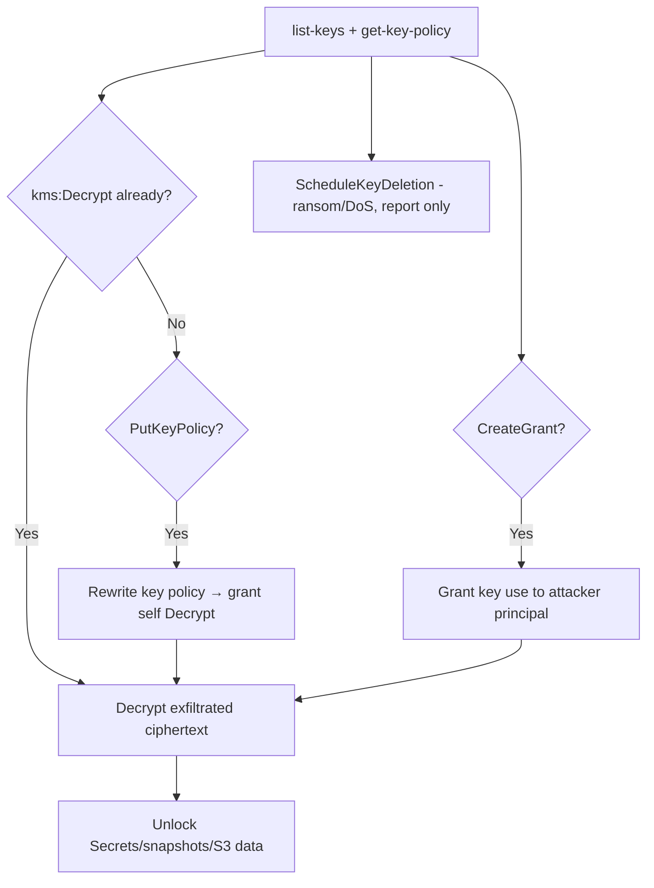

# 13 - AWS KMS Exploitation

## 1. Executive Summary

KMS (Key Management Service) holds the keys that encrypt S3 objects, EBS/RDS volumes, Secrets Manager, etc. Control of a key = control of the data it protects. Privesc/abuse: **`kms:PutKeyPolicy`** rewrites a key's policy to grant you `Decrypt`; **`kms:CreateGrant`** delegates key use to a principal you control; with `kms:Decrypt` you decrypt ciphertext you've exfiltrated; and destructive options (`ScheduleKeyDeletion`, `DisableKey`) are a denial/ransom vector. KMS is often the missing permission gating Secrets Manager / encrypted-snapshot reads.

## 2. Service Overview & Architecture

A **CMK** (customer master key) has a **key policy** (the primary access control — independent of IAM) plus optional **grants** (temporary, programmatic delegations of specific key operations). Services do envelope encryption: data keys are wrapped by the CMK. To read encrypted data you need `kms:Decrypt` (and access to the ciphertext). The key policy can stand alone, so editing it bypasses IAM expectations.

## 3. Enumeration

```bash
aws kms list-keys
aws kms list-aliases
aws kms get-key-policy --key-id <id> --policy-name default
aws kms describe-key --key-id <id>
aws kms list-grants --key-id <id>
```

## 4. Privilege Escalation / Abuse Vectors

- **`kms:PutKeyPolicy`** — overwrite the key policy to grant your principal `Decrypt`/`*` → unlock all data under that key (incl. Secrets Manager, snapshots).
- **`kms:CreateGrant`** — issue a grant letting an attacker principal use the key (`Decrypt`, `GenerateDataKey`) — stealthier than a policy edit.
- **`kms:Decrypt` / `ReEncrypt`** — decrypt exfiltrated ciphertext (encrypted backups, params, objects).
- **`kms:ReplicateKey`** — multi-region replica that may broaden access.
- **Destructive** — `ScheduleKeyDeletion` / `DisableKey` → make data unrecoverable (ransom/DoS; report, don't run on prod).

```bash
aws kms put-key-policy --key-id <id> --policy-name default --policy file://grant-self.json
aws kms create-grant --key-id <id> --grantee-principal <you> --operations Decrypt
```

## 5. Mermaid Attack Flow



## 6. Persistence
- Long-lived grant to an attacker principal (survives policy reviews more easily than edits).
- Key policy backdoor statement.

## 7. Post-Exploitation / Data Access
- Decrypt anything wrapped by the key: Secrets Manager values, encrypted EBS/RDS snapshots, S3 objects, Parameter Store SecureStrings.
- KMS is the pivot that turns "I have the ciphertext" into "I have the data."

## 8. Detection & Hardening
1. Tight key policies (deny `PutKeyPolicy`/`CreateGrant` to non-admins); separate key admins from users.
2. Alert on `PutKeyPolicy`, `CreateGrant`, `ScheduleKeyDeletion`, unusual `Decrypt` volume.
3. Enable key rotation; use grants with constraints; multi-Region only where needed.

## 9. Chaining / Related Notes
- Unlocks **[[12 - Secrets Manager Exploitation]]** and encrypted snapshots in **[[04 - EC2 Exploitation]]** / **[[06 - RDS Exploitation]]**.
- Param SecureStrings: **[[14 - SSM Exploitation]]**.

## 10. Tools
`aws kms`, `pacu`, `ScoutSuite`, `cloudsplaining`.
