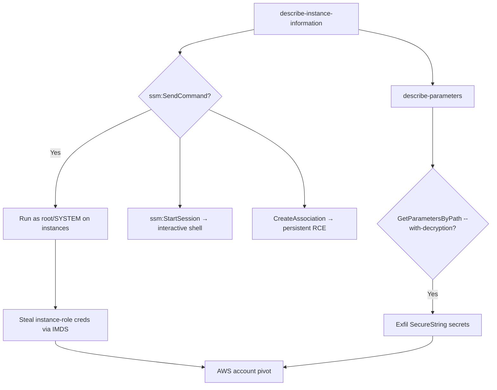

# 14 - AWS Systems Manager (SSM) Exploitation

## 1. Executive Summary

SSM (Systems Manager) manages EC2/on-prem fleets via an agent — and it's a direct **RCE-on-instances** primitive: `ssm:SendCommand` (or `StartSession`) runs arbitrary commands as **root/SYSTEM** on every managed instance, no SSH needed. Separately, **Parameter Store** holds config and SecureString secrets — `ssm:GetParameter(s)`/`GetParametersByPath` exfiltrates them (SecureStrings need `kms:Decrypt`). Together SSM gives both fleet-wide command execution and secret theft, often from a modest IAM permission set.

## 2. Service Overview & Architecture

The **SSM agent** on managed instances polls SSM; `SendCommand` pushes documents (scripts) that run as root/SYSTEM; `StartSession` opens an interactive Session Manager shell. **Parameter Store** is a hierarchical config/secret store (String / SecureString). Both are IAM-gated APIs reachable without touching the instance network directly.

## 3. Enumeration

```bash
aws ssm describe-instance-information          # managed instances
aws ssm list-documents
aws ssm describe-parameters
aws ssm get-parameters-by-path --path / --recursive --with-decryption   # dump params/secrets
```

## 4. Privilege Escalation / Abuse Vectors

- **`ssm:SendCommand`** — run commands as root/SYSTEM on managed instances → RCE, steal that instance's role creds (IMDS), pivot.
- **`ssm:StartSession`** — interactive shell on an instance (Session Manager).
- **`ssm:CreateAssociation`** — schedule a document to run on targets (persistent RCE).
- **`ssm:GetParameter(s)` / `GetParametersByPath --with-decryption`** — exfil config + SecureString secrets (DB creds, tokens).
- **`ssm:PutParameter`** — tamper config other systems consume (logic/supply-chain).

```bash
aws ssm send-command --document-name AWS-RunShellScript \
  --targets Key=instanceids,Values=<id> \
  --parameters 'commands=["id; curl http://169.254.169.254/latest/meta-data/iam/security-credentials/"]'
```

## 5. Mermaid Attack Flow



## 6. Persistence
- `CreateAssociation` re-running a malicious document on a schedule.
- Backdoor parameters; leave a Session Manager foothold.

## 7. Post-Exploitation / Data Access
- Root/SYSTEM on fleet → local secrets + instance role creds → broad pivot.
- Parameter Store SecureStrings → DB/API creds.

## 8. Detection & Hardening
1. Tightly restrict `ssm:SendCommand`/`StartSession`/`CreateAssociation` (it's RCE); scope by tags/instances.
2. Restrict `GetParameter*` + `kms:Decrypt`; least-privilege; VPC endpoints.
3. Enable Session Manager logging; alert on `SendCommand`, bulk parameter reads, new associations.

## 9. Chaining / Related Notes
- Deep dive: **[[11 - AWS Systems Manager SSM Run Command Abuse]]** (A-62).
- IMDS cred theft after RCE: **[[04 - EC2 Exploitation]]**. Secrets cousin: **[[12 - Secrets Manager Exploitation]]**; decrypt: **[[13 - KMS Exploitation]]**.

## 10. Tools
`aws ssm`, `pacu` (ssm), `ScoutSuite`.
