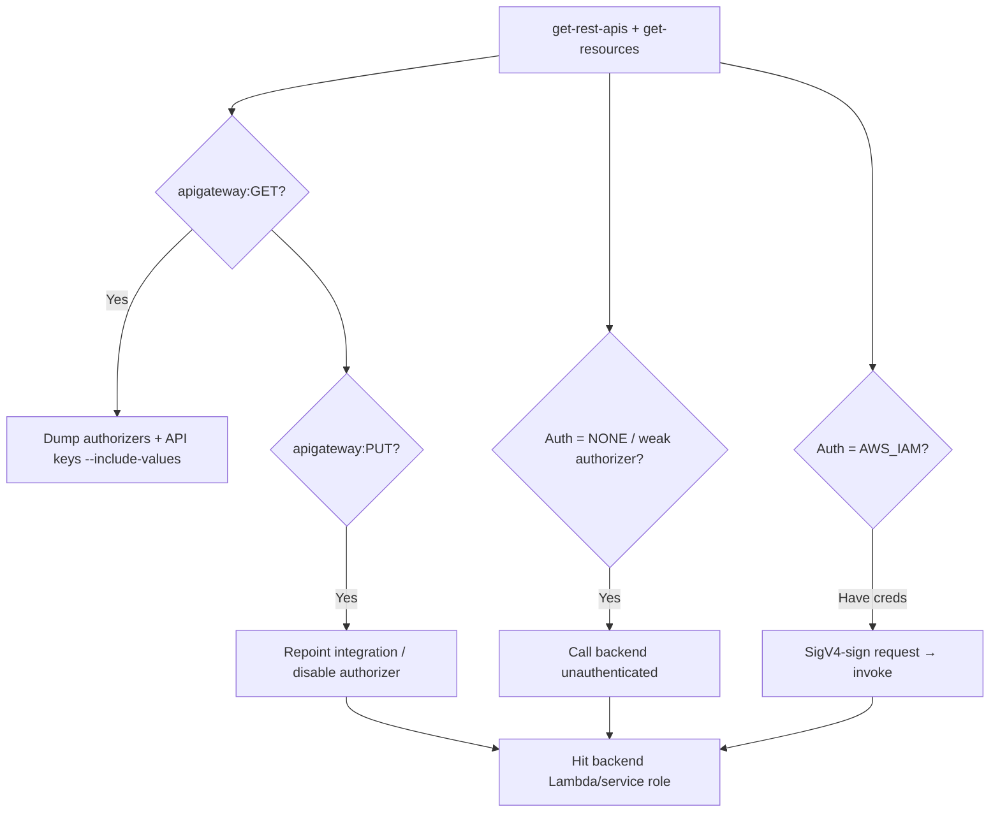

# 15 - AWS API Gateway Exploitation

## 1. Executive Summary

API Gateway fronts Lambda/HTTP/AWS-service backends. Attacks target **auth bypass** (missing/weak authorizers, IAM-auth endpoints reachable with stolen SigV4 creds), **hidden stages/methods** discovered by enumeration, and **backend abuse** — an integration with a permissive execution role or `apigateway:GET` over the config leaks API keys, authorizers, and integration secrets. Private APIs reachable from inside a VPC widen the surface.

## 2. Service Overview & Architecture

A **REST/HTTP API** has resources → methods → integrations (Lambda proxy, HTTP, AWS service). **Stages** (`dev`/`prod`) deploy the API; **authorizers** (IAM SigV4, Cognito, Lambda) gate methods; **API keys** + usage plans throttle. `AWS_IAM` auth means any principal with `execute-api:Invoke` (or valid SigV4) can call it.

## 3. Enumeration

```bash
aws apigateway get-rest-apis
aws apigateway get-resources --rest-api-id <id>
aws apigateway get-stages --rest-api-id <id>
aws apigateway get-authorizers --rest-api-id <id>
aws apigateway get-api-keys --include-values
aws apigatewayv2 get-apis           # HTTP/WebSocket APIs
```
Invoke URL: `https://<id>.execute-api.<region>.amazonaws.com/<stage>/<resource>`

## 4. Privilege Escalation / Abuse Vectors

- **`apigateway:GET`** — read full API config: authorizers, integration request/headers, **API keys with `--include-values`**, model/mapping secrets.
- **IAM-auth endpoints** — with stolen account creds, sign requests (SigV4) and call `AWS_IAM`-protected methods directly.
- **Missing/weak authorizer** — methods set to `NONE` auth, or Lambda authorizers with logic flaws → unauthenticated backend access.
- **`apigateway:PUT/POST/PATCH`** — modify integration to point at attacker backend, disable authorizer, or add a method that invokes a sensitive Lambda.
- **Backend role pivot** — the integrated Lambda/service runs with its own role; abuse via [[05 - Lambda Exploitation]].

```bash
# Sign + call an AWS_IAM method with current creds
awscurl --service execute-api -X GET \
  "https://<id>.execute-api.<region>.amazonaws.com/prod/admin"
```

## 5. Mermaid Attack Flow



## 6. Persistence
- Add a hidden method/resource + deploy a new stage as a backdoor invoke path.
- Create an API key / usage plan you control.

## 7. Post-Exploitation / Data Access
- Leaked API keys + backend data via integrations.
- Pivot to integrated Lambda/DynamoDB/service roles.

## 8. Detection & Hardening
1. Enforce authorizers on every method; prefer IAM/Cognito; least-privilege `execute-api:Invoke`.
2. Restrict `apigateway:GET/PUT`; never embed secrets in mapping templates; rotate API keys.
3. Enable access logging + WAF; alert on new stages/methods/authorizer changes.

## 9. Chaining / Related Notes
- Backend: **[[05 - Lambda Exploitation]]**. Auth backend: **[[16 - Cognito Exploitation]]**.
- SigV4 from stolen creds: **[[01 - IAM Exploitation]]** / **[[02 - STS Exploitation]]**.

## 10. Tools
`aws apigateway`, `awscurl`, `pacu`, `ScoutSuite`.
