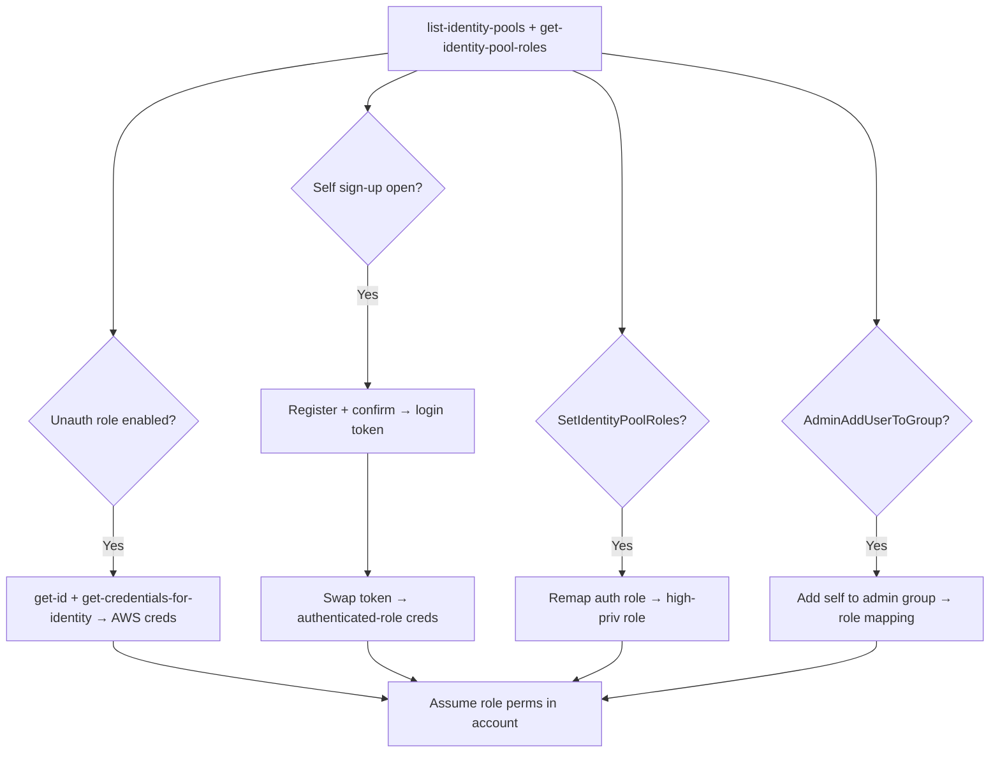

# 16 - AWS Cognito Exploitation

## 1. Executive Summary

Cognito is AWS's auth service — and a rich privesc target. Two halves: **User Pools** (directory/auth; sign-up, MFA, groups) and **Identity Pools** (exchange a token for **temporary AWS IAM creds**). Misconfigs: open self-sign-up → get a valid user; an identity pool that grants **authenticated or even unauthenticated** roles → free AWS creds; `cognito-identity:SetIdentityPoolRoles` / `cognito-idp:Admin*` → take over users, escalate group/role mappings. The classic chain: register → get identity-pool creds → assume an over-permissioned role.

## 2. Service Overview & Architecture

**User Pool**: user directory + JWT issuer (ID/access tokens). **Identity Pool (Federated Identities)**: maps an authenticated (or guest/unauth) identity to an IAM role via `GetId` → `GetCredentialsForIdentity`. Role mapping can be by group, by rule, or a single default role. App client settings control allowed auth flows.

## 3. Enumeration

```bash
aws cognito-idp list-user-pools --max-results 60
aws cognito-idp list-user-pool-clients --user-pool-id <id>
aws cognito-idp describe-user-pool-client --user-pool-id <id> --client-id <c>
aws cognito-identity list-identity-pools --max-results 60
aws cognito-identity get-identity-pool-roles --identity-pool-id <id>
```

## 4. Privilege Escalation / Abuse Vectors

- **Unauth identity-pool creds** — if guest access enabled, `GetId`+`GetCredentialsForIdentity` with no login → temp AWS creds of the unauth role.
- **Self-sign-up → authed creds** — `SignUp`/`AdminCreateUser`, confirm, log in, swap token for authenticated-role creds; role often over-permissioned.
- **`cognito-identity:SetIdentityPoolRoles`** — remap the pool's authenticated role to a high-priv role you can assume → direct privesc.
- **`cognito-idp:AdminAddUserToGroup`** — add self to an admin group (group → IAM role mapping = escalation).
- **`AdminSetUserPassword` / `AdminConfirmSignUp` / `AdminUpdateUserAttributes`** — take over any user, set `email_verified`, reset password.
- **`AdminInitiateAuth` / `AdminRespondToAuthChallenge`** — auth as a target without their password.
- **`CreateUserPoolClient` / `UpdateUserPoolClient`** — make a client with weak/no secret + permissive flows for abuse.
- **`UpdateIdentityProvider`** — tamper federated IdP trust.

```bash
# Unauth → AWS creds
PID=<identity-pool-id>
ID=$(aws cognito-identity get-id --identity-pool-id $PID --query IdentityId --output text)
aws cognito-identity get-credentials-for-identity --identity-id $ID
```

## 5. Mermaid Attack Flow



## 6. Persistence
- Create a backdoor user / app client.
- Keep a malicious IdP or group→role mapping.

## 7. Post-Exploitation / Data Access
- Temp AWS creds → whatever the mapped role allows (pivot via IAM).
- Full account takeover of app users (read their data, impersonate).

## 8. Detection & Hardening
1. Disable guest/unauth access unless required; scope unauth/auth roles to minimum.
2. Lock `SetIdentityPoolRoles`, `cognito-idp:Admin*`, `CreateUserPoolClient` to admins; disable open self-sign-up where possible.
3. Enforce MFA; alert on group changes, role remaps, new clients/IdPs.

## 9. Chaining / Related Notes
- Resulting creds: **[[01 - IAM Exploitation]]** / **[[02 - STS Exploitation]]**.
- Fronts APIs via authorizer: **[[15 - API Gateway Exploitation]]**.

## 10. Tools
`aws cognito-idp`, `aws cognito-identity`, `pacu` (cognito), `cognito-scanner`, `ScoutSuite`.
