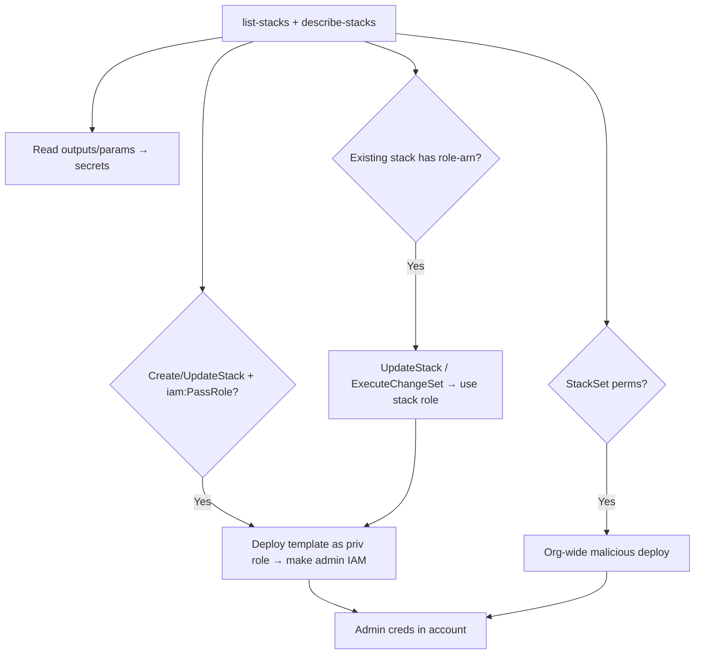

# 17 - AWS CloudFormation Exploitation

## 1. Executive Summary

CloudFormation deploys infrastructure from templates — and it deploys **as a role**. The headline privesc: `cloudformation:CreateStack`/`UpdateStack` **+ `iam:PassRole`** lets you run a template under a high-priv service role (or a stack role) and create IAM users/roles/policies you control — classic `PassRole` escalation. Even without PassRole, `UpdateStack`/`CreateChangeSet`+`ExecuteChangeSet` on an existing stack reuses the stack's existing (often admin) role. Templates and stack outputs also **leak secrets** (hardcoded creds, parameters).

## 2. Service Overview & Architecture

A **stack** is a template's deployed resources. CloudFormation can act with a **stack role** (`--role-arn`) — if set, all resource actions use that role; if not, it uses the caller's perms. **Change sets** preview/apply diffs. **StackSets** deploy across accounts/regions (org-wide blast radius). Outputs/parameters are stored and readable via `DescribeStacks`.

## 3. Enumeration

```bash
aws cloudformation list-stacks
aws cloudformation describe-stacks                       # outputs, params (often secrets)
aws cloudformation get-template --stack-name <s>
aws cloudformation list-stack-resources --stack-name <s>
aws cloudformation describe-stack-events --stack-name <s>
```

## 4. Privilege Escalation / Abuse Vectors

- **`CreateStack`/`UpdateStack` + `iam:PassRole`** — deploy a template under a privileged role; template creates an admin role/user/access key for you. Top-tier privesc.
- **`UpdateStack` / `CreateChangeSet`+`ExecuteChangeSet`** on a stack with an existing **stack role** — mutate the stack to add IAM resources using *its* role, no PassRole needed.
- **`SetStackPolicy`** — remove update protection on resources, then update them.
- **`CreateStackSet`/`UpdateStackSet`** — push malicious template org-wide (service-managed StackSets can self-PassRole across accounts).
- **Read secrets** — `DescribeStacks` outputs + `GetTemplate` often expose creds/params.

```bash
# PassRole privesc: template that mints an admin user
aws cloudformation create-stack --stack-name pwn \
  --template-body file://admin.yml \
  --capabilities CAPABILITY_NAMED_IAM \
  --role-arn arn:aws:iam::<acct>:role/<priv-role>
```

## 5. Mermaid Attack Flow



## 6. Persistence
- Leave a stack whose template recreates a backdoor role/key on each update.
- Org StackSet that redeploys persistence to new accounts.

## 7. Post-Exploitation / Data Access
- Admin IAM in account → full control.
- Template/output secrets; StackSets → multi-account reach.

## 8. Detection & Hardening
1. Never let non-admins pair `cloudformation:*` with `iam:PassRole` to privileged roles; scope passable roles.
2. Use least-priv stack roles; protect stacks with stack policies; restrict StackSet admin.
3. Don't store secrets in templates/params/outputs (use Secrets Manager refs); alert on `CreateStack`/`UpdateStack`/`CreateStackSet` with IAM capabilities.

## 9. Chaining / Related Notes
- PassRole core: **[[01 - IAM Exploitation]]**. Deep dive: **[[01 - AWS IAM Privilege Escalation Advanced Vectors]]** (A-62).
- CI/CD cousin: **[[18 - CodeBuild and CodePipeline Exploitation]]**.

## 10. Tools
`aws cloudformation`, `pacu`, `cloudsplaining`, `ScoutSuite`.
