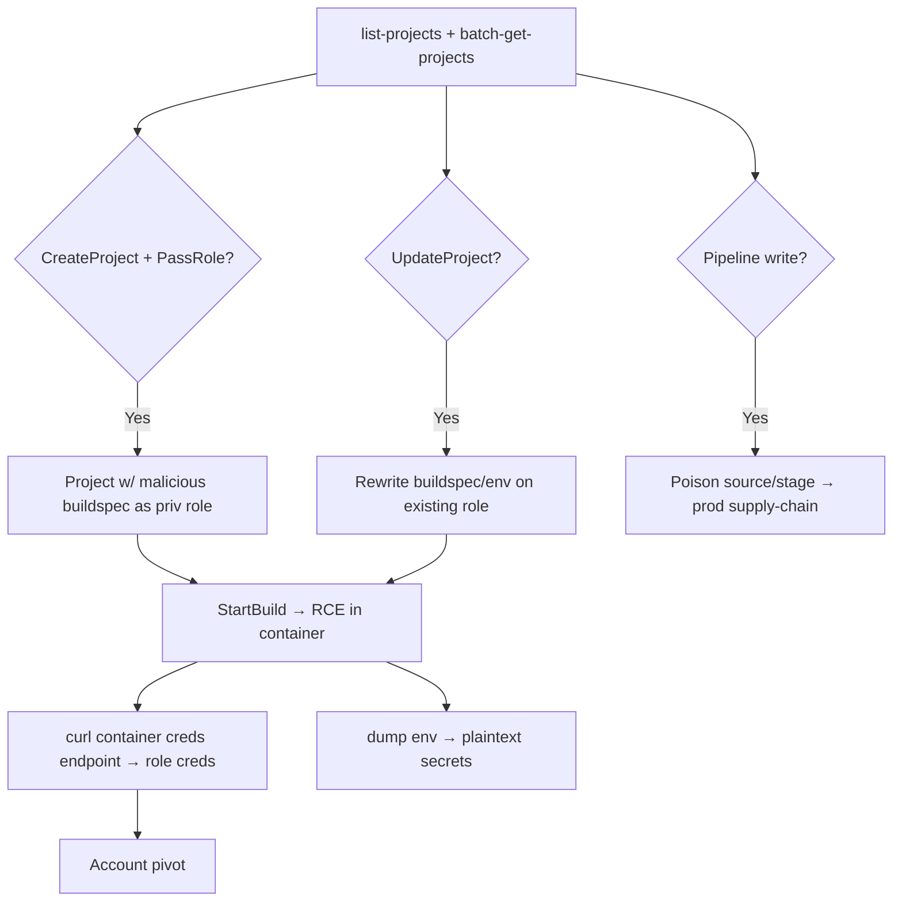

# 18 - AWS CodeBuild and CodePipeline Exploitation

## 1. Executive Summary

CodeBuild runs build jobs **as a service role** — usually a powerful one (deploy perms, secrets, registry push). That makes it an RCE + privesc engine: `codebuild:CreateProject`/`UpdateProject`/`StartBuild` **+ `iam:PassRole`** lets you run arbitrary buildspec commands under that role, then steal its creds from the build container's metadata. CodePipeline orchestrates CodeBuild/CodeDeploy stages — poisoning a source or stage is a **CI/CD supply-chain** attack reaching production. Build envs also expose env-var secrets and source creds.

## 2. Service Overview & Architecture

A **CodeBuild project** = source + environment (container image) + **buildspec** (commands) + **service role**. **CodePipeline** chains stages (Source → Build → Deploy), each acting via roles, passing artifacts in an S3 bucket. Builds run with the service role's creds reachable inside the container (container credential endpoint).

## 3. Enumeration

```bash
aws codebuild list-projects
aws codebuild batch-get-projects --names <p>      # role, env vars, source
aws codepipeline list-pipelines
aws codepipeline get-pipeline --name <p>
aws codecommit list-repositories
```

## 4. Privilege Escalation / Abuse Vectors

- **`codebuild:CreateProject` + `iam:PassRole`** — new project with a buildspec that runs your commands under a chosen high-priv role; `StartBuild` → RCE as that role; exfil creds.
- **`codebuild:UpdateProject`** — change an existing project's buildspec/role/env, then `StartBuild` — reuses an existing service role (PassRole sometimes not needed).
- **`codebuild:StartBuild` / `StartBuildBatch`** with `buildspecOverride`/env overrides — inject commands into a build you can trigger.
- **Steal role creds** in buildspec:
  ```yaml
  phases:
    build:
      commands:
        - curl $AWS_CONTAINER_CREDENTIALS_RELATIVE_URI
        - env   # often leaks plaintext secret env vars
  ```
- **Pipeline poisoning** — modify source repo/artifact or pipeline definition → malicious code flows to deploy stage (supply-chain to prod). Authorized scope only.

## 5. Mermaid Attack Flow



## 6. Persistence
- Leave a project/pipeline that rebuilds a backdoor on each run.
- Backdoor source repo (CodeCommit) so every build re-injects.

## 7. Post-Exploitation / Data Access
- Build-role creds (often deploy/admin-ish) → account pivot.
- Env-var + Secrets/Parameter-Store secrets pulled by builds; artifact S3 bucket contents.

## 8. Detection & Hardening
1. Least-priv build service roles; never pair `codebuild:*` with broad `iam:PassRole`.
2. No plaintext secret env vars (use Secrets Manager/Parameter Store refs with scoped access); restrict `UpdateProject`/`StartBuild`.
3. Protect pipeline source (branch protection, signed artifacts); alert on project/pipeline edits + builds from unusual principals.

## 9. Chaining / Related Notes
- PassRole: **[[01 - IAM Exploitation]]**. IaC cousin: **[[17 - CloudFormation Exploitation]]**.
- Secret sources: **[[12 - Secrets Manager Exploitation]]** / **[[14 - SSM Exploitation]]**. Registry push: **[[08 - ECR Exploitation]]**.

## 10. Tools
`aws codebuild`, `aws codepipeline`, `pacu`, `ScoutSuite`.
