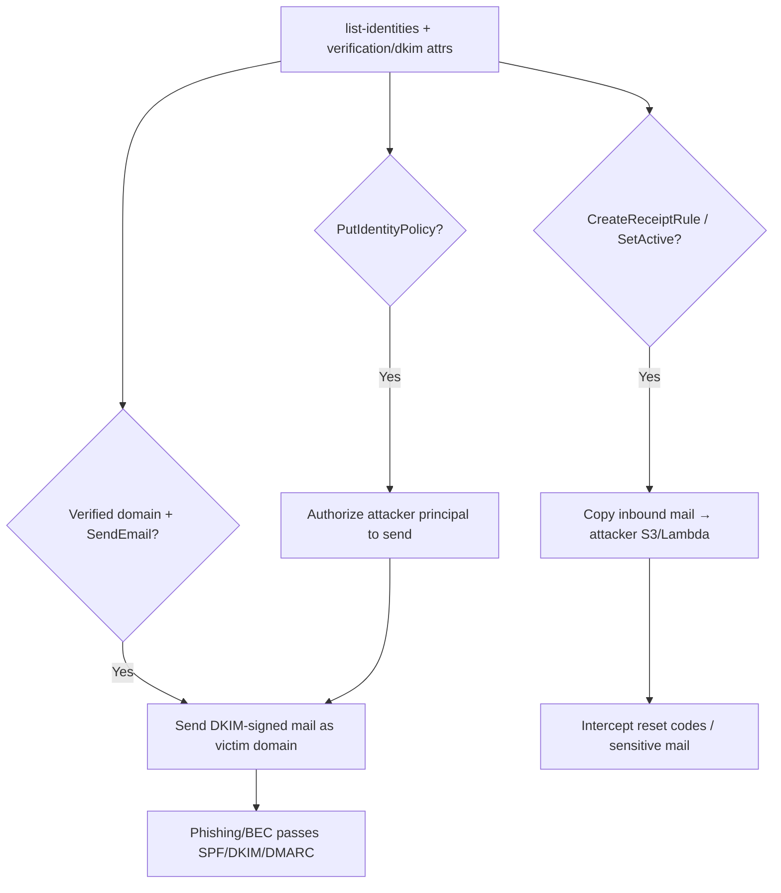

# 20 - AWS SES Exploitation

## 1. Executive Summary

SES (Simple Email Service) sends email — from **verified domains/identities you may now control**. The big abuse: `ses:SendEmail`/`SendRawEmail` lets an attacker send mail **as the victim's own verified, DKIM-signed domain** → high-trust phishing, BEC, password-reset abuse, and internal spoofing that passes SPF/DKIM/DMARC. Receipt rules can **exfiltrate inbound mail**; identity/sending-authorization policies can be edited to broaden who can send. SES access turns a cloud foothold into a trusted-email weapon.

## 2. Service Overview & Architecture

**Verified identities** (domains/emails) prove ownership and enable DKIM signing. **Sending** via API/SMTP from those identities. **Receipt rule sets** (in supported regions) process inbound mail (S3 store, Lambda, forward). **Authorization policies** on an identity can delegate sending to other principals/accounts.

## 3. Enumeration

```bash
aws ses list-identities
aws ses get-identity-verification-attributes --identities <domain>
aws ses get-identity-dkim-attributes --identities <domain>
aws ses list-receipt-rule-sets
aws ses describe-active-receipt-rule-set
aws ses get-send-quota
aws sesv2 list-email-identities
```

## 4. Privilege Escalation / Abuse Vectors

- **`ses:SendEmail` / `SendRawEmail`** — send as a verified domain → DKIM-signed phishing that passes DMARC; impersonate execs/internal addresses (BEC).
- **Password-reset / approval abuse** — send/spoof to drive workflows (reset links, approvals).
- **`ses:PutIdentityPolicy` / `PutEmailIdentityPolicy`** — authorize your principal / another account to send as the identity.
- **`ses:CreateReceiptRule` / `SetActiveReceiptRuleSet`** — add a rule that copies inbound email to an S3 bucket / Lambda you control → mail exfil + interception of reset codes.
- **`ses:VerifyDomainIdentity`** — stand up attacker-controlled sending identities under the account's reputation.

```bash
aws ses send-email --from "ceo@victim.com" \
  --destination ToAddresses=finance@victim.com \
  --message 'Subject={Data=Wire request},Body={Text={Data=Please pay...}}'
```

## 5. Mermaid Attack Flow



## 6. Persistence
- Identity authorization policy granting ongoing send rights.
- Receipt rule silently forwarding inbound mail.

## 7. Post-Exploitation / Data Access
- Trusted outbound channel for phishing/BEC at scale.
- Inbound mail interception → MFA/reset codes, sensitive comms.

## 8. Detection & Hardening
1. Least-priv `ses:Send*`; lock identity policies + receipt-rule actions to admins.
2. Strict DMARC (p=reject) + monitor; review verified identities + active receipt rule set regularly.
3. Alert on new identities, identity-policy edits, receipt-rule changes, send-rate spikes; keep production access off sandbox creds.

## 9. Chaining / Related Notes
- Inbound exfil lands in **[[03 - S3 Exploitation]]** / triggers **[[05 - Lambda Exploitation]]**.
- Messaging cousin: **[[19 - SNS and SQS Exploitation]]**.

## 10. Tools
`aws ses`, `aws sesv2`, `pacu`, `ScoutSuite`.
