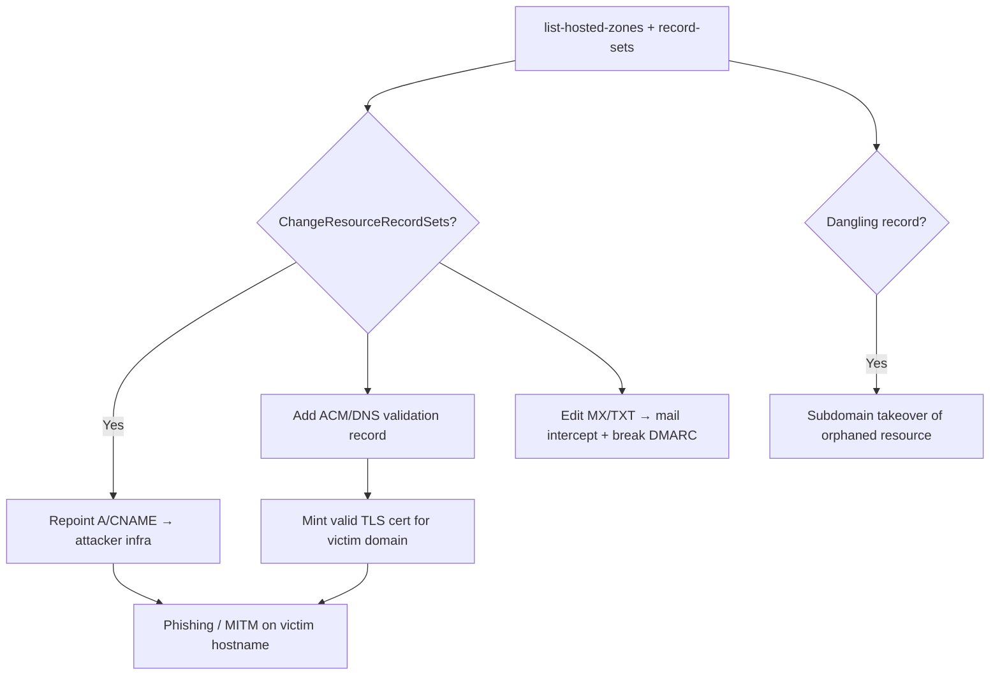

# 21 - AWS Route 53 Exploitation

## 1. Executive Summary

Route 53 is AWS DNS — control of a zone = control of where the org's names point. The core abuse: `route53:ChangeResourceRecordSets` rewrites records to **hijack traffic** (point a hostname at attacker infra → phishing, MITM, **ACM/DNS domain validation to mint TLS certs** for the victim's domain). `CreateHostedZone` + registrar games and **dangling records** enable subdomain takeover. DNS control also breaks email security (spoof SPF/DKIM/DMARC, MX redirect) — quiet but devastating.

## 2. Service Overview & Architecture

A **hosted zone** holds record sets (A/AAAA/CNAME/MX/TXT/NS) for a domain. Public zones answer internet queries; private zones serve VPCs. `ChangeResourceRecordSets` is the write primitive. DNS-based validation (ACM, ACM-PCA, third-party) trusts whoever controls the TXT/CNAME record.

## 3. Enumeration

```bash
aws route53 list-hosted-zones
aws route53 list-resource-record-sets --hosted-zone-id <id>
aws route53 get-hosted-zone --id <id>
aws route53domains list-domains          # registered domains (us-east-1)
```
Hunt **dangling records**: CNAMEs/A records pointing at deprovisioned S3/CloudFront/ELB/EIP → takeover.

## 4. Privilege Escalation / Abuse Vectors

- **`route53:ChangeResourceRecordSets`** — repoint records to attacker infra: hijack web/API traffic (phishing/MITM), redirect MX (mail interception), break DMARC/SPF/DKIM by editing TXT.
- **DNS validation → certs** — add the validation TXT/CNAME and obtain a valid TLS cert for the victim's domain (ACM `RequestCertificate` or external CA) → seamless HTTPS phishing/MITM. Pairs with ACM-PCA.
- **`route53:CreateHostedZone`** — create a zone for a domain whose registrar NS you can influence, or to win resolution in split-horizon setups.
- **Subdomain takeover** — claim the orphaned resource a dangling record still points to.
- **Private zone abuse** — alter internal resolution to redirect VPC service calls.

```bash
aws route53 change-resource-record-sets --hosted-zone-id <id> --change-batch '{
  "Changes":[{"Action":"UPSERT","ResourceRecordSet":{
    "Name":"app.victim.com","Type":"A","TTL":60,
    "ResourceRecords":[{"Value":"<attacker-ip>"}]}}]}'
```

## 5. Mermaid Attack Flow



## 6. Persistence
- Keep a stealth record (low-TTL or rarely-checked subdomain) pointing at attacker infra.
- Hold a valid TLS cert + takeover subdomain for long-term phishing.

## 7. Post-Exploitation / Data Access
- Intercepted web/API/email traffic → credentials, data, MFA codes.
- Trusted HTTPS phishing using a legit cert; DMARC bypass for email attacks.

## 8. Detection & Hardening
1. Restrict `route53:ChangeResourceRecordSets`/`CreateHostedZone` to change-controlled admins.
2. Continuously hunt dangling records; clean up on resource deprovision; enable Route 53 query logging + CloudTrail alerts on record changes.
3. Enable DNSSEC; monitor cert issuance (CT logs) for your domains; protect registrar + NS delegation.

## 9. Chaining / Related Notes
- Cert issuance pairs with ACM-PCA (later A-82 note) + **[[20 - SES Exploitation]]** for full email/web impersonation.
- DNS fundamentals: **[[03 - DNS (Port 53) Pentesting]]** (Network module). Subdomain takeover overlaps recon: **[[02 - AWS SSRF to Metadata and IMDSv2 Bypass]]** (A-62) context.

## 10. Tools
`aws route53`, `dig`, `nuclei` (takeover templates), `pacu`, `ScoutSuite`.
